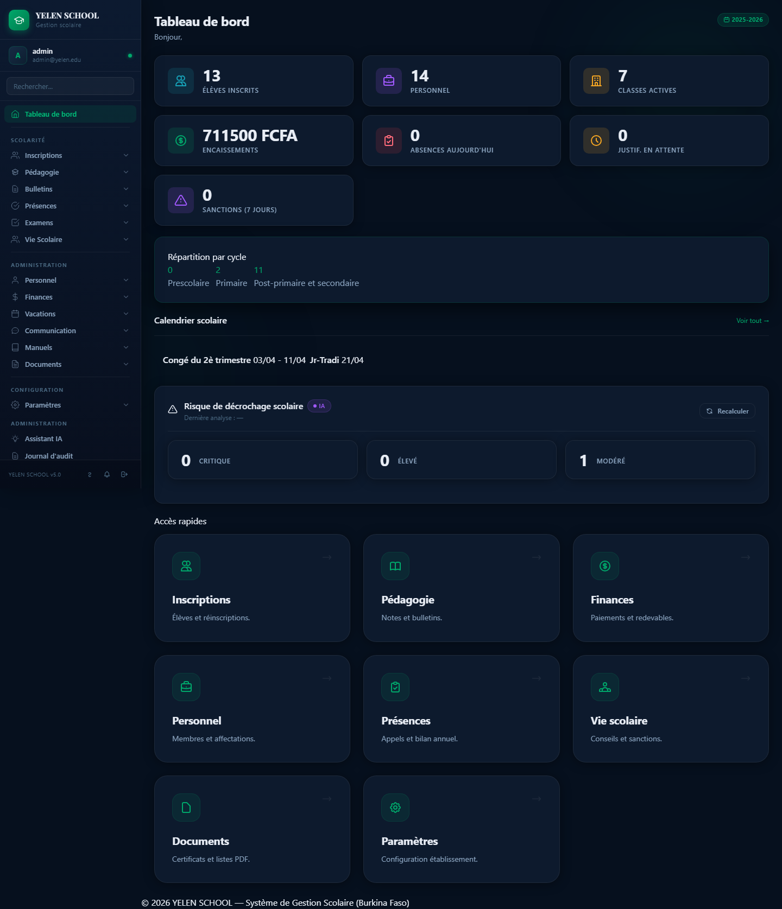
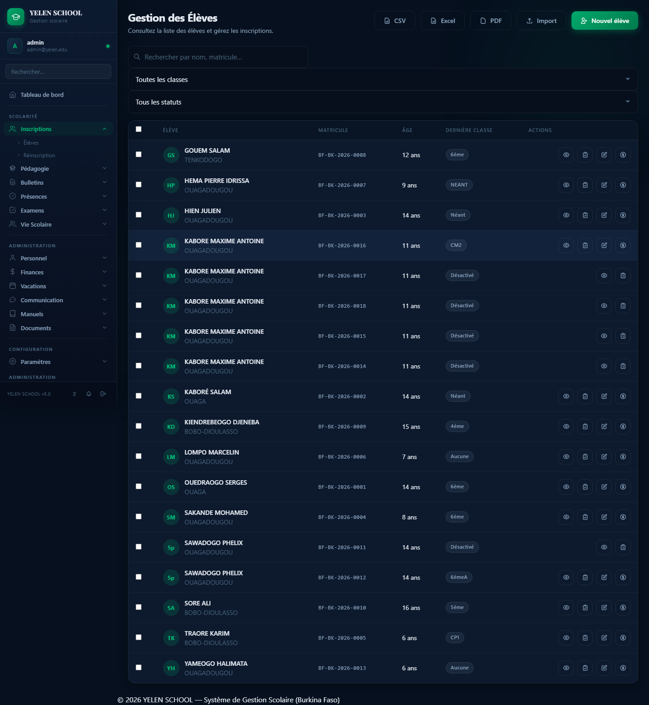
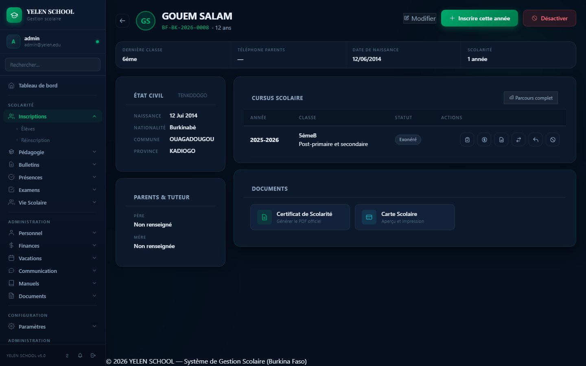
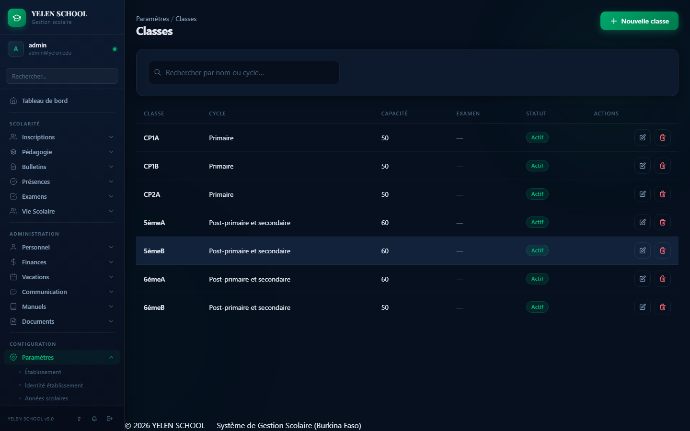
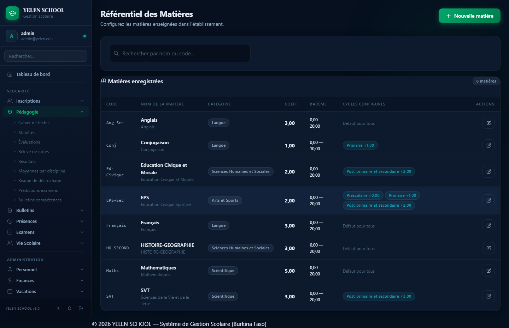
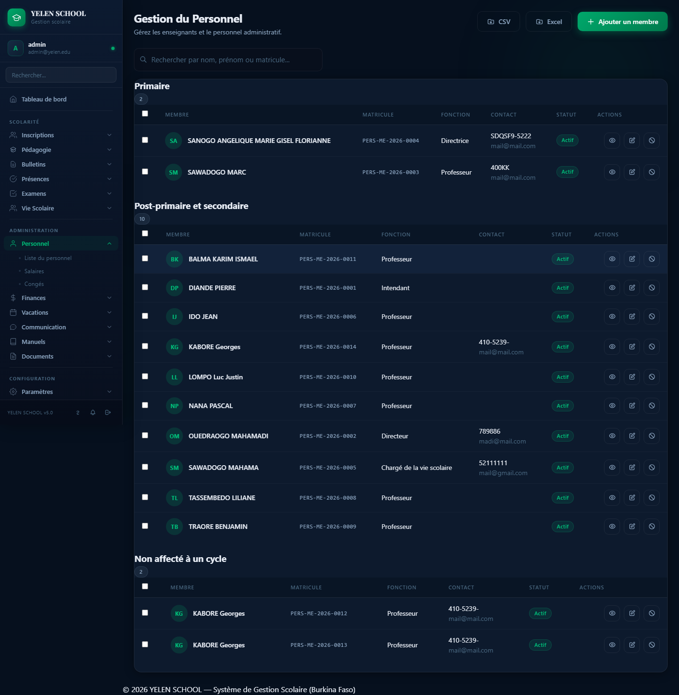
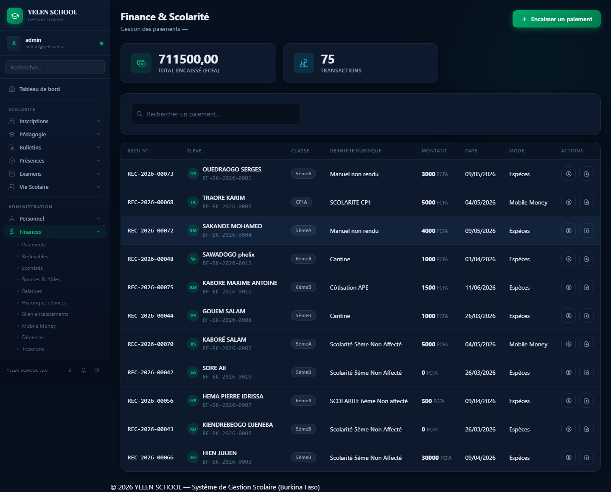
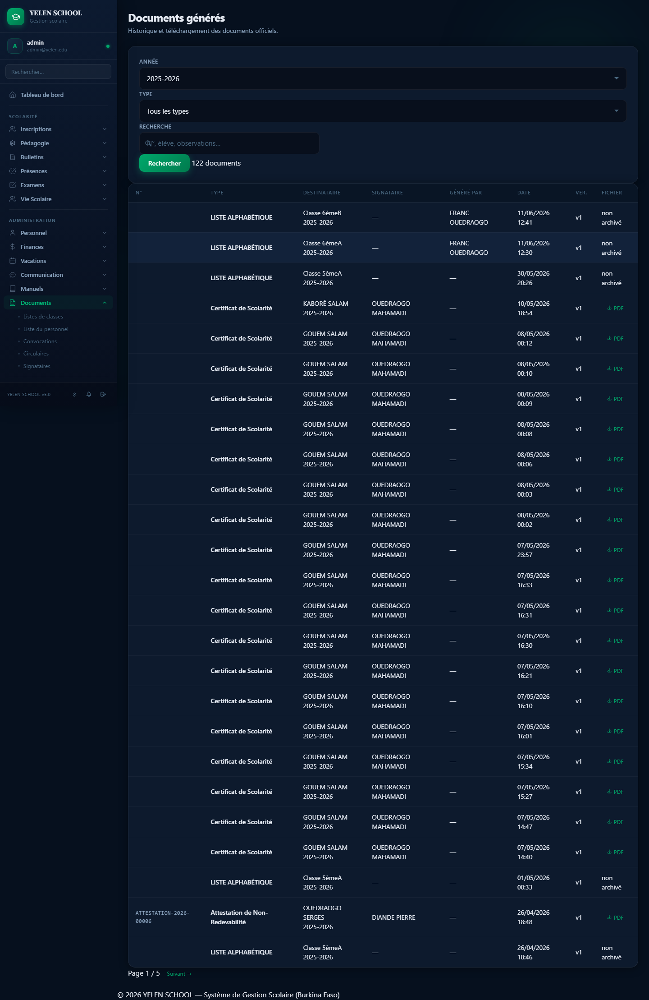
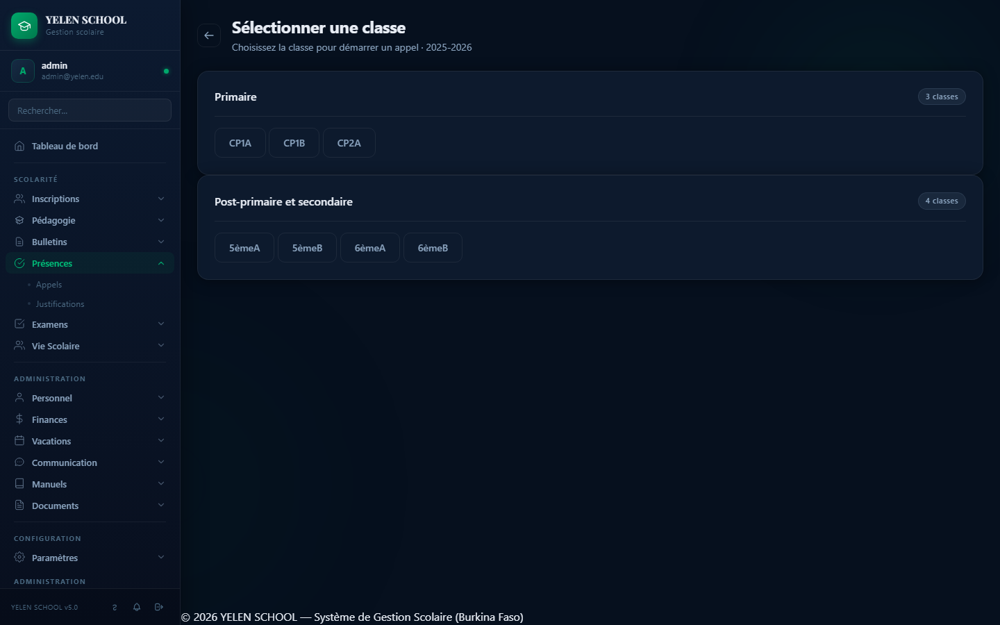

# 🎓 Guide d'Utilisation — YELEN SCHOOL
### *"Illuminer chaque parcours scolaire"*
### Version 4.2 — Avril 2026 (Guide v2.6)

---

## TABLE DES MATIÈRES

- [0. Introduction](#0-introduction)
- [1. Connexion et Tableau de Bord](#1-connexion-et-tableau-de-bord)
  - [1.6 Gestion des Comptes Utilisateurs](#16-gestion-des-comptes-utilisateurs)
  - [1.7 Double Authentification (2FA) — Activer la Sécurité Renforcée](#17-double-authentification-2fa--activer-la-sécurité-renforcée)
  - [1.8 Se Connecter avec la 2FA Activée](#18-se-connecter-avec-la-2fa-activée)
  - [1.9 Désactiver la 2FA](#19-désactiver-la-2fa)
- [2. Paramètres de l'Établissement](#2-paramètres-de-létablissement)
  - [2.1 Identité de l'établissement](#21-identité-de-létablissement)
  - [2.2 Gestion des Années Scolaires](#22-gestion-des-années-scolaires)
  - [2.3 Génération Automatique de la Nouvelle Année Scolaire](#23-génération-automatique-de-la-nouvelle-année-scolaire)
  - [2.17 Configuration SMS](#217-configuration-sms)
  - [2.7 Appréciations et Moyennes (Secondaire)](#27-appréciations-et-moyennes)
  - [2.10 Signataires des Documents PDF](#210-signataires-des-documents-pdf)
  - [2.11 Appréciations — Cycle Primaire](#211-appréciations-de-moyenne--cycle-primaire)
  - [2.14 Types d'Évaluation](#214-types-dévaluation)
  - [2.15 Calendrier Scolaire](#215-calendrier-scolaire)
  - [2.16 Modèles de Messages SMS](#216-modèles-de-messages-sms)
  - [2.18 Localisations des Postes](#218-localisations-des-postes)
- [3. Enregistrement des Élèves](#3-enregistrement-des-élèves)
  - [3.8 Page Profil Élève — Vue d'ensemble](#38-page-profil-élève--vue-densemble)
- [4. Inscription et Réinscription](#4-inscription-et-réinscription)
  - [4.5 Carte Scolaire de l'Élève](#45-carte-scolaire-de-lélève)
  - [4.7 Marquer Abandon / Annuler l'Abandon](#47-marquer-abandon--annuler-labandon)
- [5. Gestion du Personnel](#5-gestion-du-personnel)
  - [5.1 Profil du Personnel (Page de Détail)](#51-profil-du-personnel-page-de-détail)
  - [5.10 Gestion des Congés du Personnel](#510-gestion-des-congés-du-personnel)
    - [Design du formulaire (Design System v4)](#design-du-formulaire-conge_formhtml--design-system-v4)
  - [5.11 Gestion des Salaires du Personnel](#511-gestion-des-salaires-du-personnel)
    - [Design du formulaire (Design System v4)](#design-du-formulaire-salaire_formhtml--design-system-v4)
- [6. Scolarité et Notes](#6-scolarité-et-notes)
  - [6.1 Matières et Enseignements (regroupés par classe)](#61-configurer-les-matières-et-enseignements)
  - [6.6 Conseil de Classe](#66-conseil-de-classe)
  - [6.7 Bulletins Trimestriels PDF](#67-bulletins-trimestriels-pdf)
  - [6.7.0 Duplicata du Bulletin Trimestriel](#670-duplicata-du-bulletin-trimestriel)
  - [6.7.1 Bulletin Annuel](#671-bulletin-annuel)
  - [6.7.2 Palmarès Annuel](#672-palmarès-annuel)
  - [6.8 Moyennes par Discipline](#68-moyennes-par-discipline)
  - [6.9 Relevé de Notes par Discipline](#69-relevé-de-notes-par-discipline)
  - [6.10 Analyse du Risque de Décrochage (IA)](#610-analyse-du-risque-de-décrochage-ia)
- [7. Présences et Absences](#7-présences-et-absences)
  - [7.3 Justifications d'absences](#73-justifications-dabsences)
  - [7.4 Bilan des présences par élève](#74-bilan-des-présences-par-élève)
  - [7.5 Pointage par QR Code](#75-pointage-par-qr-code)
- [8. Vie Scolaire](#8-vie-scolaire)
  - [8.2 Activités Parascolaires](#82-activités-parascolaires)
  - [8.3 Participation des Élèves](#83-participation-des-élèves-aux-activités)
  - [8.4 Capital de Points Discipline](#84-capital-de-points-discipline)
  - [8.5 Configuration du Système de Points](#85-configuration-du-système-de-points)
  - [8.6 Appels de Décision du Conseil de Classe](#86-appels-de-décision-du-conseil-de-classe)
- [9. Finances et Scolarité](#9-finances-et-scolarité)
  - [9.2 Tableau de bord financier](#92-tableau-de-bord-financier)
  - [9.4 Échéancier de Paiement](#94-gérer-un-échéancier-de-paiement)
  - [9.6 Reçu de paiement PDF](#96-imprimer-un-reçu-de-paiement-pdf)
  - [9.7 Historique des versements PDF](#97-historique-des-versements-pdf)
  - [9.8 Liste des Élèves Redevables](#98-liste-des-élèves-redevables)
  - [9.9 Bilan des Encaissements](#99-bilan-des-encaissements)
  - [9.10 Certificat de Non-Redevabilité](#910-certificat-de-non-redevabilité)
  - [9.11 Relances de Paiement PDF](#911-relances-de-paiement-pdf)
  - [9.12 Élèves Exonérés de Paiement](#912-élèves-exonérés-de-paiement)
  - [9.13 Bourses et Aides Financières](#913-bourses-et-aides-financières)
  - [9.14 Paiements Mobile Money](#914-paiements-mobile-money-orange-money)
- [10. Examens](#10-examens)
- [20. Portail Parent PWA](#20-portail-parent-pwa)
- [21. Signature Électronique des Bulletins](#21-signature-électronique-des-bulletins)
  - [10.5 Liste des Candidats — Filtre par Centre](#105-liste-des-candidats--filtre-par-centre)
- [11. Vacations](#11-vacations)
  - [11.3 Générer un Bulletin de Vacation](#113-générer-un-bulletin-de-vacation)
- [12. Documents Administratifs](#12-documents-administratifs)
  - [12.1 Certificat de Scolarité](#121-certificat-de-scolarité)
  - [12.2 Attestation de Fréquentation](#122-attestation-de-fréquentation)
  - [12.3 Relevé de Notes / Cursus Scolaire](#123-relevé-de-notes--cursus-scolaire)
  - [12.4 Autorisation d'Absence](#124-autorisation-dabsence)
  - [12.5 Carte d'Identité Scolaire](#125-carte-didentité-scolaire)
  - [12.6 Liste Alphabétique d'une Classe](#126-liste-alphabétique-dune-classe-pdf)
  - [12.7 Liste du Personnel](#127-liste-du-personnel-pdf)
  - [12.8 Accès aux Documents Archivés](#128-accès-aux-documents-archivés)
  - [12.9 Archivage et Consultation](#129-archivage-et-consultation-des-documents-générés)
  - [12.10 Codes QR dans les documents](#1210-codes-qr-dans-les-documents-générés)
  - [12.11 Convocations](#1211-convocations)
  - [12.12 Circulaires](#1212-circulaires)
  - [12.13 Attestation de Non-Redevabilité](#1213-attestation-de-non-redevabilité)
- [13. Gestion des Licences](#13-gestion-des-licences-super-admin-uniquement)
- [14. Statistiques et Rapports](#14-statistiques-et-rapports)
  - [14.4 Emploi du Temps](#144-emploi-du-temps)
    - [14.4.1 Emploi du Temps par Professeur](#1441-emploi-du-temps-par-professeur)
- [15. Fonctionnalités à Venir](#15-fonctionnalités-à-venir-)
- [16. Questions Fréquentes (FAQ)](#16-questions-fréquentes-faq)
- [17. Glossaire](#17-glossaire)
- [18. Design System et Interface](#18-design-system-et-interface)
  - [18.1 Principes de Design YELEN SCHOOL](#181-principes-de-design-yelen-school)
  - [18.2 Fonctionnement Hors Ligne](#182-fonctionnement-hors-ligne-complet)
  - [18.3 Design System v4 — Refonte Aura](#183-design-system-v4--refonte-aura)
  - [18.4 Guide Administrateur Technique](#184-guide-administrateur-technique)
  - [18.5 Système de Notifications](#185-système-de-notifications)
  - [18.6 Journal d'Audit (Traçabilité)](#186-journal-daudit-traçabilité)
  - [18.7 Réunion de Parents](#187-réunion-de-parents-reunion-parents)
  - [18.8 Galerie de Captures d'Écran](#188-galerie-de-captures-décran)

---

## 0. INTRODUCTION

### 0.1 Présentation de YELEN SCHOOL

YELEN SCHOOL est un logiciel de gestion scolaire conçu spécifiquement pour les établissements d'enseignement du **Burkina Faso**.

Les captures d'écran suivantes (disponibles dans `docs/screenshots/`) montrent l'interface réelle de l'application. Les images sont référencées dans chaque section concernée.

--- Le mot « Yelen » signifie *lumière* en bambara — une métaphore du savoir qui éclaire chaque élève.

Ce logiciel te permet de gérer, depuis un seul endroit :

- L'enregistrement et le suivi des élèves
- Les inscriptions et réinscriptions annuelles
- Les notes, évaluations et moyennes
- Les paiements de scolarité en FCFA
- Les présences et absences
- Le personnel enseignant et administratif
- Les documents officiels (certificats, attestations, bulletins)
- La vie scolaire (disciplines, sanctions, activités)

YELEN SCHOOL est développé par et pour le contexte burkinabè. Il respecte les cycles scolaires, les nomenclatures et les pratiques administratives en vigueur au Burkina Faso.

---

### 0.2 Les 4 Cycles Scolaires Couverts

| Cycle | Niveaux | Diplôme visé |
|-------|---------|--------------|
| **Préscolaire** | Petite Section, Moyenne Section, Grande Section | — |
| **Primaire** | CP1, CP2, CE1, CE2, CM1, CM2 | CEP |
| **Post-primaire** | 6ème, 5ème, 4ème, 3ème | BEPC |
| **Secondaire** | 2nde, 1ère, Terminale | BAC |

---

### 0.3 Les 9 Profils Utilisateurs

| Profil | Rôle | Accès principal |
|--------|------|-----------------|
| **Super Admin** | Administrateur technique de la plateforme | Tout + gestion des licences |
| **Directeur** | Directeur d'établissement (Primaire/Post-primaire) | Tous les modules |
| **Proviseur** | Proviseur de lycée (Secondaire) | Tous les modules |
| **Censeur** | Censeur de lycée | Vie scolaire, emploi du temps |
| **Secrétaire** | Secrétariat de l'établissement | Inscriptions, documents, finances |
| **Enseignant** | Professeur | Ses matières, notes, présences |
| **Comptable** | Gestionnaire financier | Finances uniquement |
| **Agent de Vie Scolaire (AVS)** | Surveillance et discipline | Présences, vie scolaire |
| **Parent** | Père ou mère d'élève | Consultation uniquement *(à venir)* |

---

### 0.4 Comment Lire et Naviguer dans ce Guide

Ce guide est organisé **par module**. Chaque section suit le même schéma :

1. **À quoi ça sert** — l'objectif du module en une phrase
2. **Qui peut l'utiliser** — les rôles autorisés
3. **Comment y accéder** — le chemin dans le menu
4. **Les étapes** — numérotées et détaillées
5. **Une illustration** — représentation de l'écran en ASCII
6. **Un cas concret** — exemple burkinabè réel
7. **Les messages système** — ce que tu vois si tout va bien, et si ça ne va pas

> **Astuce :** Si tu cherches une fonction précise, utilise la table des matières ci-dessus pour aller directement à la bonne section.

> **🖼 Captures d'écran :** Ce guide inclut désormais des captures d'écran réelles de l'application (section 1). Les images sont situées dans le dossier `docs/screenshots/`. Elles illustrent l'interface telle qu'elle apparaît dans le navigateur.

---

### 0.5 Lexique des Termes Utilisés

| Terme | Définition |
|-------|-----------|
| **Matricule** | Identifiant unique d'un élève ou d'un agent, attribué automatiquement |
| **Rubrique** | Catégorie de frais (scolarité, inscription, cantine…) |
| **Tarif** | Montant en FCFA associé à une rubrique, selon la classe et le statut |
| **Cycle** | Niveau d'enseignement (Préscolaire, Primaire, Post-primaire, Secondaire) |
| **Année scolaire** | Période officielle d'enseignement (ex : 2025-2026) |
| **Inscription** | Acte d'enregistrement d'un élève dans une classe pour une année scolaire |
| **Réinscription** | Reconducton d'un élève dans l'établissement pour une nouvelle année |
| **AVS** | Agent de Vie Scolaire — surveille la discipline et les présences |
| **FCFA** | Franc CFA — monnaie officielle du Burkina Faso |
| **CEP** | Certificat d'Études Primaires |
| **BEPC** | Brevet d'Études du Premier Cycle |
| **BAC** | Baccalauréat |
| **Feature flag** | Option activée ou désactivée selon le niveau de licence de l'établissement |
| **PDF/A** | Format PDF archivable et non modifiable utilisé pour les documents officiels |
| **Relance** | Coupon A5 imprimable rappelant à une famille qu'un reste à payer est dû sur une rubrique donnée |

---

## 1. CONNEXION ET TABLEAU DE BORD

### 1.1 Accès à l'Application

YELEN SCHOOL fonctionne dans ton navigateur web. L'adresse dépend de ton installation :

- **Réseau local** : `http://192.168.X.X:8000` (adresse fournie par ton administrateur)
- **Internet** : `https://[nom-etablissement].yelenscnool.bf` *(si hébergé)*

> YELEN SCHOOL est conçu pour fonctionner **hors ligne** sur un réseau local. Tu n'as pas besoin d'une connexion internet si le serveur est installé dans ton établissement.

---

### 1.2 Écran de Connexion

Ouvre ton navigateur et saisis l'adresse du logiciel. Tu arrives sur la page de connexion :


**Design Premium (v4.2+) :**
- Layout deux panneaux : branding à gauche (masqué en mobile), formulaire à droite
- Palette professionnelle : fond profond `#06101E`, accent vert `#00A86B`
- Panneau branding : lueurs vertes ambiantes, logo Playfair Display, fonctionnalités, statistiques
- Panneau formulaire : glassmorphism subtil, backdrop-filter blur
- Champs avec icônes SVG intégrées et anneau vert au focus
- Bouton dégradé vert avec élévation au survol (`translateY(-2px)`)
- **Toggle mot de passe (v4.2.1) :** bouton œil indépendant (`#btn-pw-toggle`) positionné à droite du champ. Au clic, bascule `inp.type` entre `'password'` et `'text'`. La visibilité des deux icônes SVG (œil ouvert / œil barré) est gérée par la classe CSS `.pw-icon-hidden` (`display: none !important`) — aucun `style` inline. Le bouton reçoit la classe `.is-active` (vert `#00A86B`) quand le mot de passe est visible, et revient à la couleur neutre quand il est masqué. L'attribut `aria-pressed` et `aria-label` sont mis à jour dynamiquement pour l'accessibilité.
- Spinner de chargement animé pendant la soumission
- Accès rapides pour tester les différents profils
- Responsive : panneau branding masqué sous 960 px

**Étapes :**

1. Saisis ton **adresse e-mail** (fournie par l'administrateur)
2. Saisis ton **mot de passe**
3. Clique sur **Se connecter**
4. Option : utilise les **accès rapides** en bas pour tester

**Mot de passe oublié :**

Clique sur le lien **"Mot de passe oublié ?"** pour lancer la réinitialisation par email.

Le système vérifie si l'adresse email est connue et envoie un lien sécurisé valable **72 heures**. Si le serveur SMTP n'est pas configuré (mode local), l'email est affiché dans la console Docker (accessible via `docker compose logs web`).

**Sécurité :**
- Limitation à **3 demandes par heure** (anti-brute force)
- Token à usage unique avec horodatage (anti-rejeu)
- Aucune information sur l'existence du compte (anti-énumération)

> ⚠️ **Alternative admin :** L'administrateur peut modifier manuellement le mot de passe depuis *Administration → Utilisateurs → [compte] → Modifier le mot de passe*, sans connaître l'ancien.

**Compte Super Admin par défaut :**

| Champ | Valeur |
|-------|--------|
| Email | `admin@yelen.edu` |
| Mot de passe | `admin123` |

Ce compte est créé automatiquement lors du premier déploiement. Il possède tous les droits (SUPER_ADMIN) et permet de paramétrer l'application avant de créer d'autres utilisateurs.

> ⚠️ **Création automatique au premier démarrage :** Depuis la v4.2, si `ENSURE_ADMIN=true` dans `.env`, le conteneur Docker exécute `python manage.py ensure_admin` au démarrage via l'entrypoint. Cette commande crée le super administrateur `admin@yelen.edu` avec le mot de passe `admin123`.
> >
> > **Sécurité :** Après le premier déploiement, mettez `ENSURE_ADMIN=false` dans `.env` pour éviter la réinitialisation du mot de passe en cas de redémarrage. Changez également le mot de passe depuis l'interface.
> >
> > **Réinitialisation manuelle (si nécessaire) :**
> ```bash
> docker exec yelen-school-web-1 python manage.py ensure_admin
> ```
> Ou via les scripts : `./start.sh admin` (Linux) / `.\start.ps1 admin` (PowerShell) / `.\dev.ps1 admin`

---

### 1.3 Tableau de Bord selon le Rôle

Une fois connecté, le tableau de bord s'adapte à ton rôle :

**Tableau de bord — Super Admin / Directeur**



---

### 1.6 Gestion des Comptes Utilisateurs

**À quoi ça sert :** Permet aux administrateurs (SUPER_ADMIN, DIRECTEUR) de créer, modifier et désactiver les comptes des membres du personnel qui utilisent YELEN SCHOOL.

**Qui peut accéder :** Super Admin, Directeur

**Accès :** `Utilisateurs → Nouvel utilisateur`

**Formulaire de création (`/accounts/utilisateurs/creer/`) :**

Le formulaire est organisé en 4 sections à **2 colonnes côte à côte** :

| Section | Colonne gauche | Colonne droite |
|---|---|---|
| **Identité** | Nom ★ | Prénom ★ |
| **Contact** | Email ★ | Téléphone |
| **Accès** | Rôle ★ | Établissement |
| **Mot de passe** | Mot de passe ★ | Confirmer ★ |

En mode **modification**, la section mot de passe est remplacée par une case à cocher **Compte actif** (pour activer / désactiver un compte sans le supprimer).

**Rôles disponibles :**

| Rôle | Accès |
|---|---|
| SUPER_ADMIN | Toutes les fonctionnalités, tous les établissements |
| DIRECTEUR_RESEAU | Gestion multi-établissements |
| DIRECTEUR | Toutes les fonctionnalités de son établissement |
| CENSEUR | Présences, discipline |
| AVS | Agent de Vie Scolaire |
| ENSEIGNANT | Notes, présences de ses classes |
| COMPTABLE | Finances |
| SECRÉTAIRE | Documents, inscriptions |
| PARENT | Portail parent, suivi scolaire |
| ELEVE | Consultation des notes et bulletins |

> **Règle de sécurité :** Un DIRECTEUR ne peut pas créer un compte SUPER_ADMIN. L'établissement d'un Directeur est pré-sélectionné et non modifiable.

---

### 6.0 Cahier de textes numérique

**À quoi ça sert :** Permet à chaque enseignant de renseigner après chaque cours le contenu traité et les devoirs donnés. Le directeur dispose d'une vue consolidée de l'avancement des programmes par classe.

**Accès :** `Pédagogie → Cahier de textes`

**Qui peut accéder :**

- **Directeur / Proviseur / Censeur** : toutes les classes et matières
- **Enseignant** : uniquement les classes et matières qu'il enseigne

**Fonctionnalités :**

- **Page d'index** : sélecteur de classe par cycle (même design que l'emploi du temps)
- **Vue classe** : liste chronologique des entrées, regroupées par date, filtrables par année scolaire et par matière
- **Nouvelle entrée** : formulaire avec matière, date, heures de début/fin, contenu du cours (obligatoire), devoirs (optionnel) et date de remise
- **Modification** : édition complète de toutes les informations sauf la matière
- **Suppression** : avec confirmation, accessible depuis la liste

**Structure d'une entrée :**

| Champ | Obligatoire | Description |
|---|---|---|
| Matière | Oui | Liste des enseignements actifs de la classe |
| Date | Oui | Date du cours (pré-remplie à aujourd'hui) |
| Heure début / fin | Non | Créneau horaire du cours |
| Contenu | Oui | Notions abordées, leçons, activités |
| Devoirs | Non | Travail à faire à la maison |
| Date de remise | Non | Échéance des devoirs |

**Affichage des devoirs :** Les entrées avec devoirs sont mises en évidence par un encadré doré avec l'icône et la date de remise.

**URLs :**
- Index : `/pedagogie/cahier-textes/`
- Vue classe : `/pedagogie/cahier-textes/classe/<uuid>/`
- Nouvelle entrée : `/pedagogie/cahier-textes/ajouter/?classe=<uuid>`
- Modifier : `/pedagogie/cahier-textes/<uuid>/modifier/`
- Supprimer : `/pedagogie/cahier-textes/<uuid>/supprimer/` (POST)

**Impression :** La vue classe dispose d'un bouton **Imprimer** (dans `page-actions`, classe `.no-print`) qui déclenche `window.print()`. À l'impression :
- La barre latérale (`.sb-modern`), l'en-tête de page (`.page-header`), les filtres, les actions par entrée (modifier/supprimer) et le compteur d'entrées sont masqués par la classe `.no-print`.
- Un titre `.cahier-print-header` (caché par défaut, `display: none`) s'affiche centré en noir (`.cahier-print-header { display: block !important; }`).
- Les cartes passent en fond blanc avec bordures grises (`#ccc`), sans ombre ni arrondi.
- Les badges reçoivent une bordure et fond gris clair.
- Le corps utilise `@page { size: A4 landscape; margin: 10mm; }` pour un format paysage.
- Toutes les couleurs sont converties en noir/gris pour une impression N&B lisible.
---

### 6.1 Référentiel des Matières

**À quoi ça sert :** Gérer la liste des matières enseignées dans l'établissement : code, nom, catégorie, coefficient par défaut, barème, et surcharges par cycle.

**Accès :** `Pédagogie → Matières`

**Interface (Design System v4.0) :**

- En-tête avec bouton **Nouvelle matière** dans `page-actions`
- Barre de recherche en temps réel (HTMX) dans une `card` avec `card-body`
- Table avec `card-header` affichant le compteur de matières (se met à jour lors de la recherche)

**Colonnes du tableau :**

| Colonne | Description |
|---|---|
| **Code** | Code court en police mono (ex. `MATH`, `FR`) |
| **Nom** | Nom court + nom complet en sous-titre grisé |
| **Catégorie** | Badge neutre (ex. Enseignement Général) |
| **Coeff.** | Coefficient par défaut |
| **Barème** | Plage min–max (ex. 0 — 20) |
| **Cycles configurés** | Badges bleus pour chaque cycle avec surcharge de coefficient (ex. `Secondaire ×3`) ; *Défaut pour tous* si aucune surcharge |
| **Actions** | Bouton modifier (crayon) |

**Recherche :** Saisir dans le champ déclenche un filtrage HTMX après 500 ms sur le nom ou le code.

---

### 6.7 Bulletins Trimestriels PDF

#### 6.7.A Modale de saisie du bulletin (bouton « Saisir »)

**À quoi ça sert :** Permet de renseigner les absences et l'appréciation du conseil de classe pour un élève donné, depuis la vue liste de la classe.

**Comment y accéder :** `Bulletins → [Classe] → [Trimestre]` → colonne **Actions** → bouton crayon **Saisir**.

**Design de la modale (v2.10) :**

```
╔════════════════════════════════════════════════════════════╗
║ ┌────────────────────────────────────────────────────── ×┐ ║
║ │  ✏️  Saisie du bulletin                               │ ║
║ │  👤 SAWADOGO Aminata · 1er Trimestre                  │ ║
║ ├────────────────────────────────────────────────────────┤ ║
║ │                                                        │ ║
║ │  ┌──────────────────────────────────────────────────┐ │ ║
║ │  │ 📊  Moyenne du trimestre    13.50 /20   3e rang  │ │ ║
║ │  └──────────────────────────────────────────────────┘ │ ║
║ │                                                        │ ║
║ │  ⏱ ASSIDUITÉ                                          │ ║
║ │  ┌────────────┐ ┌────────────┐ ┌────────────┐         │ ║
║ │  │  Abs.J(h)  │ │ Abs.NJ(h) │ │  Retards   │         │ ║
║ │  │     0      │ │     2      │ │     1      │         │ ║
║ │  └────────────┘ └────────────┘ └────────────┘         │ ║
║ │  ─────────────────────────────────────────────        │ ║
║ │  💬 APPRÉCIATION DU CONSEIL DE CLASSE                 │ ║
║ │  ┌──────────────────────────────────────────────────┐ │ ║
║ │  │ Ex : Bon trimestre, continue tes efforts…        │ │ ║
║ │  └──────────────────────────────────────────────────┘ │ ║
║ │                                                        │ ║
║ │  ─────────────────────────────────────────────        │ ║
║ │                         [Annuler]  [✓ Enregistrer]    │ ║
║ └────────────────────────────────────────────────────────┘ ║
╚════════════════════════════════════════════════════════════╝
```

**Éléments de la modale :**

| Élément | Description |
|---|---|
| **En-tête** | Dégradé vert subtil, nom de l'élève et trimestre en sous-titre |
| **Bouton ×** | Ferme la modale, rouge au survol |
| **Carte Moyenne** | Affiche la moyenne calculée (verte ≥10 / rouge <10) et le rang |
| **Grille absences** | 3 champs numériques centrés (Justifiées · Non justifiées · Retards) |
| **Textarea** | Appréciation du conseil, resize vertical autorisé |
| **Footer** | Bouton Annuler (premium ghost avec icône ×, devient rouge au survol) + Enregistrer (vert primaire avec icône ✓) |

**Comportement HTMX :** Après soumission réussie (HTTP 204), la modale se ferme automatiquement et l'événement `bulletinUpdated` est déclenché pour rafraîchir la ligne dans le tableau.

---


**À quoi ça sert :** Génère les bulletins de notes au format PDF, soit pour un seul élève (vue individuelle), soit pour toute une classe en un seul fichier (export batch).

**Accès :**
- Individuel : `Pédagogie → Résultats → [élève] → Bulletin PDF`
- Classe : `Pédagogie → Résultats → [classe] → Bulletins PDF (batch)`

**Format batch (classe complète) :** Chaque élève occupe exactement **une page A4**. Optimisations appliquées (v2.10) :

| Paramètre | Avant | Après |
|-----------|-------|-------|
| Marges `@page` | 1.5 cm | 10 mm haut/bas, 12 mm côtés |
| Police de base | 11pt / line-height 1.35 | 9.5pt / line-height 1.25 |
| Padding en-tête | `8pt 12pt` | `4pt 8pt` |
| Padding cellules tableau | `6pt 10pt` | `3pt 6pt` |
| Padding entête tableau | `4pt 10pt` | `2pt 6pt` |
| Margin entre cartes | `7pt` | `3pt` |
| Badge école | 42 × 42 pt | 30 × 30 pt |
| Nom école | 15pt | 11pt |
| Titre bannière | 12pt | 10pt |
| Statistiques (valeurs) | 13pt | 10pt |
| Signatures gap | `20pt` | `12pt` |
| Signatures margin-top | `12pt` | `5pt` |

Ces optimisations garantissent qu'un bulletin avec jusqu'à **15 matières** + conduite tient sur **une seule page A4 imprimée**. La classe `.bulletin-page` dans le template batch est contrainte à `max-height: 267mm` (= 297mm − marges − running footers WeasyPrint).

**Design :** Thème sombre (fond `#0A1628`, cartes `#111E35`, accent vert `#00A86B`). Structure en sections :

- **En-tête** : badge logo circulaire + nom + devise + contact de l'établissement
- **Titre** : bannière verte avec le nom du trimestre et l'année
- **Identité de l'élève** : matricule, sexe, nom, classe, date de naissance, effectif, cycle, redoublant
- **Notes du trimestre** : tableau complet matières / coeff / moyenne / rang / appréciation / professeur / signature du professeur
- **Statistiques de la classe** : plus forte, plus faible, moyenne de classe + rang de l'élève
- **Conduite** (si sanctions) · **Appréciation du Conseil** (si commentaire) · **Signature**

**Signataire :** Détecté automatiquement selon le cycle de la classe et l'année scolaire (`Paramètres → Signataires des documents`, type `BULLETIN`).

> **Configuration requise :** Créer au moins un signataire pour le type `BULLETIN` via `Paramètres → Signataires → Nouveau signataire`. Le formulaire de création est organisé en 3 sections à 2 colonnes : **Période & Périmètre** (année scolaire + cycle), **Type de document** (catégorie + fonction du signataire), **Signataire** (membre du personnel + titre honorifique). Si aucun signataire cycle-spécifique n'existe, le système utilise le signataire générique.

---

#### 6.7.0 Duplicata du Bulletin Trimestriel

**À quoi ça sert :** Génère une copie officielle (duplicata) du bulletin trimestriel d'un élève, identique à l'original dans son contenu et son signataire, mais distinguée visuellement par des marquages explicites.

##### Différences visuelles avec le bulletin original

| Élément | Bulletin original | Duplicata |
| ------- | ---------------- | --------- |
| Couleur du titre | Vert `#00A86B` | Or/ambre `#C27D00` |
| Sous-titre | — | "Duplicata officiel délivré le JJ/MM/AAAA" |
| En-tête | — | Tampon "Duplicata" en coin supérieur droit |
| Bandeau haut | — | Bandeau doré "Duplicata officiel — Ce document est une reproduction du bulletin original" |
| Filigrane | — | "DUPLICATA" diagonal en transparence sur toute la page |
| Pied de page | "YELEN SCHOOL — Système de Gestion Scolaire" | "YELEN SCHOOL — Duplicata officiel" |
| Signataire | Identique (détecté automatiquement) | Identique (détecté automatiquement) |
| Contenu pédagogique | Identique | Identique |
| Mise en page | Standard | Compressée (une seule page A4) |

##### Accéder au duplicata

1. Va dans **Scolarité → Résultats → Classe**
2. Sélectionne le trimestre
3. Dans la colonne **Actions** de chaque élève, clique sur l'icône **duplicata** (icône double-page, couleur or) à côté du bulletin trimestriel standard
4. Le PDF s'ouvre dans un nouvel onglet

##### URL

```
/pedagogie/resultats/inscription/<uuid>/trimestre/<uuid>/bulletin/duplicata/
```

---

#### 6.7.1 Bulletin Annuel

**À quoi ça sert :** Génère le bulletin annuel de notes agrégé pour l'ensemble de l'année scolaire (tous trimestres confondus), avec la moyenne annuelle de passage, le rang et la décision (PASSE EN CLASSE SUPÉRIEURE ou REDOUBLE LA CLASSE).

Le bulletin annuel contient :

- **Informations élève** : Matricule, nom/prénom, classe, cycle, date de naissance
- **Récapitulatif des périodes** : Moyenne par trimestre (verte ≥10, rouge <10) + moyenne annuelle agrégée
- **Statistiques de classe** : Moyenne la plus haute, la plus basse, moyenne de la classe, rang annuel, mention
- **Décision** : Bannière ADMIS (vert) ou NON ADMIS (rouge) avec seuil affiché
- **Signature** : Nom et fonction du signataire configuré par cycle

> Le design est en thème sombre (fond `#0A1628`, cartes `#111E35`, accent `#00A86B`) pour les deux versions : individuelle et batch (PDF groupé de toute la classe).

##### Règles de calcul

```
moyenne_periode  = Σ(note × coefficient) / Σ(coefficient) pour chaque période
moyenne_annuelle = Σ(moyenne_periode) / nombre_periodes
est_admis        = moyenne_annuelle >= 10.00
```

##### Générer le Bulletin Annuel d'un Élève

1. Va dans **Bulletins → Bulletin annuel**
2. Sélectionne l'**inscription** et l'**année scolaire**
3. Clique sur **Voir** pour afficher le bulletin
4. Clique sur **Télécharger PDF** pour générer le document PDF

```
╔══════════════════════════════════════════════════════════════════╗
║  [LOGO]  YELEN SCHOOL                                          ║
║          Devise · Téléphone · Adresse                          ║
╠══════════════════════════════════════════════════════════════════╣
║         BULLETIN DE FIN D'ANNÉE  2024-2025                     ║
╠══════════════════════════════════════════════════════════════════╣
║ IDENTITÉ DE L'ÉLÈVE                                            ║
║  Matricule : BF-2025-00002    Sexe : M    Effectif : 35        ║
║  Nom & Prénom : TIOTION ABDOUL RAHMAN                          ║
║  Classe : CM2        Date de naissance : 15/05/2008            ║
║  Cycle : Primaire    Classe redoublée : Non                     ║
╠══════════════════════════════════════════════════════════════════╣
║ RÉCAPITULATIF DES PÉRIODES                                     ║
║  Trimestre 1              │  9.63  (rouge)                     ║
║  Trimestre 2              │ 12.50  (vert)                      ║
║  Trimestre 3              │  9.60  (rouge)                     ║
║  ─────────────────────────┼──────────────                      ║
║  Moyenne annuellement     │ 10.58 /20  (vert)                  ║
╠══════════════════════════════════════════════════════════════════╣
║ STATISTIQUES DE LA CLASSE                                      ║
║  Plus forte : 13.74   Plus faible : 7.00   Moy. classe : 10.77 ║
║  Rang annuel : 12ème / 35 élèves  ·  Mention : Passable        ║
╠══════════════════════════════════════════════════════════════════╣
║  ✓ ADMIS — Moyenne annuelle : 10.58/20 (seuil : 10,00/20)     ║
╠══════════════════════════════════════════════════════════════════╣
║                               Le Directeur des études          ║
║                               NOM PRÉNOM DU SIGNATAIRE         ║
╚══════════════════════════════════════════════════════════════════╝
```

##### URLs

- Vue HTML : `/bulletins/inscription/<uuid:inscription_id>/annee/<uuid:annee_pk>/bulletin-annuel/`
- PDF : `/bulletins/inscription/<uuid:inscription_id>/annee/<uuid:annee_pk>/bulletin-annuel/pdf/`

##### API Python (service)

```python
from bulletins.services import calculer_bulletin_annuel
from inscriptions.models import Inscription
from parametres.models import AnneeScolaire

inscription = Inscription.objects.get(pk=...)
annee = AnneeScolaire.objects.get(pk=...)
bulletin = calculer_bulletin_annuel(inscription, annee)

# Propriétés principales
print(bulletin.moyenne_annuelle)  # Decimal
print(bulletin.est_admis)         # Boolean
print(bulletin.decision)          # "Passe en classe supérieure" ou "Redouble la classe"

# Statistiques
print(bulletin.rang_annuel)           # Integer ou None
print(bulletin.effectif_classe)       # Integer
print(bulletin.moyenne_max_classe)    # Decimal
print(bulletin.moyenne_min_classe)    # Decimal
print(bulletin.moyenne_classe)        # Decimal

# Données JSON complètes
print(bulletin.donnees_json)  # {'periodes': [{'nom': 'Trimestre 1', 'matieres': [...], ...}], ...}

# Générer tous les bulletins d'une classe
from bulletins.services import generer_bulletins_annuels_classe
bulletins = generer_bulletins_annuels_classe(classe, annee)
```

---

#### 6.7.2 Palmarès Annuel

**À quoi ça sert :** Génère un tableau récapitulatif de toute la classe classant les élèves par moyenne annuelle décroissante, avec leur rang, matricule et la décision du conseil (Admis(e) en classe supérieure ou Redouble la classe). Disponible en aperçu HTML et en PDF imprimable.

##### Contenu du palmarès

| Colonne | Description |
|---------|-------------|
| **Rang** | Classement annuel avec gestion des ex-aequo (même rang si même moyenne) |
| **Élève** | Nom (majuscules) + Prénom |
| **Matricule** | Identifiant unique de l'élève (format `{CODE_ETAB}-AAAA-NN`) |
| **Moyenne Annuelle** | Agrégation de tous les trimestres, sur 20 — verte ≥10, rouge <10 |
| **Décision du conseil** | "Admis(e) en classe supérieure" si moyenne ≥ 10, sinon "Redouble la classe" |

Le bandeau de statistiques affiche : nombre d'élèves, admis, redoublants, taux de réussite, moyenne maximale, minimale et moyenne de classe.

##### Accéder au palmarès

1. Va dans **Scolarité → Résultats → Classe**
2. Sélectionne l'année scolaire
3. Clique sur le bouton **Palmarès** (vert, en haut à droite)
4. Pour générer le PDF : clique sur **Télécharger PDF**

```
╔══════════════════════════════════════════════════════════════════╗
║  [LOGO]  YELEN SCHOOL                          Année 2024-2025  ║
╠══════════════════════════════════════════════════════════════════╣
║              PALMARÈS ANNUEL — CM2 — Primaire                   ║
╠══════════════════════════════════════════════════════════════════╣
║  Élèves : 35  │  Admis : 28  │  Redoublants : 7  │  Réussite : 80%
║  Max : 17.50  │  Min : 4.30  │  Moy. classe : 11.20
╠══════════════════════════════════════════════════════════════════╣
║  Rang │ Élève               │ Matricule      │ Moy. │ Décision  ║
║  1er  │ KABORE Seydou       │ BF-2025-00012  │ 17.50│ Admis(e) ║
║  2e   │ OUEDRAOGO Awa       │ BF-2025-00005  │ 16.80│ Admis(e) ║
║  ...                                                            ║
║  35e  │ TAPSOBA Hamidou     │ BF-2025-00031  │  4.30│ Redouble ║
╚══════════════════════════════════════════════════════════════════╝
```

##### URLs

- Aperçu HTML : `/pedagogie/resultats/classe/<uuid>/palmares/annuel/?annee=<uuid>`
- PDF : `/pedagogie/resultats/classe/<uuid>/palmares/annuel/pdf/?annee=<uuid>`

---

### 6.8 Moyennes par Discipline

**À quoi ça sert :** Affiche, pour une classe et une période donnée, le tableau complet des moyennes de chaque élève dans chaque matière, avec la moyenne générale et le rang. Permet d'imprimer ce tableau en PDF.

**Qui peut accéder :** Directeur, Proviseur, Censeur, Enseignant

**Accès :** `Pédagogie → Moyennes par discipline`

**Étapes :**

1. Clique sur **Pédagogie** dans le menu
2. Clique sur **Moyennes par discipline**
3. Sélectionne les paramètres :

```
┌──────────────────────────────────────────────────────────────┐
│  📊 Moyennes par Discipline                                  │
├──────────────────────────────────────────────────────────────┤
│  Année scolaire *    : [▼ 2025-2026 ▼]                      │
│  Période *           : [▼ 1er Trimestre ▼]                  │
│  Classe *            : [▼ Terminale A ▼]                    │
│                                                              │
│                                     [ 🖨 Imprimer PDF ]     │
└──────────────────────────────────────────────────────────────┘
```

4. Le tableau s'affiche automatiquement avec codage N&B :
   - **Gras normal** : Moyenne ≥ 14 (Bien)
   - **Gras italique** : Moyenne entre 10 et 13 (Passable)
   - **Gras** : Moyenne < 10 (Insuffisant)
   - **D** : Dispensé

> **Impression N&B :** Le PDF est optimisé pour imprimante noir et blanc. Les couleurs sont remplacées par des variations typographiques (gras, italique) et des fonds gris légers. Aucune information n'est portée uniquement par la couleur.

5. L'en-tête du tableau reste fixe lors du défilement horizontal

6. Clique sur **Imprimer PDF** pour exporter en PDF paysage (A4)

**Lecture du tableau :**

```
┌────┬────────────────────┬──────────┬──────────┬──────┬──────┬──────┐
│ N° │ Nom & Prénom       │ Maths    │ Français │  …   │ Moy. │ Rang │
│    │                    │ c.3      │ c.4      │      │ Gén. │      │
├────┼────────────────────┼──────────┼──────────┼──────┼──────┼──────┤
│  1 │ SAWADOGO Aminata   │  16.50   │  13.00   │ …    │14.02 │  3e  │
│  2 │ TRAORÉ Moussa      │   8.00   │  11.50   │ …    │ 9.75 │ 28e  │
└────┴────────────────────┴──────────┴──────────┴──────┴──────┴──────┘
```

> **Prérequis :** Les moyennes doivent avoir été calculées pour la classe et la période sélectionnées. Si le tableau est vide, recalcule les moyennes depuis `Pédagogie → Résultats de la classe`.

---

### 6.9 Relevé de Notes par Discipline

**À quoi ça sert :** Affiche le tableau croisé élèves × évaluations pour une discipline donnée — toutes les notes de chaque évaluation, la moyenne individuelle, le rang et les statistiques de classe (moy. min/max/classe). Permet d'imprimer le relevé en PDF.

**Qui peut accéder :** Directeur, Proviseur, Censeur, Enseignant

**Accès :** `Pédagogie → Relevé de notes`

**Étapes (stepper 4 étapes) :**

1. Choisir l'**année scolaire** (l'année courante est pré-sélectionnée)
2. Choisir la **classe**
3. Choisir la **discipline** → le tableau s'affiche automatiquement
4. Filtrer par **période** (optionnel — toutes les périodes par défaut)

```
┌──────────────────────────────────────────────────────────────┐
│  📋 Relevé de notes                                          │
├──────────────────────────────────────────────────────────────┤
│  ① Année    ② Classe    ③ Discipline    ④ Période (opt.)    │
├──────────────────────────────────────────────────────────────┤
│  Elève          │ Eval1 /20 │ Eval2 /20 │ Moy /20 │  Rang  │
│  SAWADOGO A.    │   16.00   │   14.50   │  15.25  │   1er  │
│  TRAORÉ M.      │    8.00   │   11.00   │   9.50  │  28e   │
│  ─────────────────────────────────────────────────────────  │
│  Moy. classe    │   14.20   │   13.10   │         │        │
│  Notes saisies  │   28/30   │   27/30   │         │        │
└──────────────────────────────────────────────────────────────┘
```

**Codage N&B des notes (PDF imprimable) :**

- **Gras normal** : note ramenée sur 20 ≥ 10
- **Gras italique** : note ramenée sur 20 < 10
- **ABS** : élève absent à l'évaluation (gras)
- **~** (tilde) : estimation locale, non validée (italique)

> **Impression N&B :** Le relevé de notes PDF est entièrement optimisé pour imprimante sans couleur. En-tête noir (`#111`), lignes paires en gris `#f5f5f5`, colonne Moy. sur fond `#555`, récapitulatif en cartes avec bordure gauche noire. Aucune couleur rouge/verte utilisée.

**Boutons d'impression :** disponibles dès qu'une discipline est sélectionnée et que le tableau contient des données.

| Bouton | Description |
| --- | --- |
| **Relevé PDF** | Tableau complet paysage, signataire paramétrique (SignataireDocument `RELEVE_NOTES`) |
| **Fiche discipline** | Fiche officielle paysage, **signée par l'enseignant de la discipline** |

**Barre de recherche :** filtre les élèves en temps réel par nom/prénom.

> **Prérequis :** Des enseignements doivent être configurés pour la classe (`Pédagogie → Enseignements`). Si le menu "Discipline" est vide, créez d'abord les enseignements.

#### Fiche de Relevé par Discipline (PDF signé par l'enseignant)

**À quoi ça sert :** Génère une fiche officielle A4 paysage du relevé de notes pour une discipline, signée par le professeur qui enseigne cette matière à la classe. Ce document peut servir de pièce justificative dans un dossier de conseil de classe ou de communication avec les parents.

**Contenu de la fiche :**
- En-tête établissement (logo, nom, coordonnées)
- Bandeau titre : *"FICHE DE RELEVÉ DE NOTES — [Discipline]"*
- Barre d'infos : Classe · Discipline · Enseignant(e) · Période · Année scolaire
- Tableau des notes : #, Élève (nom + matricule), une colonne par évaluation (type, date, barème), Moyenne /20
- Pied de tableau : Moyenne de classe et nombre de saisies par évaluation
- Statistiques : meilleure moyenne, moyenne de classe, moyenne la plus faible
- **Bloc de certification et signature** :
  - Formule de certification (« Je soussigné(e) certifie l'exactitude des notes… »)
  - Fonction : *"L'Enseignant(e) de [Discipline]"*
  - Nom complet de l'enseignant en majuscules
  - Matricule de l'enseignant

**URL :**
```
/pedagogie/releve-notes/fiche-discipline/pdf/?annee=<uuid>&enseignement=<uuid>&periode=<uuid>
```

**Comportement si aucun enseignant assigné :** La zone de signature affiche *(Aucun enseignant assigné à cette discipline)* en grisé.

### 6.10 Analyse du Risque de Décrochage (IA)

**À quoi ça sert :** Utilise un algorithme d'analyse statistique pour identifier les élèves présentant un risque de décrochage scolaire (abandon, échec massif). Le système calcule un score sur 100 basé sur les notes, l'assiduité et les antécédents.

**Qui peut accéder :** Directeur, Proviseur, Censeur

**Accès :** `Pédagogie → Risque de décrochage`

**Fonctionnalités :**

1. **Calcul Individuel** : Clique sur l'icône de rafraîchissement dans la liste pour recalculer le score d'un élève spécifique.
2. **Analyse Globale** : Clique sur le bouton **"Lancer l'analyse globale"** en haut de page pour recalculer les scores de TOUS les élèves actifs de l'établissement pour l'année en cours. La page se recharge automatiquement après le traitement et affiche un message de confirmation avec le nombre d'élèves traités.
3. **Filtres** : Filtre la liste par niveau ou par classe pour cibler les interventions.
4. **Indicateurs de Risque** :
   - 🔴 **Élevé** (Score > 70) : Intervention urgente recommandée.
   - 🟠 **Moyen** (Score 40-70) : Suivi pédagogique nécessaire.
   - 🟢 **Faible** (Score < 40) : Pas d'alerte particulière.

```
┌──────────────────────────────────────────────────────────────┐
│  🤖 Risque de Décrochage scolaire IA                         │
├──────────────────────────────────────────────────────────────┤
│  [ 🔄 Lancer l'analyse globale ]      [ 🖨 Exporter PDF ]    │
├──────────────────────────────────────────────────────────────┤
│  Élève              │ Score │ Niveau   │ Facteurs            │
│  SAWADOGO A.        │  15   │ Faible   │ Assiduité correcte  │
│  TRAORÉ M.          │  78   │ Élevé    │ ⚠️ Notes en baisse   │
└──────────────────────────────────────────────────────────────┘
```

> **Attention :** L'analyse globale peut prendre plusieurs secondes selon l'effectif total de l'établissement. Un indicateur de chargement s'affiche pendant le traitement.

---

## 2. PARAMÈTRES DE L'ÉTABLISSEMENT

### 2.1 Identité de l'établissement

> **Accès :** `Paramètres → Identité Établissement`

**À quoi ça sert :** Configurer les informations officielles de l'établissement — nom, adresse, contacts, logo, signature et cachet — qui apparaîtront sur tous les documents PDF (certificats, bulletins, attestations).

**Champs principaux :**
- **Informations officielles** : nom, sigle, type (public/privé/confessionnel), numéro et date d'agrément MENA
- **Adresse complète** : rue/quartier, ville, province, région
- **Contact** : téléphone, email, site web, nom du directeur
- **Éléments graphiques** : logo (PNG/JPG ≥ 300×300px), signature du directeur (PNG transparent), cachet officiel
- **Devise** : phrase ou valeur éducative de l'établissement

**Design v2.11 :** La page a été modernisée avec des sections séparées (card-header + card-title), des icônes Lucide par section, et une correction de l'affichage des messages de confirmation.

---

### 2.2 Gestion des Années Scolaires

> **Accès :** `Paramètres → Années scolaires`

**À quoi ça sert :** Créer et gérer les années scolaires de l'établissement. Chaque année scolaire définit une période d'enseignement avec une date de début et une date de fin.

**Interface :** Tableau listant toutes les années avec les colonnes :
- **Libellé** (ex: `2025-2026`)
- **Date début / Date fin**
- **Statut** — badge vert "Courante" pour l'année active

**Actions disponibles :**
- **Créer** — ajouter une nouvelle année (libellé, dates, cocher "Année en cours")
- **Définir comme courante** — cliquer sur le bouton dans la liste pour basculer
- **Supprimer** — impossible si des inscriptions sont rattachées

**Règles :**
- Un seul établissement ne peut avoir qu'**une seule année courante** à la fois
- Les matricules élèves (`{CODE_ETAB}-AAAA-NN`) sont liés à l'année de première inscription

---

### 2.3 Création Manuelle d'une Année Scolaire (recommandé)

> **L'année scolaire se crée manuellement** via l'interface `Paramètres → Années scolaires`.

**Procédure :**
1. Cliquer sur **Ajouter une année scolaire**
2. Saisir le libellé (ex: `2025-2026`)
3. Définir la date de début (généralement 1er octobre) et la date de fin (30 juin)
4. Cocher **"Année en cours"** pour activer la nouvelle année
5. Valider

> L'ancienne année passe automatiquement à `Année précédente` dès qu'une nouvelle année est marquée comme courante.

**Commande manuelle (pour les administrateurs — dépréciée) :**
```bash
python manage.py auto_generer_annee_scolaire --dry-run # simulation
python manage.py auto_generer_annee_scolaire --force   # création forcée
```

---

### 2.17 Configuration SMS

> **Accès :** `Menu principal → Core → Configuration SMS`
>
> **Qui peut accéder :** SUPER_ADMIN, DIRECTEUR

**À quoi ça sert :** Permet de paramétrer la passerelle SMS pour l'envoi de notifications aux parents (absences, relances, convocations, bulletins).

**Interface :** La page se compose de quatre cartes :

0. **URL Endpoint du Webhook SMS** — Affiche l'URL du webhook `/communication/webhook/sms/` à configurer dans l'App Android SMS Gateway. Bouton "Copier l'URL" pour copier en un clic.

1. **Paramètres de Backend** — Configuration de la passerelle :
   - **Activer le service SMS** — Toggle ON/OFF pour activer/désactiver l'envoi SMS
   - **Type de passerelle** : `Interface WiFi` (App Android SMS Gateway via HTTP) ou `Interface Série` (Clé Modem GSM USB)
   - **Configuration HTTP** : URL endpoint, timeout, identifiant API, mot de passe
   - **Configuration Série** : Port COM, baudrate

2. **Test de Connectivité** — Lancer un diagnostic pour vérifier la connexion au modem ou à l'API

3. **Envoi Manuel** — Envoyer un SMS de test vers un numéro pour valider la configuration

**Prise en compte immédiate (sans redémarrage) :** Depuis la version avec cache runtime, les modifications de configuration SMS sont appliquées immédiatement après le clic sur "Enregistrer". Le système stocke les valeurs dans un cache mémoire (via `get_sms_val()` / `set_sms_config_runtime()`) et les persist dans le fichier `.env`. Aucun redémarrage du serveur ni du conteneur Docker n'est nécessaire.

**Design :** Page modernisée avec cartes premium, icônes param-icon colorées par section, toggle-switch iOS-style, et classes CSS exclusives du design system (zéro style inline).

---

## 5. GESTION DU PERSONNEL

### 5.1 Profil du Personnel (Page de Détail)

**À quoi ça sert :** Affiche la fiche détaillée d'un membre du personnel : informations personnelles, coordonnées, affectations, inscriptions annuelles, bulletins de salaire récents et congés.

**Qui peut accéder :** Directeur, Proviseur, Secrétaire, Comptable

**Accès :** `Personnel → Liste → [Nom du membre]` ou via le bouton "Voir le profil"

**Template :** `personnel/templates/personnel/personnel_detail.html`

#### Design System v4 — Refactorisation complète

La page de détail du personnel a été intégralement refactorisée pour être en conformité totale avec `DESIGN_SYSTEM_v4.md` :

| Règle | Application |
|---|---|
| **Zéro CSS inline** | Toutes les balises `style="..."` supprimées et remplacées par des classes CSS |
| **Zéro classe CSS créée** | Utilisation exclusive des classes de `yelen.css` |
| **Icônes Lucide** | Toutes les icônes sont des SVGs Lucide inline (flèche retour, contrat, badge, salaire, congé, document) |
| **Boutons** | `.btn-danger` (Désactiver), `.btn-primary` (Réactiver, Nouvelle inscription), `.btn-secondary` (Modifier le profil), `.btn-ghost.btn-sm` (actions inline : Supprimer, Approuver, Refuser) |
| **En-tête de page** | `.page-header` + `.page-title` + `.page-subtitle` |
| **En-têtes de carte** | `.card-header` + `.card-title` pour chaque section |
| **Badges statut** | `.badge-success` (Actif / Payé / Approuvé), `.badge-danger` (Inactif / Refusé), `.badge-info` (cycles / Validé), `.badge-neutral` (Terminée / Brouillon / Annulé), `.badge-warning` (En attente) |
| **Grille d'actions rapides** | `.form-grid-2` pour les 4 cartes d'actions (contrat, badge, salaire, congé) |
| **Disposition** | `.d-flex.gap-6` pour les deux colonnes principales, `.flex-1.min-w-0` pour chaque colonne |
| **Affichage inline** | `.d-inline` pour les formulaires d'action dans les tableaux |
| **Couleurs d'accent** | `.color-primary` (liens Voir tout, Voir, Autorisation PDF), `.color-danger` (Supprimer, Refuser), `.color-success` (Approuver) |
| **Police mono** | `.font-mono` pour les matricules et montants |
| **Alignement** | `.text-right` pour les colonnes de montants, `.text-center` pour le nombre de jours |
| **Espacement** | `.p-4` pour le padding uniforme des rangées et des cartes |
| **Icônes statistiques** | `.stat-icon-green`, `.stat-icon-blue`, `.stat-icon-gold`, `.stat-icon-purple` pour les cartes d'actions |
| **Animations** | `.animate-fade-up` + `.delay-1` / `.delay-2` pour l'apparition progressive |
| **Confirmation** | `data-confirm` remplace les appels `onsubmit`/`confirm()` JavaScript pour les actions destructrices (Désactiver, Supprimer inscription) |
| **Survol CSS** | `:hover` géré par la classe `.card` (transition border-color et box-shadow) — aucun `onmouseover`/`onmouseout` |

#### Sections de la page

1. **En-tête** : nom complet, fonction, matricule (`.text-mono.color-primary`), badge Inactif si désactivé, boutons d'action (Modifier, Nouvelle inscription, Désactiver/Réactiver)
2. **Carte d'identité** : téléphone, email, date d'embauche, type de contrat en grille 4 colonnes flex
3. **Informations personnelles** : date/lieu de naissance, sexe, nationalité, CNI, situation matrimoniale, adresse
4. **Affectations (Cycles)** : badges pour chaque cycle assigné
5. **Inscriptions annuelles** : tableau avec année, cycle, poste, statut (Active/Terminée), date d'inscription, actions Modifier/Supprimer
6. **Actions rapides** : 4 cartes cliquables (Contrat de travail, Badge Personnel, Bulletin de salaire, Demande de congé)
7. **Derniers bulletins de salaire** : tableau mois, brut, net, statut, lien Voir
8. **Congés récents** : tableau type, dates, nombre de jours, statut, actions Approuver/Refuser, Autorisation PDF

#### URLs

- Détail : `/personnel/<uuid:pk>/`
- Modification : `/personnel/<uuid:pk>/modifier/`
- Activation/désactivation : `/personnel/<uuid:pk>/toggle-active/` (POST)

### 5.10 Gestion des Congés du Personnel

**À quoi ça sert :** Permet d'enregistrer et de suivre les demandes de congé des membres du personnel (annuels, maladie, formation, etc.) avec affichage du solde de jours restants.

**Qui peut accéder :** Directeur, Proviseur, Secrétaire

**Accès :** `Personnel → Congés → Nouvelle demande`

**Design du formulaire (`conge_form.html`) — Design System v4 :**

Le formulaire de demande de congé a été refactorisé pour être en conformité totale avec `DESIGN_SYSTEM_v4.md` :

| Règle | Application |
|---|---|
| **Zéro CSS inline** | Aucune balise `style="..."` ni `<style>` dans le template |
| **Zéro classe CSS créée** | Utilisation exclusive des classes de `yelen.css` |
| **Icônes Lucide** | Icône de retour (flèche) via SVG inline Lucide |
| **Boutons** | `.btn-primary` (Enregistrer, vert) + `.btn-secondary` (Annuler, bordure verte) |
| **En-tête de carte** | `.card-header` + `.card-title` pour chaque section |
| **Labels** | `.input-label` + `.required-star` pour champs obligatoires |
| **Erreurs** | `.input-error` pour les messages d'erreur par champ |
| **Grille formulaire** | `.form-grid-2` pour les champs en 2 colonnes |
| **Séparateur** | `.divider` entre les lignes du solde congés |
| **Texte danger** | `.text-danger` pour les jours pris |
| **Texte accent** | `.color-primary` pour le solde restant (vert) |
| **Animations** | `.animate-fade-up` sur les cartes, `.delay-1` / `.delay-2` pour le décalage |

**Champs du formulaire :**

| Champ | Type | Obligatoire |
|---|---|---|
| Membre du personnel | Select | Oui |
| Type de congé | Select | Oui |
| Date de début | Date | Oui |
| Date de fin | Date | Oui |
| Motif / Justification | Textarea | Non |

**Carte latérale — Solde des congés :**

Affiche dynamiquement les droits annuels, jours pris et solde restant pour l'année en cours. Apparaît uniquement si `jours_info` est présent dans le contexte. Le design utilise `.stat-value` pour le solde en grand chiffre, `.text-muted` pour les libellés, et `.fw-bold` + `.color-primary` pour la mise en valeur du solde.

### 5.11 Gestion des Salaires du Personnel

**À quoi ça sert :** Permet de créer et de modifier les bulletins de salaire mensuels des membres du personnel (salaire de base, primes, indemnités, retenues CNSS/IUTS, net à payer).

**Qui peut accéder :** Directeur, Proviseur, Comptable, Secrétaire

**Accès :** `Personnel → Salaires → Nouveau bulletin`

**Design du formulaire (`salaire_form.html`) — Design System v4 :**

Le formulaire de bulletin de salaire a été refactorisé pour être en conformité totale avec `DESIGN_SYSTEM_v4.md` :

| Règle | Application |
|---|---|
| **Zéro CSS inline** | Aucune balise `style="..."` ni `<style>` dans le template — supprimé les anciens `max-width`, `grid-template-columns`, `grid-column` inline |
| **Zéro classe CSS créée** | Utilisation exclusive des classes de `yelen.css` |
| **Icônes Lucide** | Icône de retour (flèche) via SVG inline Lucide |
| **Boutons** | `.btn-primary` (Enregistrer) + `.btn-secondary` (Annuler) + `.btn-icon` (retour) |
| **En-tête de carte** | `.card-header` + `.card-title` pour chaque section (Identification, Éléments de rémunération, Retenues, Paiement) |
| **Conteneur formulaire** | `.form-page-wrap` remplace le `max-width` inline |
| **Labels** | `.input-label` pour tous les champs |
| **Erreurs** | `.input-error` pour les messages d'erreur par champ |
| **Aide** | `.form-hint` pour les textes d'aide (prime ancienneté, CNSS, IUTS) |
| **Grilles** | `.form-grid-3` pour Identification (4 champs dont 1 full-width), `.form-grid-2` pour Éléments de rémunération (5 champs dont 1 full-width), `.form-grid-3` pour Retenues et Paiement |
| **Full-width** | `.form-grid-2-full` pour les champs qui doivent occuper toute la largeur dans leur grille |
| **Animations** | `.animate-fade-up` sur le header et chaque carte, `.delay-1` / `.delay-2` pour le décalage progressif |

**Sections du formulaire :**

1. **Identification** : Membre du personnel (full-width), Année scolaire, Mois, Année (grille 3 colonnes)
2. **Éléments de rémunération** : Salaire de base (obligatoire), Prime d'ancienneté, Indemnités transport/logement, Autres primes (grille 2 colonnes)
3. **Retenues** : CNSS, IUTS, Autres retenues (grille 3 colonnes)
4. **Paiement** : Statut, Date de paiement, Référence paiement, Observations (full-width)

---

## 7. PRÉSENCES ET ABSENCES

> **Qui peut accéder :** AVS (pour la saisie), Directeur, Proviseur, Censeur (pour la consultation)
>
> **Accès menu :** `Menu principal → Présences`

---

### 7.1 Faire l'Appel

**À quoi ça sert :** Enregistre les présences et absences des élèves pour chaque séance de cours.

**Accès :** `Présences → Faire l'appel`

**Interface de saisie (`/presences/appel/<id>/saisie/`) :**

La page affiche en haut **3 compteurs en temps réel** (Présents / Absents / En retard) mis à jour instantanément sans rechargement.

Pour chaque élève, une rangée propose :

- **3 pills radio** : `Présent` (vert), `Absent` (rouge), `En retard` (orange) — sélectionnables en un clic
- **Champ retard** : nombre de minutes (0–180)

**Boutons disponibles :**

- **Tout présent** — coche tous les élèves comme présents en un clic
- **Scanner QR** — active la saisie via QR code
- **Enregistrer le brouillon** — sauvegarde sans clôturer (modifiable)
- **Clôturer la séance** — archive définitivement l'appel (irréversible)

> Un appel clôturé passe en lecture seule. La bannière "Séance clôturée" remplace les boutons d'action.

---

### 7.2 Enregistrer une Absence

Si un élève est absent, tu peux enregistrer son absence même en dehors d'un appel :

1. Clique sur **Présences → Enregistrer une absence**
2. Saisis le matricule de l'élève
3. Indique la date, le début et la fin de l'absence
4. Clique sur **Enregistrer**

---

### 7.3 Justifications d'Absences

> **Qui peut accéder :** AVS, Censeur, Directeur, Proviseur
>
> **Accès :** `Présences → Justifications`

**À quoi ça sert :** Le module de justifications permet de gérer les demandes de justification soumises par les parents ou tuteurs pour les absences de leurs enfants. Une absence justifiée passe du statut **Absent** à **Excusé** dans le système.

**Flux complet d'une justification :**

```
Parent apporte un document
        ↓
AVS crée une justification (motif + document + période)
        ↓
La justification est "En attente" de traitement
        ↓
Censeur/Directeur examine et statue : Acceptée ou Refusée
        ↓
Si Acceptée → les absences de la période passent à "Excusé"
```

**Consulter la liste des justifications**

**Accès :** `Présences → Justifications`

```
┌────────────────────────────────────────────────────────────────────┐
│  📋 Justifications d'Absences                                      │
├──────────────┬───────────────┬──────────────┬──────────────────────┤
│  Total       │  En attente   │  Acceptées   │  Refusées            │
│    24        │      7        │     15       │      2               │
├──────────────┴───────────────┴──────────────┴──────────────────────┤
│  Filtrer : [▼ Statut]  [▼ Classe]  [🔍 Nom de l'élève]            │
├────────┬────────────────────┬────────────┬────────────┬────────────┤
│ Élève  │ Période            │ Motif      │ Statut     │ Actions    │
├────────┼────────────────────┼────────────┼────────────┼────────────┤
│ SAWAD. │ 10/03 → 12/03/2026 │ Maladie    │ En attente │ [Traiter] │
│ TRAORÉ │ 14/03 → 14/03/2026 │ Décès fam. │ Acceptée   │ [Voir]    │
└────────┴────────────────────┴────────────┴────────────┴────────────┘
```

**Créer une justification**

**Accès :** `Présences → Justifications → + Nouvelle justification`

1. Clique sur **+ Nouvelle justification**
2. Remplis le formulaire :

```
┌──────────────────────────────────────────────────────────────┐
│  📄 Nouvelle Justification d'Absence                         │
├──────────────────────────────────────────────────────────────┤
│  Élève *        : [▼ Rechercher un élève________________]    │
│  Motif *        : [Certificat médical — Dr TRAORÉ_______]    │
│  Date de début* : [10/03/2026]                               │
│  Date de fin *  : [12/03/2026]                               │
│  Document joint : [📎 Choisir un fichier  (PDF, image)]      │
│                                                              │
│         [ Annuler ]    [ ✅ Soumettre la justification ]     │
└──────────────────────────────────────────────────────────────┘
  * Champ obligatoire
```

3. Clique sur **Soumettre la justification**

> **Règle :** La date de fin doit être supérieure ou égale à la date de début — sinon le système affiche une erreur de validation.

**Traiter une justification (Accepter ou Refuser)**

**Accès :** `Présences → Justifications → [En attente] → Traiter`

1. Clique sur **Traiter** sur une justification *En attente*
2. La page affiche le détail + la liste des absences concernées :

```
┌──────────────────────────────────────────────────────────────────┐
│  🔎 Traiter — SAWADOGO Aminata  |  10/03 → 12/03/2026           │
│  Motif : Certificat médical                                      │
├──────────────────────────────────────────────────────────────────┤
│  Absences sur la période :                                       │
│  ┌──────────────┬────────────────────┬────────────────────────┐  │
│  │ 10/03/2026   │ Mathématiques      │ Absent                 │  │
│  │ 10/03/2026   │ Français           │ Absent                 │  │
│  │ 12/03/2026   │ Physique-Chimie    │ Absent                 │  │
│  └──────────────┴────────────────────┴────────────────────────┘  │
│  3 absence(s) seront excusée(s) si tu acceptes.                  │
├──────────────────────────────────────────────────────────────────┤
│       [ ✅ Accepter ]              [ ❌ Refuser ]                │
└──────────────────────────────────────────────────────────────────┘
```

3. Clique sur **Accepter** ou **Refuser**

**Message si acceptée :**

```
╔══════════════════════════════════════════════════════════╗
║  ✅ Justification acceptée                              ║
║  3 absence(s) marquée(s) comme excusée(s)               ║
╚══════════════════════════════════════════════════════════╝
```

> **Bon à savoir :** Une justification déjà traitée ne peut plus être modifiée. Elle reste visible avec son statut final.

**Cas concret :** La mère de SAWADOGO Aminata (Terminale A) apporte un certificat médical pour une hospitalisation du 10 au 12 mars. L'AVS crée la justification. Le lendemain, le censeur clique sur **Traiter**, vérifie les 3 absences listées, et clique **Accepter**. Les absences passent automatiquement en *Excusée*.

---

### 7.4 Bilan des Présences par Élève

> **Qui peut accéder :** AVS, Censeur, Directeur, Proviseur
>
> **Accès :** Via la liste d'appel (clic sur le nom d'un élève) ou `Élèves → [fiche élève] → Bilan présences`

**À quoi ça sert :** Affiche le récapitulatif complet des présences, absences et retards d'un élève sur toute l'année scolaire, ainsi que l'historique de ses justifications.

```
┌───────────────────────────────────────────────────────────────────┐
│  📊 Bilan des Présences — SAWADOGO Aminata — Terminale A          │
│  Année scolaire 2025-2026                                         │
├──────────────┬────────────────┬──────────────┬────────────────────┤
│  Présences   │  Absences      │  Retards     │  Excusées          │
│     142      │     12         │     3        │     8              │
├──────────────┴────────────────┴──────────────┴────────────────────┤
│  Détail des absences :                                            │
│  ┌──────────────┬─────────────────────┬────────────────────────┐  │
│  │ 10/03/2026   │ Mathématiques       │ ✅ Excusée             │  │
│  │ 20/02/2026   │ Histoire-Géo        │ ⚠️ Non justifiée       │  │
│  └──────────────┴─────────────────────┴────────────────────────┘  │
├───────────────────────────────────────────────────────────────────┤
│  Justifications :                                                 │
│  ┌──────────────┬─────────────────────┬────────────────────────┐  │
│  │ 10/03→12/03  │ Certificat médical  │ ✅ Acceptée [Voir]     │  │
│  └──────────────┴─────────────────────┴────────────────────────┘  │
└───────────────────────────────────────────────────────────────────┘
```

- Les absences **excusées** ✅ ont fait l'objet d'une justification acceptée
- Les absences **non justifiées** ⚠️ peuvent encore faire l'objet d'une justification

**Cas concret :** Avant de convoquer les parents de SAWADOGO Aminata, l'AVS consulte son bilan depuis la liste d'appel pour connaître le nombre exact d'absences non justifiées.

---

### 7.5 Pointage par QR Code

**À quoi ça sert :** Permet de marquer la présence d'un élève en scannant le QR code imprimé sur sa carte d'identité scolaire. Plus rapide que l'appel nominal, ce système est particulièrement utile lors des entrées et sorties de classe.

**Qui peut accéder :** AVS, Enseignant, Censeur, Directeur

**Accès :** `Présences → Scanner QR Code`

#### Générer les Cartes QR des Élèves

Avant de pouvoir utiliser le pointage QR, chaque élève doit disposer de sa carte avec QR code.

1. Va dans `Présences → Cartes QR par classe`
2. Sélectionne la classe
3. Clique sur **Générer les cartes QR (PDF)**

```
┌──────────────────────────────────────────────────────────────┐
│  🔲 Cartes QR — Terminale A — 2025-2026                      │
├──────────────────────────────────────────────────────────────┤
│  Classe : [▼ Terminale A]                                    │
│                                                              │
│  32 élèves — Cartes prêtes à imprimer                        │
│                                                              │
│  [ 🔲 Générer cartes QR PDF ]    [ 🖼 QR individuel ]        │
└──────────────────────────────────────────────────────────────┘
```

4. Imprime le PDF et découpe les cartes (format carte de visite)
5. Distribue une carte à chaque élève — ils la conservent toute l'année

Chaque carte contient :
- Le nom et prénom de l'élève
- Sa classe et son matricule
- Un QR code unique encodant son identifiant

#### Scanner un QR Code à l'Entrée

1. Va dans `Présences → Scanner QR Code`
2. Une interface apparaît avec la caméra de l'appareil (tablette ou PC avec webcam)
3. Pointe l'appareil vers le QR code de la carte de l'élève

```
╔══════════════════════════════════════════════════════╗
║  🔲  Pointage QR Code                                ║
╠══════════════════════════════════════════════════════╣
║                                                      ║
║       ┌─────────────────────────────────┐            ║
║       │  [ Vue de la caméra / scanner ] │            ║
║       └─────────────────────────────────┘            ║
║                                                      ║
║  Dernier pointage :                                  ║
║  ✅ SAWADOGO Aminata — Terminale A — 07h52           ║
║                                                      ║
╚══════════════════════════════════════════════════════╝
```

4. Dès le scan, le système enregistre la présence et affiche le nom de l'élève

**Cas concret :** L'AVS du Lycée Zinda se poste à l'entrée du portail avec une tablette. Chaque élève qui entre présente sa carte, l'AVS scanne et la présence est enregistrée instantanément — sans feuilles papier ni appel vocal.

> **Sans réseau :** Le pointage QR nécessite que le serveur soit accessible (réseau local). Il ne fonctionne pas hors ligne.

---

### 7.6 Historique des Appels

**À quoi ça sert :** Affiche l'historique de tous les appels enregistrés, avec filtres par date et par classe. Pour chaque journée, les appels sont regroupés par classe et montrent les statistiques de présence/absence/retard par matière.

**Qui peut accéder :** AVS, Censeur, Directeur, Proviseur

**Accès :** `Présences → Suivi des Appels`

#### Filtrer les appels

La barre de filtres permet de restreindre l'affichage :

- **Du / Au** : plage de dates à consulter
- **Classe** : filtre par classe (toutes les classes par défaut)
- **Filtrer** : applique les filtres sélectionnés
- **×** : réinitialise tous les filtres (visible uniquement si un filtre est actif)

#### Actions disponibles

- **Saisir** : accède à la saisie d'un appel en cours (non clôturé)
- **Voir** : consultation en lecture seule d'un appel clôturé
- **Justifications** : accès à la liste des justifications en attente (badge rouge si justifications en attente)
- **Nouvel appel** : démarre un nouvel appel de présence
- **Imprimer** : génère la liste des appels filtrés dans un format imprimable (voir section 7.7)

---

### 7.7 Impression de la Liste des Appels

**À quoi ça sert :** Génère une page imprimable de la liste des appels avec les statistiques de présence — nom de l'établissement, récapitulatif global et détail par classe/matière.

**Accès :** Bouton imprimante dans les filtres de `Présences → Suivi des Appels`

La page d'impression s'ouvre dans un nouvel onglet et reprend automatiquement les filtres actifs (dates et classe).

#### Structure de la page

1. **En-tête** : nom de l'établissement, titre, année scolaire, classe filtrée (si applicable), plage de dates et date d'impression
2. **Récapitulatif global** : 4 compteurs — nombre de séances, total présences, total absences, total retards sur toute la période
3. **Contenu par date** : pour chaque journée, les classes sont listées avec :
   - Stats de la classe (présents · absents · retards + % de présence)
   - Tableau détaillé par matière (horaire, prés./abs./ret., statut Clôturé/En cours)

**Mode écran** :

- Barre d'outils YELEN SCHOOL avec bouton **Imprimer** (vert) et **Retour**
- Document centré sur fond sombre, présenté comme une carte blanche
- Chiffres en couleur (vert/rouge/amber)

**Mode impression** :

- Barre d'outils masquée, numéros de page en bas à droite (`Page X / Y`)
- Couleurs converties en noir, badges en niveaux de gris

```
┌──────────────────────────────────────────────────────────────┐
│  YELEN SCHOOL — Liste des appels      [Retour]  [Imprimer]   │
├──────────────────────────────────────────────────────────────┤
│  LYCÉE ZINDA                                                 │
│  Liste des Appels                  Du 01/05 au 09/05/2026    │
│  Année scolaire 2025-2026          Imprimé le 09/05/2026     │
│  ┌──────────┬──────────────┬──────────────┬──────────────┐  │
│  │ 12 Séan. │ 310 Présenc. │  18 Absences │   4 Retards  │  │
│  └──────────┴──────────────┴──────────────┴──────────────┘  │
│  Vendredi 09 mai 2026                          2 classes     │
│  ├─ Terminale A (Secondaire)                                 │
│  │  28 présents · 3 absents · 1 retard    90% de présence   │
│  │  Maths    08h–10h   28   3   1   Clôturé                 │
│  │  Français 10h–12h   28   3   1   Clôturé                 │
└──────────────────────────────────────────────────────────────┘
```

**Cas concret :** Le Censeur veut un rapport hebdomadaire des présences. Il filtre du lundi au vendredi, clique sur l'icône imprimante : la page affiche d'abord le total de la semaine (ex : 312 présences, 21 absences), puis le détail journalier par classe et par matière. Il imprime et archive.

---

## 8. VIE SCOLAIRE

> **Qui peut accéder :** AVS, Censeur, Directeur, Proviseur
>
> **Accès menu :** `Menu principal → Vie Scolaire`

---

### 8.0 Fiche de Suivi d'un Élève

**À quoi ça sert :** Centralise toutes les informations de suivi d'un élève pour une année scolaire donnée : présences/retards, résultats par trimestre, sanctions, décisions de conseil et activités parascolaires. Accessible depuis `/viescolaire/eleve/<uuid>/fiche-suivi/`.

**Interface :**

- **En-tête** : nom/prénom de l'élève, classe, année scolaire + boutons Situation financière et + Sanction
- **Colonne gauche (profil)** : photo/initiales, infos clés (classe, cycle, statut, date de naissance, tél. parent) + bloc Capital discipline (solde coloré selon statut : vert/orange/rouge)
- **Colonne droite (métriques)** : grille 3 colonnes — Absences, Retards, Sanctions + une carte par trimestre avec la moyenne générale et le rang
- **Onglets** (navigation JS côté client, hash URL) :
  - **Présences & Retards** : deux tableaux côte à côte (absences + retards)
  - **Notes & Résultats** : un tableau par trimestre avec matière, coeff., moyenne, rang, nombre de notes
  - **Sanctions** : tableau avec type, motif, durée, impact points, statut
  - **Conseil de classe** : décisions de passage/redoublement + félicitations/encouragements
  - **Activités parascolaires** : cartes des activités avec type (Sport/Club/Art/Acad.)

---

### 8.1 Enregistrer une Sanction Disciplinaire

**À quoi ça sert :** Documente officiellement une sanction appliquée à un élève.

**Accès :** `Vie Scolaire → Sanctions disciplinaires`

#### Fonctionnalités

- **Statistiques** :Total, Confirmées, En cours, Levées, Avec impact
- **Filtres avancés** : par type, statut, classe, date, élève (nom/matricule)
- **Liste regroupée par classe**
- **Colonnes** : Élève, Type, Date, Motif, Durée, Points, Trimestre, Statut, Appréciation, Parents convoqués

**Étapes :**

1. Clique sur **Vie Scolaire → Sanctions**
2. Clique sur **+ Nouvelle sanction**

```
┌──────────────────────────────────────────────────────────────┐
│  ⚠️ Nouvelle Sanction Disciplinaire                          │
├──────────────────────────────────────────────────────────────┤
│  Élève *                : [BF-CEN-2526-0048_______________]  │
│                  → OUÉDRAOGO Boureima — Terminale A          │
│  Type de sanction *     : [▼ Exclusion temporaire — 3j___]   │
│  Date de la faute *     : [14/03/2026]                       │
│  Début de sanction *    : [15/03/2026]                       │
│  Fin de sanction *      : [17/03/2026]                       │
│  Motif *                : [Bagarre dans la cour___________]  │
│  Décidé par *           : [▼ Censeur TRAORÉ Moumouni_____]   │
│  Convocation parents    : (●) Oui  ( ) Non                   │
│  Date convocation       : [16/03/2026]                       │
│                                                              │
│          [ Annuler ]    [ ✅ Enregistrer ]                   │
└──────────────────────────────────────────────────────────────┘
```

3. Clique sur **Enregistrer**

---

### 8.2 Activités Parascolaires

**À quoi ça sert :** Enregistre et gère les clubs, associations et activités extrascolaires de l'établissement. Chaque activité a une capacité maximale et un type.

**Qui peut accéder :** AVS, Censeur, Directeur, Proviseur

**Accès :** `Vie Scolaire → Activités`

#### Créer une Activité

1. Clique sur **Vie Scolaire → Activités**
2. Clique sur **+ Nouvelle activité**

Le formulaire est en deux colonnes : **Identification + Organisation** à gauche, **aide contextuelle** à droite.

**Section Identification :**

- **Nom** — nom court affiché sur la fiche de suivi de l'élève
- **Type** — sélecteur visuel en 4 cartes (Sport · Club · Art & Culture · Académique), chacune colorée selon la catégorie
- **Capacité maximale** — le système bloque les inscriptions automatiquement une fois la limite atteinte
- **Description** — optionnelle, objectifs et modalités

**Section Organisation :**

- **Responsable** — membre du personnel encadrant (modifiable à tout moment)
- **Jour de réunion** et **heure de début** — indicatifs, affichés sur la fiche de l'activité

**Types d'activités disponibles :**

- **Sport** (bleu) — Football, Basketball, Athlétisme, Volleyball…
- **Club** (vert) — Association des élèves, Comité de santé, Environnement…
- **Art & Culture** (violet) — Théâtre, Musique, Danse, Arts plastiques…
- **Académique** (or) — Club de Mathématiques, Concours scientifiques, Débat…

#### Consulter la Liste des Activités

```
┌──────────────────────────────────────────────────────────────────────────┐
│  🎭 Activités Parascolaires — Lycée Zinda — 2025-2026                    │
├────┬──────────────────────────────┬────────────┬────────────┬────────────┤
│ N° │ Activité                     │ Type       │ Inscrits   │ Capacité   │
├────┼──────────────────────────────┼────────────┼────────────┼────────────┤
│  1 │ Club de Mathématiques        │ Académique │     18     │     25     │
│  2 │ Équipe de Football           │ Sportif    │     22     │     22     │
│  3 │ Troupe de Théâtre            │ Culturel   │     15     │     20     │
│  4 │ Association des Élèves       │ Associatif │     12     │     15     │
└────┴──────────────────────────────┴────────────┴────────────┴────────────┘
```

---

### 8.3 Participation des Élèves aux Activités

**À quoi ça sert :** Inscrit des élèves dans une activité parascolaire et consulte la liste des participants.

**Qui peut accéder :** AVS, Censeur, Directeur, Proviseur

**Accès :** `Vie Scolaire → Activités → [Nom de l'activité] → Participants`

#### Inscrire un Élève dans une Activité

1. Clique sur **Vie Scolaire → Activités**
2. Clique sur le nom d'une activité (ex : « Club de Mathématiques »)
3. Clique sur **+ Ajouter un participant**
4. Saisis le matricule ou le nom de l'élève
5. Clique sur **Inscrire**

```
┌──────────────────────────────────────────────────────────────┐
│  🎓 Inscrire un élève — Club de Mathématiques                │
├──────────────────────────────────────────────────────────────┤
│  Élève (matricule) *    : [BF-CEN-2526-0047_______________]  │
│                  → SAWADOGO Aminata — Terminale A            │
│                                                              │
│          [ Annuler ]    [ ✅ Inscrire ]                      │
└──────────────────────────────────────────────────────────────┘
```

> **Capacité maximale :** Si l'activité a atteint sa capacité maximale, le système bloque l'inscription et affiche un message d'avertissement.

#### Retirer un Élève d'une Activité

1. Clique sur l'activité concernée
2. Dans la liste des participants, clique sur **Retirer** à côté du nom de l'élève
3. Confirme l'action

**Cas concret :** Le club de Mathématiques du Lycée Zinda prépare des élèves pour les olympiades nationales. L'AVS inscrit 18 volontaires après la sélection en début d'année. La liste est consultable à tout moment par le responsable du club.

---

### 8.4 Capital de Points Discipline

**À quoi ça sert :** YELEN SCHOOL attribue à chaque élève un **capital de points** qui évolue au fil de l'année selon les sanctions reçues. Chaque sanction confirmée déduit des points. Quand le solde atteint certains seuils, le système déclenche automatiquement une alerte.

**Qui peut accéder :** AVS, Censeur, Directeur, Proviseur

**Accès :** `Vie Scolaire → Capital points discipline`

#### Lire le Tableau du Capital de Points

```
┌───────────────────────────────────────────────────────────────────────────────┐
│  ⚖️ Capital de Points Discipline — Lycée Zinda — 2025-2026                    │
├─────────────────────┬───────────────────────────────────────────────────────  │
│  🔴 En exclusion : 3  │  🟠 Conseil de discipline : 7  │  🟡 En alerte : 12   │
├────────┬────────────────────────────┬─────────┬──────────────────────────────┤
│ Classe │ Élève                      │  Solde  │ Statut                       │
├────────┼────────────────────────────┼─────────┼──────────────────────────────┤
│ Tle A  │ OUÉDRAOGO Boureima         │   42 pt │ 🔴 EXCLUSION                 │
│ 1ère C │ SAWADOGO Hamidou           │   58 pt │ 🟠 CONSEIL                   │
│ 2nde B │ KABORÉ Fatimata            │   72 pt │ 🟡 ALERTE                    │
│ Tle B  │ TRAORÉ Awa                 │   88 pt │ 🟢 NORMAL                    │
└────────┴────────────────────────────┴─────────┴──────────────────────────────┘
```

#### Signification des Statuts

| Statut | Couleur | Signification |
|--------|---------|---------------|
| **NORMAL** | 🟢 Vert | L'élève n'a pas de problème disciplinaire notable |
| **ALERTE** | 🟡 Jaune | Attention requise — l'élève approche d'un seuil critique |
| **CONSEIL** | 🟠 Orange | Le dossier doit être examiné en conseil de discipline |
| **EXCLUSION** | 🔴 Rouge | Le seuil d'exclusion est atteint — action immédiate nécessaire |

#### Consulter la Fiche d'un Élève

Dans le tableau, clique sur le nom d'un élève pour accéder à sa **fiche de suivi** complète. La fiche affiche :

- **En-tête élève** : avatar ou initiales, matricule (DejaVu Sans Mono), classe, cycle, statut
- **Statistiques** : absences, retards, sanctions avec indicateurs colorés selon seuil
- **Moyennes trimestrielles** : scores sur 20 avec barre de progression visuelle
- **Capital Discipline** (en bas) : solde de points avec badge de statut
- **Onglets** : Présences · Notes · Sanctions · Conseil · Activités parascolaires

```
┌─────────────────────────────────────┐
│  Capital discipline                 │
│                                     │
│         42 / 100                    │
│    🔴 EXCLUSION                     │
│                                     │
│  Points perdus : −58 pts            │
│  Seuil d'exclusion atteint.         │
│  Convoquer les parents et saisir    │
│  le conseil de discipline.          │
└─────────────────────────────────────┘
```

**Filtres disponibles :**
- Filtrer par **année scolaire**
- Filtrer par **classe**
- Le tableau se trie automatiquement du cas le plus grave (EXCLUSION) au plus léger (NORMAL)

---

### 8.5 Configuration du Système de Points

**À quoi ça sert :** Le Directeur ou le Proviseur définit les règles du capital de points : le nombre de points de départ, les seuils d'alerte, et les messages affichés aux surveillants.

**Qui peut accéder :** Directeur, Proviseur uniquement

**Accès :** `Vie Scolaire → Configuration discipline`

```
┌──────────────────────────────────────────────────────────────┐
│  ⚙️ Configuration du Capital de Points Discipline            │
├──────────────────────────────────────────────────────────────┤
│  Capital de départ *        : [100 points______________]     │
│  Seuil d'alerte *           : [80 pts — en dessous = ALERTE] │
│  Seuil conseil discipline * : [60 pts — en dessous = CONSEIL]│
│  Seuil d'exclusion *        : [50 pts — en dessous = EXCLUSION│
│                                                              │
│  Message d'alerte           :                                │
│  [Cet élève a accumulé plusieurs sanctions. Contacter       ]│
│  [les parents et renforcer le suivi disciplinaire.          ]│
│                                                              │
│          [ Annuler ]    [ ✅ Enregistrer ]                   │
└──────────────────────────────────────────────────────────────┘
```

#### Points Déduits par Type de Sanction

Les points déduits sont définis pour chaque **type de sanction** dans `Paramètres → Types de sanctions`. Lors de la saisie d'une sanction, le champ **Points** est pré-rempli automatiquement avec la valeur par défaut du type choisi.

```
┌──────────────────────────────────────────────────────────────────┐
│  Types de sanctions — Points par défaut                          │
├──────────────────────────────────────────────────────────────────┤
│  Avertissement oral         : −2 pts  (modifiable à la saisie)   │
│  Avertissement écrit        : −5 pts                             │
│  Exclusion temporaire (1j)  : −10 pts                            │
│  Exclusion temporaire (3j)  : −15 pts                            │
│  Blâme                      : −8 pts                             │
└──────────────────────────────────────────────────────────────────┘
```

> **Règle :** Seules les sanctions au statut **CONFIRMÉ** sont comptabilisées dans le capital. Une sanction en attente ou annulée n'affecte pas le solde.

**Cas concret :** Le Censeur du Lycée Zinda configure un capital de départ de 100 points. Après 3 exclusions temporaires (−30 pts) et 2 avertissements écrits (−10 pts), l'élève OUÉDRAOGO Boureima se retrouve à 60 points — statut CONSEIL. Le système affiche le message d'alerte configuré et recommande de convoquer les parents.

---

### 8.6 Appels de Décision du Conseil de Classe

**À quoi ça sert :** Permet à un parent ou à un élève de contester officiellement une décision prise en conseil de classe (passage en classe supérieure refusé, redoublement imposé, orientation…). Le directeur ou le censeur traite ensuite l'appel en le confirmant ou en le révisant.

**Qui peut accéder :**
- **Saisir un appel :** AVS, Censeur, Secrétaire, Directeur (au nom du parent)
- **Traiter un appel :** Directeur, Proviseur, Censeur

**Accès :** `Vie Scolaire → Appels de décision`

#### Enregistrer un Appel

1. Clique sur **Vie Scolaire → Appels de décision**
2. Clique sur **+ Nouvel appel**

```
┌──────────────────────────────────────────────────────────────┐
│  📋 Appel de Décision du Conseil de Classe                   │
├──────────────────────────────────────────────────────────────┤
│  Décision contestée *   : [▼ Redoublement — KONÉ Issa____ ] │
│  Demandeur *            : [▼ Parent / Tuteur_____________ ]  │
│  Date de l'appel *      : [28/03/2026]                       │
│  Motif de l'appel *     :                                    │
│  [L'élève a eu une moyenne de 11/20 au 3ème trimestre après ]│
│  [une maladie prolongée. Nous demandons le réexamen du      ]│
│  [dossier en tenant compte de ces circonstances.            ]│
│                                                              │
│          [ Annuler ]    [ ✅ Enregistrer ]                   │
└──────────────────────────────────────────────────────────────┘
```

3. Clique sur **Enregistrer** — l'appel est enregistré avec le statut **EN ATTENTE**

#### Liste des Appels en Cours

```
┌─────────────────────────────────────────────────────────────────────────┐
│  ⚖️ Appels de Décision — Lycée Zinda — 2025-2026                        │
├────────────────────────────┬──────────────┬────────────┬────────────────┤
│  Élève                     │  Décision    │  Date      │  Statut        │
├────────────────────────────┼──────────────┼────────────┼────────────────┤
│  KONÉ Issa — Terminale A   │  Redoublement│ 28/03/2026 │ ⏳ En attente  │
│  BARRY Fatou — 3ème B      │  Orientation │ 25/03/2026 │ ✅ Accepté     │
│  OUÉD. Boureima — 2nde C   │  Redoublement│ 20/03/2026 │ ❌ Rejeté      │
└────────────────────────────┴──────────────┴────────────┴────────────────┘
```

#### Traiter un Appel

1. Clique sur l'appel à traiter
2. Clique sur **Traiter**

```
┌──────────────────────────────────────────────────────────────┐
│  ⚖️ Traitement de l'Appel — KONÉ Issa                        │
├──────────────────────────────────────────────────────────────┤
│  Décision initiale : Redoublement                            │
│  Motif de l'appel  : Maladie prolongée au 3ème trimestre     │
│                                                              │
│  Décision finale * : (●) Appel accepté — décision révisée   │
│                      ( ) Appel rejeté — décision maintenue   │
│                                                              │
│  Commentaire *      :                                        │
│  [Au vu des circonstances médicales, le conseil accepte le  ]│
│  [passage conditionnel en classe supérieure.                ]│
│                                                              │
│          [ Annuler ]    [ ✅ Valider la décision ]           │
└──────────────────────────────────────────────────────────────┘
```

3. Choisis la décision finale et rédige un commentaire
4. Clique sur **Valider**

**Cas concret :** Les parents de KONÉ Issa demandent un appel après que leur fils a été retenu en Terminale A. Le directeur du Lycée Zinda examine le dossier médical joint, accepte l'appel et valide le passage conditionnel. La décision est archivée et consultable.

---

## 9. FINANCES ET SCOLARITÉ

> **Qui peut accéder :** Comptable, Secrétaire, Directeur, Proviseur
>
> **Accès menu :** `Menu principal → Finances`
>
> **Tous les montants sont en FCFA.**

---

### 9.1 Enregistrer un Paiement

**À quoi ça sert :** Enregistre un ou plusieurs règlements de frais de scolarité en une seule transaction.

**Accès :** `Finances → + Nouveau paiement` ou directement depuis le profil élève (icône `$`)

**Structure de la page (v3 — interface cartes) :**

```text
┌────────────────────────────────────────────────────────────────┐
│  ← Encaisser un paiement                                       │
├──── Section 1 : Élève & Transaction ───────────────────────────┤
│  Date de transaction *  : [26/04/2026]                         │
│  Inscription *          : [▼ SAWADOGO Aminata — Tle A · Reg]   │
│  ┌──[avatar]─ SAWADOGO Aminata · BF-2025-00042 ──────────────┐ │
│  │  Total dû : 85 000  Déjà payé : 25 000  Reste : 60 000   │ │
│  │  ████████░░░░░░░░░░░░░  29% payé · 60 000 FCFA restants   │ │
│  └──────────────────────────────────────────────────────────┘ │
│  Mode de paiement * : [▼ Espèces]  Référence : [__________]  │
│  Observation        : [_____________________________________]  │
├──── Section 2 : Rubriques à régler ─────── [⚡ Tout régler] ───┤
│  ┌─ ☐ Frais de scolarité ─────────── 50 000 FCFA ───────────┐ │
│  │  75 000 FCFA dû · 25 000 FCFA versé                       │ │
│  │  ████████████░░░░░  33% payé                              │ │
│  └───────────────────────────────────────────────────────────┘ │
│  ┌─ ☐ Frais d'inscription ─────────── 5 000 FCFA ───────────┐ │
│  │  5 000 FCFA dû · 0 FCFA versé                             │ │
│  │  ░░░░░░░░░░░░░░░░░  0% payé                               │ │
│  └───────────────────────────────────────────────────────────┘ │
│  ┌─ ✓ Tenue scolaire ─────────────── ✓ Soldée ──────────────┐ │
│  │  10 000 FCFA dû · 10 000 FCFA versé                       │ │
│  │  ████████████████████  100% payé                          │ │
│  └───────────────────────────────────────────────────────────┘ │
├──── Section 3 : Total & Envoi ─────────────────────────────────┤
│  Total versé : 55 000 FCFA · 2 rubrique(s)    [Enregistrer]  │
└────────────────────────────────────────────────────────────────┘
```

**Étapes :**

1. La date du jour est pré-remplie automatiquement
2. Tape dans la **barre de recherche** pour filtrer les élèves par nom, prénom ou classe
3. Sélectionne l'inscription → la **carte élève** apparaît immédiatement (nom, classe, matricule, statut tarifaire) ; la page défile vers la section rubriques et la situation financière se met à jour dès que l'API répond
4. Les rubriques se chargent sous forme de **cartes cliquables** :
   - Rubriques **soldées** : grisées, non sélectionnables (badge "✓ Soldée")
   - Rubriques **en attente** : cliquables, affichent le reste à payer
5. **Cliquer sur une carte** la sélectionne (coche verte) et déploie les champs :
   - **Montant versé** (pré-rempli avec le solde exact, modifiable)
   - **Échéance** (optionnel)
6. **Bouton "⚡ Tout régler"** — sélectionne en un clic toutes les rubriques en attente avec leur solde
7. Clique sur **Enregistrer le paiement** (actif seulement si ≥ 1 rubrique sélectionnée sans erreur de montant)

**Raccourci depuis un profil élève :** L'URL `?inscription=<id>` pré-sélectionne l'inscription ET active automatiquement toutes les rubriques en attente avec leur solde.

> **Sélection par clic :** Cliquer n'importe où sur la carte (hors des champs de saisie) bascule la sélection. Les champs de saisie sont masqués quand la carte est désélectionnée — ils ne sont envoyés au serveur que lorsque la carte est sélectionnée.
>
> **"Tout régler" :** Le bouton ⚡ n'est visible que lorsqu'au moins une rubrique est en attente. Il sélectionne toutes les cartes non soldées avec leur solde exact sans désélectionner les rubriques déjà cochées.
>
> **Compteur de rubriques :** Un badge sous le titre affiche "N en attente · M soldée(s)".
>
> **Validation en temps réel :** Si le montant saisi dépasse le reste à payer, la carte affiche une erreur rouge et le bouton "Enregistrer" reste désactivé.
>
> **Référence obligatoire :** Pour tout mode autre qu'Espèces (Mobile Money, Chèque, Virement), la référence de transaction est exigée.
>
> **Erreur de configuration :** Si aucun statut élève ou aucun tarif n'est configuré, un message explicite s'affiche avec un lien vers les paramètres.

**Message succès :**

```
╔══════════════════════════════════════════════════════╗
║  ✅ 2 paiement(s) enregistré(s)                      ║
║  SAWADOGO Aminata — Total : 35 000 FCFA              ║
╚══════════════════════════════════════════════════════╝
```

---

### 9.2 Tableau de Bord Financier

**Accès :** `Finances`

La page d'accueil des finances affiche la **dernière transaction** de chaque élève inscrit pour l'année en cours.

```
┌──────────────────────────────────────────────────────────────────────────┐
│  💰 Finances & Scolarité — 2025-2026                                     │
│  Total encaissé : 12 450 000 FCFA · 847 transactions                    │
├──────────────────┬───────────────┬───────────────┬──────────────────────┤
│  Élève           │ Classe        │ Dernière rubr.│ Date · Montant        │
├──────────────────┼───────────────┼───────────────┼──────────────────────┤
│  KONÉ Fatou      │ CM2 A         │ Scolarité     │ 10/03/2026 · 15 000  │
│  SAWADOGO A.     │ Terminale A   │ Inscription   │ 08/03/2026 · 10 000  │
│  …               │ …             │ …             │ …                    │
└──────────────────┴───────────────┴───────────────┴──────────────────────┘
```

Clique sur un élève pour accéder à sa **situation financière complète**.

---

### 9.3 Consulter les Frais d'un Élève — Situation Financière

**Accès :** `Finances → [nom de l'élève] → Situation financière`

**Interface (redesignée — v2) :**

La page utilise une mise en page deux colonnes (`sit-layout`) :

**Colonne gauche (sidebar) — 4 cartes :**

| Carte | Contenu |
| ----- | ------- |
| **Résumé Financier** | Frais bruts (si bourse), Réductions, Total Dû, Total Versé, Remboursé, barre de progression, **Reste à Payer** en grand |
| **Rubriques à Payer** | Liste des rubriques avec montant par ligne |
| **Bourses & Aides** | Bourses attribuées avec montant réduit, actions Modifier/Supprimer, total réductions |
| **Informations** | Matricule, Année scolaire, Statut inscription, Statut élève |

**Colonne droite (main) — jusqu'à 4 cartes :**

| Carte | Contenu |
| ----- | ------- |
| **Échéancier de Paiement** | Tableau des tranches (libellé, date limite, montant, statut Payé/En attente), actions modifier/supprimer, bouton Ajouter |
| **Historique des Versements** | Tableau date/rubrique/mode/référence/montant, bouton rembourser, lien PDF |
| **Remboursements** | Visible seulement s'il y a des remboursements — tableau avec motif, montant, total |
| **Historique des Relances** | Visible seulement s'il y a des relances — tableau canal SMS/PDF, rubrique, montant réclamé |

**En-tête de page :** Bouton retour + Nom complet de l'élève + Classe, puis 3 boutons d'action alignés à droite (Nouvel encaissement, Fiche suivi, Attestation).

---

### 9.4 Gérer un Échéancier de Paiement

**À quoi ça sert :** Permet de créer un plan de paiement fractionné pour un élève — définir les tranches, les montants et les dates limites. Le champ **Échéance** lors d'un paiement permet ensuite d'associer chaque versement à la bonne tranche.

**Qui peut accéder :** Comptable, Secrétaire, Directeur, Proviseur

**Accès :** `Finances → [Situation de l'élève] → Créer un échéancier`

#### Créer un Échéancier pour un Élève

1. Clique sur **Finances** dans le menu
2. Clique sur le nom de l'élève pour accéder à sa situation financière
3. Clique sur **+ Créer un échéancier**
4. Remplis le formulaire :

```
┌──────────────────────────────────────────────────────────────┐
│  📅 Nouvel Échéancier de Paiement                            │
├──────────────────────────────────────────────────────────────┤
│  Libellé *              : [1er versement — Octobre_________] │
│  Montant prévu (FCFA) * : [30 000_________________________]  │
│  Date limite *          : [31/10/2025]                       │
│  Rubrique               : [▼ Frais de scolarité___________]  │
│                                                              │
│          [ Annuler ]    [ ✅ Enregistrer ]                   │
└──────────────────────────────────────────────────────────────┘
```

Clique sur **Enregistrer**, puis répète pour chaque tranche (2ème versement, 3ème versement…).

> **Modification / Suppression :** Chaque tranche d'échéancier peut être modifiée ou supprimée individuellement depuis la situation financière de l'élève.

---

#### Échéancier Standard au Burkina Faso

Les établissements burkinabè pratiquent couramment un paiement en 3 tranches :

| Versement       | Période habituelle        | Pourcentage recommandé |
|-----------------|---------------------------|------------------------|
| 1er versement   | Octobre (début d'année)   | 40 %                   |
| 2ème versement  | Janvier (2ème trimestre)  | 35 %                   |
| 3ème versement  | Mars (3ème trimestre)     | 25 %                   |

**Exemple pour un élève dont la scolarité est de 75 000 FCFA :**

| Versement | Montant | Date limite |
|-----------|---------|-------------|
| 1er versement | 30 000 FCFA | 31 octobre 2025 |
| 2ème versement | 26 250 FCFA | 31 janvier 2026 |
| 3ème versement | 18 750 FCFA | 31 mars 2026 |

---

#### Associer un Versement à une Échéance

Lors de l'enregistrement d'un paiement (section 9.1), le champ **Échéance** permet de préciser à quelle tranche correspond ce versement :

```
┌──────────────────────────────────────────────────────────────┐
│  💰 Enregistrement d'un Paiement                             │
├──────────────────────────────────────────────────────────────┤
│  …                                                           │
│  Montant payé (FCFA) *  : [30 000________________________]   │
│  Échéance               : [▼ 1er versement — Octobre_____]   │
│  …                                                           │
└──────────────────────────────────────────────────────────────┘
```

Ce champ est visible dans l'historique des versements de l'élève et sur le reçu PDF, permettant au comptable de vérifier d'un coup d'œil quelle tranche a été réglée.

---

### 14.4 Emploi du Temps

**À quoi ça sert :** Permet de créer, consulter et imprimer l'emploi du temps hebdomadaire des classes. La grille est calculée dynamiquement : chaque ligne = un créneau horaire unique, chaque colonne = un jour (Lun–Sam).

**Qui peut accéder :** Directeur, Proviseur, Censeur

**Accès :** `Vie Scolaire → Emploi du temps → [Classe]`

**Page d'index (Design System v4.0) :**

- En-tête avec bouton **Vue par professeur** dans `page-actions`
- Sections par cycle avec badge coloré (vert Préscolaire, bleu Primaire, or Post-primaire, violet Secondaire) + séparateur horizontal + compteur de classes
- Cartes `module-card` avec icône calendrier, nom de classe, cycle + "Emploi du temps hebdomadaire", flèche animée au survol

#### Consulter l'Emploi du Temps d'une Classe

1. Va dans **Vie Scolaire → Emploi du temps**
2. Sélectionne la classe souhaitée dans la grille, organisée par cycle
3. Choisis l'**année scolaire** dans le sélecteur en haut à droite
4. La grille s'affiche avec les créneaux en lignes et les jours en colonnes

**Interface :**

- Chaque cours est une carte colorée (8 couleurs en rotation par matière)
- La carte affiche : nom de la matière, enseignant, salle
- Légende des matières avec point de couleur au-dessus de la grille
- Colonne horaire : heure de début en vert, heure de fin en gris
- Cellule vide affichée avec `—` si aucun cours à ce créneau/jour

#### Ajouter une Séance

1. Remplis le formulaire **Ajouter une séance** en bas de page :
   - **Matière / Enseignant** : sélection parmi les enseignements configurés
   - **Jour** : lundi au samedi
   - **Heure début / fin** : créneau horaire
   - **Salle** : optionnel
2. Clique sur **Ajouter** pour enregistrer

> Si aucun enseignement n'est configuré pour la classe, le formulaire n'est pas affiché. Configurez d'abord les enseignements dans **Pédagogie**.

#### Imprimer l'Emploi du Temps en PDF (par Classe)

1. Affiche l'emploi du temps de la classe souhaitée
2. Clique sur **PDF** dans l'en-tête
3. Le PDF s'ouvre dans un nouvel onglet (format A4 paysage)

---

#### 14.4.1 Emploi du Temps par Professeur

**À quoi ça sert :** Génère l'emploi du temps personnel d'un enseignant sur toute la semaine. Montre toutes ses classes, matières, créneaux et salles regroupés dans une grille hebdomadaire. Le PDF inclut un récapitulatif des enseignements et le total d'heures hebdomadaires.

**Qui peut accéder :** Directeur, Proviseur, Censeur

**Accès :** `Vie Scolaire → Emploi du temps → Par professeur`

##### Consulter la Liste des Professeurs

1. Clique sur **Vie Scolaire → Emploi du temps**
2. Clique sur le lien **Par professeur** dans l'en-tête
3. La liste de tous les enseignants actifs cette année s'affiche :

```
╔══════════════════════════════════════════════════════════════════╗
║  👨‍🏫 Emplois du temps par professeur         [2025-2026 ▼]       ║
╠══════════════════════════════════════════════════════════════════╣
║  Liste des professeurs                               12 profs    ║
╠═══════════════╦══════════════════╦══════════════════════════════╣
║  ┌────────────┐  ┌─────────────────┐  ┌──────────────────────┐  ║
║  │ 👤         │  │ 👤              │  │ 👤                   │  ║
║  │ KABORÉ Ali │  │ TRAORÉ Mariam   │  │ OUÉDRAOGO Jean       │  ║
║  │ 3 matières │  │ 2 matières      │  │ 4 matières           │  ║
║  │ enseignées │  │ enseignées      │  │ enseignées           │  ║
║  └────────────┘  └─────────────────┘  └──────────────────────┘  ║
╚══════════════════════════════════════════════════════════════════╝
```

4. Clique sur la **carte d'un professeur** pour voir son emploi du temps

##### Consulter l'Emploi du Temps d'un Professeur

Une fois sur la page du professeur, tu vois :

```
╔══════════════════════════════════════════════════════════════════════╗
║  ← Emploi du temps — KABORÉ ALIMATA         [2025-2026 ▼]  [PDF]   ║
║  Enseignante de Mathématiques                                        ║
╠════════════╦══════════════╦════════════════════════════════════════╣
║  3 matières║  12h/semaine ║  Maths — Tle A · Maths — 1ère C · … ║
╠════════════╩══════════════╩════════════════════════════════════════╣
║  Lundi         Mardi         Mercredi     Jeudi     Vendredi  Sam   ║
╠══════════════════════════════════════════════════════════════════════╣
║  ┌──────────┐               ┌──────────┐                            ║
║  │ Maths    │               │ Maths    │                            ║
║  │ 07h00–   │               │ 08h00–   │                            ║
║  │   09h00  │               │   10h00  │                            ║
║  │ Tle A    │               │ 1ère C   │                            ║
║  │ Salle 3  │               │ Salle 5  │                            ║
║  └──────────┘               └──────────┘                            ║
╚══════════════════════════════════════════════════════════════════════╝
```

**Informations affichées par séance :**
- Nom de la matière
- Créneau horaire (ex : 07h00 – 09h00)
- Classe concernée (ex : Terminale A)
- Salle (si renseignée)

**Statistiques en en-tête :**
- Nombre de matières enseignées
- Total d'heures hebdomadaires calculé automatiquement
- Résumé par matière avec le nombre de séances

##### Imprimer l'Emploi du Temps en PDF

1. Clique sur le bouton **Imprimer PDF** en haut à droite
2. Le PDF s'ouvre dans un nouvel onglet
3. Imprime ou enregistre le fichier

**Contenu du PDF :**

```
╔══════════════════════════════════════════════════════════════════╗
║  LYCEE ZINDA          Emploi du temps — Professeur               ║
║  ─────────────────────  KABORÉ ALIMATA                           ║
║  Année 2025-2026        Enseignante de Mathématiques             ║
║ ──────────────────────────────────────────────────────────────── ║
║  3 matières     12h/sem.     PERS-LZ-2025-0042                   ║
╠══════════════════════════════════════════════════════════════════╣
║  LUNDI     MARDI   MERCREDI   JEUDI   VENDREDI   SAMEDI          ║
╠══════════════════════════════════════════════════════════════════╣
║  ┌──────┐          ┌───────┐                                     ║
║  │Maths │          │Maths  │                                     ║
║  │07h00 │          │08h00  │                                     ║
║  │ Tle A│          │1ère C │                                     ║
║  └──────┘          └───────┘                                     ║
╠══════════════════════════════════════════════════════════════════╣
║  Récapitulatif des enseignements                                  ║
║  Matière        Classe   Coeff.  H/sem.                          ║
║  Mathématiques  Tle A    3,00    3h                              ║
║  Mathématiques  1ère C   3,00    3h                              ║
╠══════════════════════════════════════════════════════════════════╣
║  Ouagadougou, le 21 avril 2026       Le Directeur               ║
║                                       NOM Prénom                 ║
╚══════════════════════════════════════════════════════════════════╝
```

**Caractéristiques du PDF :**
- Format **A4 paysage** pour une lecture optimale
- En-tête avec nom de l'établissement, matricule du professeur et année scolaire
- Barre de statistiques (nombre de matières, total heures / semaine, matricule)
- Grille à 6 colonnes (Lundi → Samedi)
- Tableau récapitulatif des enseignements avec coefficients
- Signature configurable (selon la configuration Signataires)
- Pied de page avec date et heure de génération

##### Pré-requis

Pour que l'emploi du temps d'un professeur soit visible :

| Condition | Où configurer |
|-----------|--------------|
| Le professeur doit avoir une inscription active pour l'année | `Personnel → Inscriptions` |
| Des enseignements doivent lui être assignés | `Pédagogie → Enseignements` |
| Des séances doivent être saisies pour ses enseignements | `Vie Scolaire → Emploi du temps → [Classe]` |

**Cas concret :** En début d'année, le Censeur du Lycée Zinda saisit les séances de cours pour chaque classe. Il imprime ensuite les emplois du temps de toutes les classes et les affiche dans les couloirs. Chaque enseignant reçoit son emploi du temps personnel imprimé et signé par le Directeur.

---

### 9.5 Rapport des Paiements

**Accès :** `Finances → Rapports`

Sélectionne la période pour obtenir le rapport de tous les paiements :

```
┌──────────────────────────────────────────────────────────────┐
│  📊 Rapport des Paiements — Lycée Zinda — Mars 2026          │
├──────────────────────────────────────────────────────────────┤
│  Total encaissé ce mois   : 2 415 000 FCFA                   │
│  Nombre de paiements      : 247                              │
│  Élèves en règle          : 623 (73.6%)                      │
│  Élèves avec solde        : 224 (26.4%)                      │
│  Rubrique principale      : Scolarité — 1 850 000 FCFA       │
├──────────────────────────────────────────────────────────────┤
│  [ 📄 Exporter PDF ]  [ 📊 Exporter Excel ]                  │
└──────────────────────────────────────────────────────────────┘

---

### 9.6 Imprimer un Reçu de Paiement (PDF)

**À quoi ça sert :** Génère un reçu officiel en PDF récapitulant toutes les rubriques payées pour l'inscription de l'élève. Optimisé pour l'impression en noir et blanc.

**Accès :** `Finances → [nom de l'élève] → Imprimer le reçu`

Le reçu PDF contient :

- En-tête : logo (converti en niveaux de gris), nom de l'établissement, N° agrément MENA, adresse, téléphone
- Informations de l'élève : nom, matricule, classe, année scolaire, mode et date de paiement
- **QR code de l'élève** (lisible sans connexion) — contient : matricule, nom/prénom, établissement, ville, téléphone, adresse
- Résumé financier en 3 blocs différenciés par épaisseur de bordure gauche :
  - **Total Dû** — bordure fine
  - **Total Versé** — bordure épaisse (valeur mise en avant)
  - **Reste à Payer** — fond grisé
- Tableau des rubriques : montant dû, versé, reste, statut (✓ Soldé / En cours)
- Ligne de total avec double bordure noire
- Zone de signature configurable

---

### 9.7 Historique des Versements (PDF)

**À quoi ça sert :** Génère le détail de tous les versements effectués pour un élève, versement par versement.

**Accès :** `Finances → [nom de l'élève] → Historique des versements`

Le document contient :
- Tableau chronologique : date, rubrique, mode de paiement, référence, montant
- Résumé : Total Dû / Total Payé / Reste à payer
- **QR code de l'élève** (identique au reçu, offline)

---

### 9.8 Liste des Élèves Redevables

**À quoi ça sert :** Affiche la liste des élèves ayant un reste à payer (dette scolaire). Les élèves sont regroupés par cycle puis par classe.

**Accès :** `Finances → Redevables`

**Étapes :**

1. Clique sur **Finances** dans le menu
2. Clique sur **Redevables**

```
┌──────────────────────────────────────────────────────────────────────────┐
│  💰 Élèves Redevables — Lycée Zinda — 2025-2026                       │
│  Total Redevable : 5 450 000 FCA                                       │
├──────────────────────────────────────────────────────────────────────────┤
│  ▼ Secondaire — 3 200 000 FCA                                         │
│    ▼ Terminale A — 1 200 000 FCA                                     │
│      BF-CEN-2526-0047  SAWADOGO Aminata     75 000 FCA              │
│      BF-CEN-2526-0051  OUÉDRAOGO Boureima   50 000 FCA              │
│    ▼ 1ère C — 800 000 FCA                                            │
│      ...                                                              │
│  ▼ Post-primaire — 2 250 000 FCA                                     │
│    ...                                                                │
├──────────────────────────────────────────────────────────────────────────┤
│  [ 📄 Imprimer PDF ]  [ 🔍 Rechercher ]                                │
└──────────────────────────────────────────────────────────────────────────┘
```

**Fonctionnalités :**

- **Regroupement** : Les élèves sont triés par cycle, puis par classe, puis par ordre alphabétique
- **Totaux** : Chaque classe et chaque cycle affiche son total
- **Actions** : Bouton "Payer" pour enregistrer un paiement, "Situation" pour voir les détails
- **Recherche** : Barre de recherche par nom, prénom, matricule ou classe
- **Impression PDF** : Génère un document PDF imprimable de la liste

---

### 9.9 Bilan des Encaissements

**À quoi ça sert :** Tableau de bord complet des paiements reçus, filtrable par année scolaire, période (date début/fin) et rubrique. Présente les statistiques globales, les graphiques par mode de paiement et par jour, et le détail par cycle et classe.

**Accès :** `Finances → Bilan Encaissements`

**Interface (Design System v4.0) :**
- **En-tête de page** : titre + sous-titre + boutons d'export (PDF, CSV, Excel) dans `page-actions`
- **Formulaire de filtres** : carte avec `card-header` "Filtres" + bouton Réinitialiser + champs (Année, Rubrique, Date début, Date fin) + bouton **Filtrer**
- **Stat-cards premium** : Total Encaissé (vert) et Transactions (bleu) avec accent ambiant coloré et icône thématique
- **Graphiques** : 2 colonnes — "Répartition par Mode de Paiement" et "Évolution des Encaissements" (10 derniers jours)
- **Graphique par cycle** : barres horizontales colorées si plusieurs cycles
- **Tableaux détaillés** : section par cycle (badge vert) > par classe (badge orange) > lignes de paiements

**Étapes :**

1. Clique sur **Finances** dans le menu
2. Clique sur **Bilan Encaissements**
3. Utilise les filtres dans la carte **Filtres** :
   - **Année scolaire** : Sélectionne l'année (ou "Toutes")
   - **Rubrique** : Filtre par type de frais (scolarité, inscription...)
   - **Date début / Date fin** : Filtre par période
4. Clique sur **Filtrer**
5. Pour exporter : boutons **PDF**, **CSV** ou **Excel** en haut à droite de la page

```
┌──────────────────────────────────────────────────────────────────────┐
│  Bilan des Encaissements                   [PDF] [CSV] [Excel]     │
│  Statistiques et détail des paiements reçus                        │
├──────────────────────────────────────────────────────────────────────┤
│  [Filtres]  Année ▼  Rubrique ▼  Date début  Date fin  [Filtrer]  │
├──────────────────────────────────────────────────────────────────────┤
│  ● 8 450 000 FCFA       ● 247                                      │
│    Total Encaissé         Transactions                              │
├─────────────────────────┬────────────────────────────────────────────┤
│  Par Mode de Paiement   │  Évolution des Encaissements             │
│  Espèces  ████████ 5.2M │  15/03 ████████ 450 000                 │
│  Mobile   ████ 2.1M     │  14/03 ██████ 380 000                   │
│  Chèque   ██ 1.1M       │  13/03 █████████ 520 000                │
├─────────────────────────┴────────────────────────────────────────────┤
│  Secondaire                                    [5 200 000 FCFA]    │
│    Terminale A                                 [2 100 000 FCFA]    │
│      Date     │ Élève         │ Rubrique │ Mode  │ Montant        │
│      15/03    │ SAWADOGO A.   │ Scolar.  │ Esp.  │ 25 000         │
└──────────────────────────────────────────────────────────────────────┘
```

**Fonctionnalités :**

- **Filtres multiples** : Année scolaire, Rubrique, Date début, Date fin
- **Statistiques globales** : Total encaissé et nombre de transactions
- **Par mode de paiement** : Répartition par Espèces, Mobile Money, Chèque, Virement
- **Par jour** : Évolution quotidienne des encaissements
- **Regroupement** : Liste des paiements groupée par cycle et classe
- **Impression PDF** : Génère un rapport complet imprimable

---

### 9.10 Certificat de Non-Redevabilité

**À quoi ça sert :** Génère un document PDF officiel attestant qu'un élève n'a **aucune dette financière** envers l'établissement. Ce certificat est exigé lors des inscriptions aux examens officiels (BEPC, BAC) ou pour les transferts.

**Accès :** `Finances → [Situation de l'élève] → Certificat de non-redevabilité`

**Conditions pour générer le certificat :**

| Condition | Vérification |
|-----------|---------------|
| Toutes les rubriques obligatoires soldées | Reste à payer = 0 FCFA |
| Élève inscrit pour l'année en cours | Inscription active |

> **Attention :** Si l'élève a encore un solde impayé (même 1 FCFA), le système refusera de générer le certificat et affichera le montant restant dû.

**Contenu du document PDF généré :**

```
┌────────────────────────────────────────────────────────────────┐
│  LYCES ZINDA — OUAGADOUGOU                                   │
│                                                              │
│            CERTIFICAT DE NON-REDEVABILITÉ                   │
│                                                              │
│  Je soussigné(e), Proviseur du Lycée Zinda,                 │
│  certifie que l'élève :                                       │
│                                                              │
│    NOM, Prénom : SAWADOGO Aminata                            │
│    Matricule  : BF-CEN-2526-0047                             │
│    Classe     : Terminale A — Année 2025-2026               │
│                                                              │
│  ne doit AUCUNE somme d'argent à l'établissement             │
│  à la date du 18 Mars 2026.                                  │
│                                                              │
│  Ouagadougou, le 18 Mars 2026                                │
│                          M. le Proviseur KONÉ Seydou         │
│                          ____________________                │
│                          (Signature et Cachet)               │
└────────────────────────────────────────────────────────────────┘
```

> Le document inclut un **code QR** vérifiable hors ligne et un **numéro de référence**. Le signataire est celui configuré dans les paramètres de l'établissement pour le type de document correspondant.

---

### 9.11 Relances de Paiement PDF

**À quoi ça sert :** Génère un document PDF de relances destiné aux élèves ayant un reste à payer sur une rubrique donnée. Chaque relance est un coupon A5 compact (3 par page) à distribuer aux familles concernées.

**Qui peut accéder :** Comptable, Secrétaire, Directeur, Proviseur

**Accès :** `Finances → Relances`

**Prérequis :**

- Un signataire de type **RELANCE** doit être configuré dans `Paramètres → Signataires des documents`
- Des tarifs de scolarité doivent être définis pour les niveaux concernés

**Étapes :**

1. Clique sur **Finances** dans le menu
2. Clique sur **Relances**
3. Sélectionne les paramètres de génération :

```
┌──────────────────────────────────────────────────────────────┐
│  📨 Relances de Paiement                                     │
├──────────────────────────────────────────────────────────────┤
│  Année scolaire *    : [▼ 2025-2026______________________]   │
│  Classe *            : [▼ 5ème A__________________________]  │
│  Rubrique *          : [▼ Frais de scolarité_____________]   │
│                                                              │
│  Date limite *       : [31/03/2026]                         │
│                                                              │
│  ── Aperçu ──────────────────────────────────────────────── │
│  → 12 élèves redevables identifiés                           │
│                                                              │
│          [ Générer les relances PDF ]                        │
└──────────────────────────────────────────────────────────────┘
```

4. Le nombre d'élèves concernés s'affiche **automatiquement** après la sélection de la classe et de la rubrique
5. Clique sur **Générer les relances PDF**

**Format du document PDF généré :**

```
┌─────────────────────────────────── A5 ─────────────────────────────────────┐
│  LYCÉE ZINDA — ANNÉE 2025-2026                         27/03/2026          │
│                                                                            │
│  Madame, Monsieur,                                                         │
│                                                                            │
│  Nous vous prions de bien vouloir régler les frais de                      │
│  SCOLARITÉ pour l'élève :                                                  │
│                                                                            │
│    NOM, Prénom  : SAWADOGO Aminata                                         │
│    Classe       : 5ème A                                                   │
│    Reste à payer: 50 000 FCFA                                              │
│                                                                            │
│  Date limite : 31/03/2026                                                  │
│                                                                            │
│                                     L'Intendant                           │
│                                     DIANDE Pierre                          │
│- - - - - - - - - - - - - - - ✂ - - - - - - - - - - - - - - - - - - - -  │
│  LYCÉE ZINDA — ANNÉE 2025-2026                         27/03/2026          │
│  [relance suivante…]                                                       │
│- - - - - - - - - - - - - - - ✂ - - - - - - - - - - - - - - - - - - - -  │
│  [3ème relance sur cette page A5]                                          │
└────────────────────────────────────────────────────────────────────────────┘
```

**Fonctionnalités :**

- **Comptage préalable** : Avant de générer, le système affiche le nombre d'élèves redevables pour la sélection choisie
- **3 relances par page A5** : Optimisation de l'impression pour réduire la consommation de papier
- **Trait de découpe** : Séparateur visuel entre les coupons pour faciliter la distribution
- **Signataire automatique** : Le nom, la fonction et les titres du signataire sont issus des paramètres (`type = RELANCE`, `cycle = cycle de la classe`)
- **Date limite obligatoire** : La date limite de paiement est requise pour générer les relances

> **Configurer le signataire des relances :** Va dans `Paramètres → Signataires des documents`, puis clique **Nouveau signataire**. Le formulaire est organisé en 3 sections à 2 colonnes côte à côte : **Période & Périmètre** (année + cycle), **Type de document** (catégorie + fonction), **Signataire** (nom + titre honorifique). Sélectionne la catégorie **RELANCE** et associe le membre du personnel signataire.

---

### 9.12 Élèves Exonérés de Paiement

**À quoi ça sert :** Affiche la liste de tous les élèves exonérés de paiement pour l'année scolaire, regroupés par classe, avec la raison d'exonération. Permet d'imprimer cette liste en PDF.

**Qui peut accéder :** Comptable, Secrétaire, Directeur, Proviseur

**Accès :** `Finances → Exonérés`

**Design v4.3 :** La page a été refondue avec les composants du design system — `.page-header`, `.card`, `.data-table`, `.stat-card` avec icônes colorées par section, `.param-icon` dans les en-têtes de groupe, `.badge` pour les statuts, et classes utilitaires exclusives (zéro style inline, zéro classe `dash-*`).

**Étapes :**

1. Clique sur **Finances** dans le menu
2. Clique sur **Exonérés**
3. Sélectionne l'**année scolaire** dans le filtre en haut
4. Utilise la barre de recherche pour filtrer par nom si besoin

```
┌──────────────────────────────────────────────────────────────┐
│  🟢 Élèves Exonérés de Paiement                              │
├──────────────────────────────────────────────────────────────┤
│  Année scolaire : [▼ 2025-2026]   🔍 [Rechercher…]          │
│                                                              │
│  ┌─ 5ème A ──────────────────────────────── 3 élève(s) ─┐  │
│  │  N°  Nom & Prénom          Matricule  Date inscr.     │  │
│  │  1   TRAORÉ Moussa         TRA-001    12/10/2025      │  │
│  │      Raison : Boursier national                       │  │
│  │  2   KONÉ Aïcha            KON-042    15/10/2025      │  │
│  │      Raison : Non précisée                            │  │
│  └───────────────────────────────────────────────────────┘  │
│                                                              │
│  ┌─ 6ème B ──────────────────────────────── 1 élève(s) ─┐  │
│  │  ...                                                  │  │
│  └───────────────────────────────────────────────────────┘  │
│                                                              │
│  Total : 4 élèves exonérés — 2 classes concernées           │
│                                            [ 🖨 Imprimer PDF]│
└──────────────────────────────────────────────────────────────┘
```

Clique sur **Imprimer PDF** pour générer la liste complète en PDF.

**Le PDF généré contient :**

- En-tête établissement (logo, nom, coordonnées)
- Statistiques (nombre total d'élèves exonérés, nombre de classes)
- Un tableau par classe avec : N°, Nom & Prénom, Matricule, Date d'inscription, Raison d'exonération
- Total général en pied de liste
- Signataire automatique si configuré (type `LISTE_REDEVABLES`)

> **Marquer un élève comme exonéré :** Va dans `Inscriptions → Détail de l'élève → Modifier l'inscription` et coche le champ **Exonéré**. Tu peux saisir une raison dans le champ **Raison d'exonération**.
> **Différence avec les redevables :** Les élèves exonérés n'apparaissent pas dans la liste des redevables ni dans les relances. Leur situation financière affiche un reste à payer nul.

---

### 9.13 Bourses et Aides Financières

**À quoi ça sert :** Gère les bourses accordées aux élèves (bourses nationales, aides de l'établissement, subventions…). Une bourse réduit automatiquement le montant dû par l'élève sur les rubriques concernées.

**Qui peut accéder :** Comptable, Secrétaire, Directeur, Proviseur

**Accès :** `Finances → Bourses`

#### Créer un Type de Bourse

Avant d'attribuer une bourse, il faut configurer les types disponibles.

1. Clique sur **Finances → Types de bourses**
2. Clique sur **+ Nouveau type**

```
┌──────────────────────────────────────────────────────────────┐
│  🎓 Nouveau Type de Bourse                                   │
├──────────────────────────────────────────────────────────────┤
│  Nom *               : [Bourse nationale MENA______________] │
│  Source *            : [▼ État / Gouvernement______________] │
│  Montant par défaut  : [25 000 FCFA / an___________________] │
│  Rubrique concernée  : [▼ Frais de scolarité_______________] │
│  Description         : [Bourse du ministère de l'Education ]│
│                                                              │
│          [ Annuler ]    [ ✅ Enregistrer ]                   │
└──────────────────────────────────────────────────────────────┘
```

**Sources de bourses :**

| Source | Exemples |
|--------|---------|
| **État** | Bourse nationale MENA, Bourse d'excellence |
| **Établissement** | Aide sociale de l'école, Tarif préférentiel |
| **ONG / Association** | Bourse d'une ONG locale ou internationale |
| **Autre** | Don d'un particulier, aide communautaire |

#### Attribuer une Bourse à un Élève

1. Clique sur **Finances → Bourses**
2. Clique sur **+ Attribuer une bourse**

```
┌──────────────────────────────────────────────────────────────┐
│  🎓 Attribution d'une Bourse                                 │
├──────────────────────────────────────────────────────────────┤
│  Élève *              : [BF-CEN-2526-0048 — OUÉD. Boureima ] │
│  Type de bourse *     : [▼ Bourse nationale MENA___________] │
│  Année scolaire *     : [▼ 2025-2026______________________]  │
│  Montant *            : [25 000 FCFA_______________________] │
│  Date attribution *   : [15/10/2025]                         │
│  Numéro de référence  : [BN-2526-00187____________________]  │
│  Observations         : [Bourse accordée par arrêté n°042  ] │
│                                                              │
│          [ Annuler ]    [ ✅ Attribuer ]                     │
└──────────────────────────────────────────────────────────────┘
```

3. Clique sur **Attribuer** — la bourse est déduite du montant dû de l'élève

#### Liste des Boursiers

```
┌──────────────────────────────────────────────────────────────────────┐
│  🎓 Boursiers — Lycée Zinda — 2025-2026                              │
├─────────────────────────┬─────────────────────┬────────────┬─────────┤
│  Élève                  │  Type de bourse     │  Montant   │  Statut │
├─────────────────────────┼─────────────────────┼────────────┼─────────┤
│  OUÉDRAOGO Boureima     │  Bourse nationale   │ 25 000 F   │ ✅ Actif│
│  SAWADOGO Hawa          │  Aide établissement │ 15 000 F   │ ✅ Actif│
│  TRAORÉ Issouf          │  Bourse ONG Sahel   │ 30 000 F   │ ✅ Actif│
│                         │                     │            │         │
│  Total : 3 boursiers    │                     │ 70 000 F   │         │
└─────────────────────────┴─────────────────────┴────────────┴─────────┘
│                              [ 🖨 Imprimer liste PDF ]               │
└──────────────────────────────────────────────────────────────────────┘
```

> **Lien avec la situation financière :** Le montant de la bourse apparaît automatiquement dans la situation financière de l'élève comme une **réduction appliquée**, venant en déduction du montant total dû.

**Cas concret :** La comptable du Lycée Zinda reçoit la liste des 3 boursiers nationaux pour l'année 2025-2026. Elle crée les attributions dans le système. Les familles concernées n'ont plus qu'à payer le solde restant (frais totaux moins la bourse).

---

### 9.14 Paiements Mobile Money (Orange Money)

**À quoi ça sert :** Permet au comptable de créer une demande de paiement à distance pour un parent. Un SMS est envoyé automatiquement avec les instructions de paiement via `*144#` (Orange Money Burkina Faso). Le comptable valide ensuite la transaction manuellement depuis le tableau de bord.

**Qui peut accéder :** Comptable, Directeur, Proviseur

**Accès :** `Finances → Mobile Money`

**Prérequis :** Le module SMS doit être configuré (voir section 2.17). Tout détenteur d'un numéro Orange BF a accès à Orange Money via `*144#`.

**Flux complet :**

1. Depuis la fiche financière de l'élève (`Finances → Paiements → [nom élève]`), clique sur **Mobile Money**
2. Sélectionne la rubrique (optionnel) et saisit le montant en FCFA
3. Saisit le numéro Orange du parent (ex: 70123456 ou +22670123456)
4. Clique **Créer la demande & envoyer SMS** → le système génère une référence `MM-AAAA-NNNNN` et envoie le SMS
5. Le parent reçoit le SMS et compose `*144#` sur son téléphone Orange
6. Après paiement, le parent contacte l'école avec sa référence Orange Money
7. Le comptable va dans `Finances → Mobile Money`, localise la demande (statut **En attente**), clique l'icône ✓ et saisit la référence Orange Money
8. Le système crée automatiquement un paiement et génère un reçu PDF

**Tableau de bord Mobile Money :**

- **En attente** : demandes envoyées mais pas encore confirmées
- **Confirmés** : paiements validés par le comptable (reçu PDF disponible)
- **Annulés** : demandes closes sans paiement

**Page parent (lien SMS) :**

Chaque SMS inclut un lien personnel `https://[école]/finances/payer/[token]/`. Cette page publique (sans connexion) affiche :
- Le détail de la demande (élève, classe, montant, rubrique)
- Les instructions étape par étape pour payer via `*144#`
- Le statut en temps réel (En attente / Confirmé / Annulé)

```
┌─────────────────────────────────────────────────────────────────────┐
│  PAIEMENTS MOBILE MONEY                                             │
│                                                                     │
│  ┌──────────┐  ┌──────────┐  ┌──────────┐                          │
│  │    3     │  │   12     │  │    1     │                          │
│  │En attente│  │Confirmés │  │ Annulés  │                          │
│  └──────────┘  └──────────┘  └──────────┘                          │
│                                                                     │
│  [Filtrer par statut ▾]                                             │
│                                                                     │
│  Référence    Élève        Montant    Statut      Actions           │
│  MM-2026-001  Sawadogo K.  15 000 F   En attente  [✓] [✗] [👤]    │
│  MM-2026-002  Ouedraogo B. 25 000 F   Confirmé    [PDF] [👤]       │
└─────────────────────────────────────────────────────────────────────┘
```

> **Note technique :** Aucun abonnement ni API payante n'est requis. Le flux repose uniquement sur le module SMS interne de YELEN SCHOOL et le service USSD `*144#` disponible gratuitement sur tout numéro Orange Burkina Faso.

---

## 10. EXAMENS

> **Qui peut accéder :** Directeur, Proviseur, Secrétaire
>
> **Accès menu :** `Menu principal → Examens`

---

### 10.1 Créer une Session d'Examen

**À quoi ça sert :** Organise une session officielle (CEP, BEPC, BAC) ou un examen interne.

**Accès :** `Examens → + Nouvelle session`

**Étapes :**

1. Clique sur **Examens → + Nouvelle session**

```
┌──────────────────────────────────────────────────────────────┐
│  📋 Nouvelle Session d'Examen                                │
├──────────────────────────────────────────────────────────────┤
│  Nom de la session *    : [BAC 2026 — Session normale_____]  │
│  Type d'examen *        : [▼ BAC_________________________]   │
│  Année scolaire *       : [▼ 2025-2026____________________]  │
│  Date début *           : [01/06/2026]                       │
│  Date fin *             : [15/06/2026]                       │
│  Statut                 : [▼ Préparation________________]    │
│                                                              │
│          [ Annuler ]    [ ✅ Créer la session ]              │
└──────────────────────────────────────────────────────────────┘
```

2. Clique sur **Créer la session**

---

### 10.2 Configurer les Centres et Salles

**Accès :** `Examens → Centres → + Nouveau centre`

1. Crée un centre d'examen (ex : « Lycée Zinda — Centre BAC 2026 »)
2. Ajoute les salles disponibles avec leur capacité

```
┌──────────────────────────────────────────────────────────────┐
│  🏫 Nouvelle Salle d'Examen                                  │
├──────────────────────────────────────────────────────────────┤
│  Centre *               : [▼ Lycée Zinda — Centre BAC 2026]  │
│  Numéro de salle *      : [Salle 04_______________________]  │
│  Capacité *             : [40 candidats]                     │
│                                                              │
│          [ Annuler ]    [ ✅ Enregistrer ]                   │
└──────────────────────────────────────────────────────────────┘
```

---

### 10.3 Inscrire les Élèves aux Examens

**Accès :** `Examens → Inscriptions → + Inscrire des candidats`

1. Sélectionne la session d'examen
2. Clique sur **Inscrire par classe** pour inscrire tous les élèves d'une classe d'un coup
3. Ou clique sur **+ Inscrire un candidat** pour une inscription individuelle
4. Assigne chaque candidat à une salle

---

### 10.4 Saisir les Résultats d'un Examen Officiel

**À quoi ça sert :** Enregistre les résultats (admis / ajourné / absent) des candidate dans une session d'examen officielle. Ces données permettent de générer les statistiques de succès et de suivre les parcours des élèves.

**Accès :** `Examens → [session] → Saisir les résultats`

**Étapes :**

1. Clique sur **Examens** dans le menu
2. Clique sur la session concernée (ex : BAC 2025-2026)
3. Clique sur **Saisir les résultats**

```
┌────────────────────────────────────────────────────────────────┐
│  📝 Saisie des Résultats — BAC Série A — 2025-2026            │
├──────────────────────┼───────────────┼─────────┐
│  NOM Prénom            │ N° candidature  │ Résultat  │
├──────────────────────┼───────────────┼─────────┤
│  SAWADOGO Aminata     │   2526-BAC-0047  │ [Admis ▼]  │
│  OUEDRAOGO Boureima   │   2526-BAC-0048  │ [Ajourné▼]│
│  TRAORE Fatimata      │   2526-BAC-0049  │ [Absent ▼] │
└──────────────────────┴───────────────┴─────────┘
     [Enregistrer les résultats]
```

4. Pour chaque candidat, sélectionne le résultat dans la liste déroulante :
   - **Admis** — L'élève a obtenu l'examen
   - **Ajourné** — L'élève n'a pas obtenu l'examen
   - **Absent** — L'élève était absent
5. Clique sur **Enregistrer les résultats**

**Statistiques automatiques :**

Après la saisie, le système calcule automatiquement :

| Indicateur | Calcul |
|------------|--------|
| Taux de succès | (Admis / Inscrits) × 100 |
| Nombre d'admis | Candidats avec résultat = Admis |
| Nombre d'ajournés | Candidats avec résultat = Ajourné |
| Nombre d'absents | Candidats avec résultat = Absent |

---

### 10.5 Liste des Candidats — Filtre par Centre

**À quoi ça sert :** Affiche et filtre la liste des candidats d'une session d'examen par centre. Très utile pour les sessions avec plusieurs centres d'examen (ex : BAC avec 3 centres différents à Ouagadougou).

**Accès :** `Examens → [session] → Liste des candidats`

**Interface du filtre :**

```
┌───────────────────────────────────────────────────────────────────────┐
│  🔽 Filtrer par centre   [▼ Tous les centres (124 candidats)        ] │
│                           [✓ C2026-001]   [✕ Tout afficher]          │
└───────────────────────────────────────────────────────────────────────┘
```

**Éléments du filtre :**

| Élément | Description |
|---------|-------------|
| **Icône entonnoir** (🔽) | Indique visuellement que c'est une barre de filtre |
| **Liste déroulante** | Affiche tous les centres avec leur code et le nombre de candidats |
| **Badge vert** (✓ CODE) | Apparaît uniquement quand un filtre est actif — affiche le code du centre sélectionné |
| **Bouton "Tout afficher"** | Réinitialise le filtre — revient à la liste complète |

**Comment filtrer :**

1. Ouvre la liste des candidats d'une session
2. Dans la barre de filtre, sélectionne un centre dans la liste déroulante
3. La page se recharge automatiquement et n'affiche que les candidats du centre sélectionné
4. Le **badge vert** (ex : `✓ C2026-001`) confirme que le filtre est actif
5. Pour tout réafficher, clique sur **✕ Tout afficher**

**Export PDF filtré :** Le bouton **PDF** (en haut à droite) génère la liste en tenant compte du filtre actif — si un centre est sélectionné, seul ce centre apparaît dans le PDF.

**Cas concret :** Le BAC 2026 a 3 centres (C2026-001 Lycée Zinda, C2026-002 Lycée Philippe Zinda Kaboré, C2026-003 Lycée Bogodogo). Le secrétaire sélectionne « C2026-002 » pour imprimer uniquement la liste des candidats du Lycée Philippe Zinda Kaboré — le PDF généré ne contient que ces élèves.

---

## 11. VACATIONS

> **Qui peut accéder :** Directeur, Proviseur, Comptable
>
> **Accès menu :** `Menu principal → Vacations`

---

### 11.1 Créer un Contrat de Vacation

**À quoi ça sert :** Enregistre un contrat de prestation pour un enseignant vacataire (non fonctionnaire, payé à l'heure).

**Accès :** `Vacations → + Nouveau contrat`

**Étapes :**

1. Clique sur **Vacations → + Nouveau contrat**

```
┌──────────────────────────────────────────────────────────────┐
│  📄 Nouveau Contrat de Vacation                              │
├──────────────────────────────────────────────────────────────┤
│  Personnel *            : [▼ KABORÉ Idrissa — Vacataire___] │
│  Matière *              : [▼ Informatique_________________]  │
│  Classe(s)              : [Tle A, Tle C_________________]    │
│  Année scolaire *       : [▼ 2025-2026____________________]  │
│  Taux horaire (FCFA) *  : [3 500__________________________]  │
│  Volume d'heures prévu  : [80 heures]                        │
│                                                              │
│          [ Annuler ]    [ ✅ Créer le contrat ]              │
└──────────────────────────────────────────────────────────────┘
```

2. Clique sur **Créer le contrat**

---

### 11.2 Saisir les Heures Effectuées

**Accès :** `Vacations → [contrat] → Saisir les heures`

Chaque mois, saisis les heures réellement effectuées par le vacataire.

---

### 11.3 Générer un Bulletin de Vacation

**Accès :** `Vacations → [contrat] → Générer le bulletin`

Le bulletin récapitule les heures effectuées et le montant dû :

```
BULLETIN DE VACATION — LYCÉE ZINDA — 2025-2026
Enseignant : M. KABORÉ Idrissa
Matière    : Informatique
Période    : Octobre 2025 — Mars 2026

Heures effectuées : 68h sur 80h prévues
Taux horaire      : 3 500 FCFA/h
MONTANT DÛ        : 238 000 FCFA

Ouagadougou, le 14/03/2026
M. le Proviseur KONÉ Seydou
```

---

## 12. DOCUMENTS ADMINISTRATIFS

> **Qui peut accéder :** Secrétaire, Directeur, Proviseur
>
> **Accès menu :** `Menu principal → Documents`
>
> **Interface en cours de finalisation — les formulaires sont fonctionnels.**

---

### 12.0 Impression Noir et Blanc — Règles communes à tous les documents PDF

L'établissement ne dispose pas d'imprimante couleur. Tous les documents PDF générés par YELEN SCHOOL respectent les règles d'impression N&B suivantes :

**Palette de couleurs :**

| Élément | Couleur appliquée |
|---------|-------------------|
| Fond de page | `#ffffff` (blanc) |
| En-tête tableau | `#111` (noir), texte blanc |
| Lignes paires | `#f5f5f5` (gris très clair) |
| Bordures | `#111` ou `#aaa` selon l'importance |
| Texte principal | `#000` ou `#111` |
| Texte secondaire | `#333` ou `#444` |
| Fonds de blocs info | `#f5f5f5` ou `#f0f0f0` |

**Documents concernés et règles spécifiques :**

| Document | Règles N&B appliquées |
|----------|-----------------------|
| Attestation de Non-Redevabilité | Statut "EN RÈGLE" → fond `#f0f0f0` bordure `#111` ; "RESTE À PAYER" → fond `#ddd` bordure `#111` italique gras |
| Certificat de Scolarité | Barres d'accent → `#111` ; QR code → `filter: grayscale(100%)` ; logo → `filter: grayscale(100%)` |
| Convocation | Bannière encart → fond `#111` blanc ; note obligatoire → fond `#f0f0f0` bordure gauche `4pt solid #111` ; carte destinataire → bordure top `3pt solid #111` fond `#f5f5f5` |
| Liste de classe | En-tête → `#111`/blanc ; lignes paires → `#f5f5f5` ; bordures tableau visibles `1px solid #ccc` |
| Liste du personnel | Même règles que liste de classe ; ligne total récap → `#111`/blanc |
| Bulletin trimestriel PDF | En-tête section → fond `#ebebeb` bordure gauche `3pt solid #111` ; tableau notes → en-tête `#111`/blanc ; ligne totale → `border-top/bottom: 2pt solid #111` fond `#ebebeb` ; stat-box → `border-left: 3pt solid #111` ; badge rang → bordure `1pt solid #555` ; titre bannière → `border: 1.5pt solid #111` |
| Bulletin annuel PDF | Mêmes règles que bulletin trimestriel ; décision ADMIS → fond `#f5f5f5` bordure `2pt solid #111` ; décision NON ADMIS → fond `#ddd` bordure `2pt solid #111` italique |
| Bulletin batch (impression groupée) | Mêmes règles bulletin trimestriel ; bloc recap → fond `#f5f5f5` bordure `1.5pt solid #111` ; stat-values → gras sans couleur |
| Bulletin duplicata | Filigrane `rgba(0,0,0,0.08)` ; bandeau DUPLICATA → fond `#ddd` bordure `#555` ; tampon → fond `#ddd` bordure `#111` ; titre → fond `#555` blanc ; stat-box → `border-left: 3pt solid #111` |
| Bilan des périodes | En-tête période → fond `#111`/blanc ; lignes paires → `#f5f5f5` ; blocs analyse → `border-left: 3pt solid #111` fond `#f5f5f5` ; légende → texte et symboles sans couleur |
| Fiche relevé de notes (discipline) | En-tête → `border-bottom: 2.5pt solid #111` ; bandeau → fond `#111`/blanc ; colonne moy. → fond `#555`/blanc ; note basse → fond `#ddd` italique ; note ok → fond `#f5f5f5` ; stat-box → `border-left: 3pt solid` |
| Liste des candidats (examens) | Badge ADMIS → `#fff` bordure `1pt solid #111` gras ; Badge AJOURNÉ → `#ddd` bordure `#111` italique ; Badge ABSENT → `#555`/blanc ; lignes paires → `#f5f5f5` |
| Cartes scolaires classe | Header carte → `#111`/blanc ; accent → `#111` ; photo → `grayscale(100%)` ; classe-badge → `#ebebeb` bordure gauche `#555` ; footer → `#f5f5f5` |
| Carte scolaire individuelle (recto) | Mêmes règles cartes classe ; verso → fond `#111`, texte blanc/gris sur fond sombre |
| Contrat de travail | En-tête → `border-bottom: 2.5px solid #111` ; titre → `border-bottom: 2px solid #111` ; section-titre → `border-left: 2mm solid #111` ; highlight-box → `#f5f5f5` bordure `#bbb` |
| Badge personnel | Header → fond `#111`/blanc ; accent → `#111` ; photo → `grayscale(100%)` ; badge-fonction → `#ebebeb` bordure gauche `#555` ; footer → `#f5f5f5` |
| Bulletin de salaire | En-tête sep → `2px solid #111` ; tableau gains/retenues → en-tête `#111`/blanc ; sous-total → `#ebebeb` double-bordure `2px solid #111` ; retenues → gras italique (sans rouge) ; net → fond `#111`/blanc |
| PV du conseil de classe | PASSAGE → `#fff` bordure `1.5pt solid #111` gras ; REDOUBLEMENT → `#ddd` bordure `#111` italique ; EXCLUSION → `#555`/blanc gras ; Félicitations → `#f5f5f5` bordure `#555` ; décisions individ. → styles typographiques sans couleur |
| Emploi du temps classe | En-tête jours → `#111`/blanc ; cellules cours → `#fff` bordure `1pt solid #bbb` bordure-gauche `2.5pt solid #111` ; créneaux vides → `#f5f5f5` |
| Emploi du temps professeur | Mêmes règles EDT classe ; stats-bar → `#f5f5f5` bordure `#bbb` ; récap matières → en-tête `#111`/blanc ; lignes paires → `#f5f5f5` |
| Inventaire des manuels (classe) | En-tête → `#111`/blanc bordure `#111` ; lignes paires → `#f5f5f5` ; badge état → `#fff` bordure `#555` ; total-row → double-bordure `2px solid #111` fond `#fff` |
| Journal d'audit | En-tête → `#111`/blanc ; badge Création → `#fff` bordure `#555` ; badge Modification → `#ebebeb` bordure `#555` ; badge Suppression → `#555`/blanc ; lignes alternées blanc/`#f5f5f5` |
| Bulletin de vacation | En-tête → `border-bottom: 2.5px solid #111` ; titre-bloc → `#f5f5f5` bordure `#bbb` ; table → en-tête `#111`/blanc ; total → double-bordure `2px solid #111` ; badge PAYÉ → `#fff` bordure `#111` gras ; badge VALIDÉ → `#ebebeb` ; montant → texte `#111` sans couleur verte |
| Reçu de paiement (finances) | Logo → `grayscale(100%)` ; résumé 3 blocs : Total Dû `border-left:2pt/#555`, Total Versé `border-left:3.5pt/#111`, Reste `#ebebeb` ; en-tête tableau `#111`/blanc ; badge Soldé `#fff` bordure `#555` gras ; badge En cours `#ebebeb` italique ; total double-bordure `2px solid #111` |
| Historique des versements (finances) | Mêmes règles résumé 3 blocs que le reçu ; en-tête tableau `#111`/blanc ; QR code `grayscale(100%)` ; total `border-top/bottom: 2px solid #111` fond `#fff` |
| Liste des élèves redevables | Cycle-header `#111`/blanc ; classe-header `#ddd` `font-weight:bold` ; en-tête tableau `#eee` `font-weight:bold` ; total-row `#ebebeb` double-bordure ; total-général encadré `border: 2.5px solid #111` |
| Bilan des encaissements | Stats `border-left:3pt solid #111` fond `#fff` ; section-titre `#111`/blanc ; en-tête tableau `#eee` ; classe-sub-header `#ddd` ; total double-bordure `2px solid #111` fond `#fff` |
| Certificat de Non-Redevabilité | Statut EN RÈGLE → fond `#f0f0f0` bordure `2px solid #111` ; RESTE À PAYER → fond `#ddd` bordure `#111` italique ; résumé financier → reste-row double-bordure `1px solid #bbb` gras ; logo `grayscale(100%)` |
| Liste des élèves exonérés | Classe-header `#111`/blanc ; info-box `border-left:3pt solid #111` `#f5f5f5` ; en-tête tableau `#eee` ; total-général `border: 2px solid #111` |
| Attributions manuels annuelles | En-tête `border: 3pt solid #111` ; stats `border-left:3pt solid #111` fond `#fff` ; en-tête tableau `#111`/blanc ; séparateur cycle `#ddd` italique ; badge état `#fff` bordure `#555` / sortie `#ddd` italique ; total double-bordure `2px solid #111` |

**Police imprimable :** Arial (tous les documents PDF N&B), taille minimale 9pt, marges ≥ 1,5 cm.

> Les logos et images sont automatiquement convertis en niveaux de gris via `filter: grayscale(100%)`. Aucune couleur porteuse d'information n'est utilisée dans les documents PDF.

---

### 12.1 Certificat de Scolarité

**À quoi ça sert :** Atteste qu'un élève est bien inscrit dans l'établissement pour l'année en cours.

**Accès :** `Documents → Certificat de scolarité → + Générer`

**Étapes :**

1. Clique sur **Documents → Certificat de scolarité**
2. Saisis le matricule de l'élève
3. Vérifie les informations pré-remplies dans l'**aperçu** (page `/documents/certificat/<uuid>/`)
4. Clique sur **Générer le PDF** pour télécharger le document

**Aperçu du certificat (design v4.2) :**
- Barre verte en haut de la carte document (couleur primaire `#00A86B`)
- En-tête : logo établissement | nom centré | cachet
- Titre « CERTIFICAT DE SCOLARITÉ » en majuscules avec soulignement
- Corps : texte formel « Le soussigné, NOM PRÉNOM, Directeur des études de ÉTABLISSEMENT, certifie que : »
  - L'article défini initial du champ **Fonction** (« Le », « La », « L' ») est automatiquement supprimé dans le corps du texte pour éviter la répétition avec « Le soussigné » (filtre `strip_article`)
  - Dans le bloc de signature (bas de page), la fonction est affichée telle quelle avec l'article
- Pied de page : numéro de document et matricule élève
- Badge `badge-warning` affiché si le signataire n'est pas configuré

**Classes CSS :** `doc-cert-card`, `doc-cert-topbar`, `doc-cert-header`, `doc-cert-title`, `doc-cert-text`, `doc-cert-signature`, `doc-cert-footer`, `doc-preview-wrap`, `alert-warning-accent`

Le système génère automatiquement un PDF signé par le responsable configuré pour ce cycle.

**Exemple de certificat généré :**

```
╔══════════════════════════════════════════════════════════╗
║           LYCÉE ZINDA — OUAGADOUGOU                      ║
║        Année scolaire 2025-2026                          ║
╠══════════════════════════════════════════════════════════╣
║                                                          ║
║             CERTIFICAT DE SCOLARITÉ                      ║
║                                                          ║
║  Nous soussigné(e), M. le Proviseur du Lycée Zinda,      ║
║  certifions que l'élève :                                ║
║                                                          ║
║  NOM & Prénom  : SAWADOGO Aminata                        ║
║  Né(e) le      : 12/03/2012 à Ouagadougou (14 ans)       ║
║  Matricule     : BF-CEN-2526-0047                        ║
║  Classe        : Terminale A                             ║
║                                                          ║
║  est régulièrement inscrit(e) dans notre établissement.  ║
║                                                          ║
║  Ouagadougou, le 14/03/2026                              ║
║                                                          ║
║  M. le Proviseur KONÉ Seydou                             ║
║  ___________________________                             ║
║  (Signature et Cachet)                                   ║
╚══════════════════════════════════════════════════════════╝
```

---

### 12.2 Attestation de Fréquentation

**À quoi ça sert :** Atteste que l'élève a fréquenté l'établissement pendant une période donnée (utile pour les bourses, les transferts, les administrations).

**Accès :** `Documents → Attestation de fréquentation`

**Étapes similaires au certificat de scolarité** (sections 12.1).

---

### 12.3 Relevé de Notes / Cursus Scolaire

**À quoi ça sert :** Récapitule toutes les notes et moyennes d'un élève sur une ou plusieurs années scolaires.

**Accès :** `Documents → Cursus scolaire`

1. Saisis le matricule
2. Sélectionne la période (une année ou tout le cursus)
3. Clique sur **Générer**

---

### 12.4 Autorisation d'Absence

**À quoi ça sert :** Autorise officiellement un élève à s'absenter pour une période donnée.

**Accès :** `Documents → Autorisation d'absence`

**Étapes :**

1. Saisis le matricule de l'élève
2. Indique la date de début et de fin de l'absence autorisée
3. Saisis le motif
4. Clique sur **Générer l'autorisation**

---

### 12.5 Carte d'Identité Scolaire

**À quoi ça sert :** Génère une carte scolaire individuelle (format carte plastifiable) pour l'élève, avec son nom, sa classe, son matricule et un QR code d'authenticité.

**Accès :** `Inscriptions → [fiche de l'élève] → Carte scolaire`

> **Note :** La carte scolaire se génère depuis le module **Inscriptions**, pas depuis le module Documents. Consulte la section 4.5 pour les étapes complètes.

**Étapes rapides :**

1. Va dans **Inscriptions**
2. Clique sur l'élève concerné
3. Clique sur **Carte scolaire**
4. Clique sur **Télécharger PDF**
5. Imprime sur papier cartonné et plastifie

**Générer les cartes de toute une classe :** Depuis la fiche de la classe, clique sur **Cartes PDF** pour obtenir un seul fichier avec toutes les cartes.

La carte générée contient : nom, prénom, photo (ou initiales si absente), classe, établissement, QR code d'authenticité lisible hors ligne.

---

### 12.6 Liste Alphabétique d'une Classe (PDF)

**À quoi ça sert :** Génère la liste officielle de tous les élèves inscrits dans une classe, triés alphabétiquement. Utilisée pour les appels, les compositions et les remises de bulletin.

**Accès :** `Documents → Listes de classe`

**Interface :** Les classes sont regroupées par cycle (Préscolaire, Primaire, Post-primaire, Secondaire) sous un titre de section. Chaque classe est affichée sous forme de carte dans une grille 4 colonnes (responsive : 3 → 2 → 1). Le sélecteur d'année scolaire se trouve en haut à droite.

**Étapes :**

1. Clique sur **Documents** dans le menu
2. Clique sur **Listes de classe**
3. Sélectionne l'**année scolaire** dans le sélecteur en haut à droite
4. Repère la classe souhaitée dans la grille (organisée par cycle)
5. Clique sur **Aperçu** pour consulter en ligne, ou **PDF** pour télécharger

Le document contient : en-tête de l'établissement, numéro d'ordre, matricule, nom et prénom de chaque élève, sexe, date de naissance, statut, un QR code de l'établissement en bas de page.

---

### 12.7 Liste du Personnel (PDF)

**À quoi ça sert :** Génère la liste officielle du personnel d'un cycle et d'une année scolaire, triée alphabétiquement, avec ventilation par catégorie professionnelle et par genre. Utilisée pour les états nominatifs transmis au Ministère.

**Accès :** `Documents → Liste du personnel`

**Interface :** La page affiche une grille de 4 cartes (responsive : 3 → 2 → 1 selon la largeur d'écran). Chaque carte représente un cycle scolaire avec un badge **Actif** (vert) ou **Inactif** (gris) selon la présence de personnel inscrit pour l'année sélectionnée.

**Étapes :**

1. Clique sur **Documents** dans le menu
2. Clique sur **Liste du personnel**
3. Sélectionne l'**année scolaire** dans le sélecteur en haut à droite (année en cours par défaut)
4. Clique sur **Aperçu** sur la carte du cycle souhaité pour consulter en ligne
5. Clique sur **PDF** pour télécharger directement le document

**Colonnes du tableau :**

| Colonne | Description |
|---------|-------------|
| N° | Numéro d'ordre |
| Matricule | Matricule {CODE_ETAB}-P-{ANNEE}-{SEQ} |
| Nom et Prénom(s) | Nom complet en majuscules |
| Genre | H (Homme) ou F (Femme) |
| Poste / Fonction | Titre du poste occupé cette année |
| Catégorie | Catégorie professionnelle : Direction, Enseignement, Administration, Vie Scolaire, Personnel Technique |

**Récapitulatif PDF :** tableau de synthèse ventilant chaque catégorie par Hommes / Femmes / Total, plus un sous-total général.

**Contenu du document :** en-tête établissement, année scolaire, tableau alphabétique, récapitulatif par catégorie et genre, signature du directeur, QR code de l'établissement.

---

### 12.8 Accès aux Documents Archivés

**À quoi ça sert :** Affiche la liste de tous les documents officiels générés par le système (certificats, listes, reçus…), avec la possibilité de les retrouver par élève, type ou date.

**Accès :** `Documents` (page d'accueil du module)

**Informations affichées pour chaque document :**

| Colonne | Description |
|---------|-------------|
| Type | Certificat, Reçu, Liste classe, Liste personnel… |
| Élève / Classe | Le destinataire du document |
| Année scolaire | L'année de génération |
| Date | Date et heure de génération |
| Généré par | Nom de l'utilisateur qui a déclenché la génération |

> Les documents sont triés par date de génération décroissante (les plus récents en premier). Les 100 derniers documents sont affichés.

---

### 12.9 Archivage et Consultation des Documents Générés

Tous les documents générés sont **archivés automatiquement** dans le système. Tu peux les retrouver à tout moment.

**Accès :** `Documents → Archives`

1. Filtre par élève, type de document ou date
2. Clique sur le document pour le **consulter ou le télécharger**

> **Important :** Les documents archivés contiennent un **snapshot** du signataire au moment de la génération. Même si le signataire change ensuite, le document reste authentique.

---

### 12.10 Codes QR dans les Documents Générés

Tous les documents PDF générés par YELEN SCHOOL contiennent un **code QR** lisible **sans connexion internet**.

#### Contenu selon le type de document

| Document | Emplacement du QR | Contenu encodé |
|----------|-------------------|----------------|
| Certificat de scolarité | Bas de page | Matricule, Nom/Prénom élève, Établissement, Ville, Tél, Adresse |
| Reçu de paiement | Section infos élève | Matricule, Nom/Prénom élève, Établissement, Ville, Tél, Adresse |
| Historique de versements | Section infos élève | Matricule, Nom/Prénom élève, Établissement, Ville, Tél, Adresse |
| Liste alphabétique (élèves) | Bas de page (1 seul QR) | Nom établissement, Ville, Téléphone, Adresse |
| Liste du personnel | Bas de page (1 seul QR) | Nom établissement, Ville, Téléphone, Adresse |

#### Utilisation

- **Vérification d'identité** : scanner le QR d'un certificat ou reçu permet de confirmer l'appartenance du document à l'élève concerné
- **Identification de l'établissement** : les listes portent le QR de l'établissement pour authentifier leur origine
- **Aucune connexion nécessaire** : toutes les informations sont embarquées directement dans le QR code

---

### 12.11 Convocations

**À quoi ça sert :** Génère des lettres de convocation officielles à destination des parents d'élèves. Une convocation peut concerner un ou plusieurs élèves à la fois, pour différents motifs : conseil de classe, sanction disciplinaire, réunion parents-professeurs, ou autre.

**Qui peut accéder :** Directeur, Proviseur, Censeur, Secrétaire

**Accès :** `Documents → Convocations`

#### Créer une Convocation

1. Clique sur **Documents** dans le menu
2. Clique sur **Convocations**
3. Remplis le formulaire :

```
┌──────────────────────────────────────────────────────────────┐
│  📨 Nouvelle Convocation                                     │
├──────────────────────────────────────────────────────────────┤
│  Type de convocation *  : [▼ Sanction disciplinaire______]   │
│                           Conseil de classe                  │
│                           Réunion parents-professeurs        │
│                           Autre                              │
│                                                              │
│  Date de la convocation *: [22/04/2026]                      │
│  Heure *                 : [09:00]                           │
│  Lieu *                  : [Salle de réunion — bâtiment A]   │
│  Objet *                 : [Exclusion temporaire 3 jours___] │
│  Corps du message        :                                   │
│  [Nous vous prions de bien vouloir vous présenter afin de   ]│
│  [discuter du comportement de votre enfant.                 ]│
│                                                              │
│  Filtrer par classe : [▼ Terminale A___________________]     │
│  Élèves sélectionnés :                                       │
│  ☑ OUÉDRAOGO Boureima — Terminale A — BF-CEN-2526-0048      │
│  ☐ SAWADOGO Aminata — Terminale A — BF-CEN-2526-0047        │
│  ☑ KABORÉ Seydou — Terminale A — BF-CEN-2526-0051           │
│                                                              │
│  Format :  (●) Aperçu HTML    ( ) Générer PDF                │
│                                                              │
│        [ Annuler ]    [ ✅ Générer ]                         │
└──────────────────────────────────────────────────────────────┘
```

4. Sélectionne un ou plusieurs élèves dans la liste
5. Clique sur **Aperçu HTML** pour vérifier avant impression, ou directement sur **Générer PDF**

#### Contenu du PDF Généré

Le PDF de convocation contient pour chaque élève :
- En-tête officiel de l'établissement (logo, nom, adresse)
- Bandeau **CONVOCATION** avec référence du document
- Adresse de l'émetteur (établissement) et cadre destinataire (parent/tuteur)
- Encart avec date, heure, lieu et motif de la convocation
- Corps du message personnalisé
- Zone de signature du directeur / censeur
- **Récépissé détachable** : coupon à retourner signé par le parent

> **Multi-élèves :** Si tu sélectionnes plusieurs élèves, le PDF contient autant de pages que d'élèves — une lettre individuelle par élève, prête à découper et distribuer.

**Cas concret :** Après une bagarre dans la cour, le Censeur du Lycée Zinda convoque les parents de 2 élèves impliqués. Il génère un PDF unique avec 2 lettres distinctes, les imprime et les remet aux élèves concernés.

**Message succès :**
```
╔══════════════════════════════════════════════════════════╗
║  ✅ PDF généré — 2 convocation(s)                        ║
║  Le fichier s'ouvre dans un nouvel onglet.               ║
╚══════════════════════════════════════════════════════════╝
```

---

### 12.12 Circulaires

**À quoi ça sert :** Rédige et imprime des circulaires officielles destinées aux familles ou au personnel. Une circulaire est un document de communication générale (réunion, information, rappel de règlement…) diffusé à tout l'établissement ou à des classes spécifiques.

**Qui peut accéder :** Directeur, Proviseur, Secrétaire

**Accès :** `Documents → Circulaires`

#### Rédiger une Circulaire

1. Clique sur **Documents → Circulaires**
2. Remplis le formulaire :

```
┌──────────────────────────────────────────────────────────────┐
│  📋 Nouvelle Circulaire                                      │
├──────────────────────────────────────────────────────────────┤
│  Titre *         : [Réunion de parents du 1er trimestre____] │
│  Objet *         : [Organisation de la réunion trimestrielle]│
│  Date *          : [15/04/2026]                              │
│                                                              │
│  Destinataires :                                             │
│  ( ) Tout l'établissement                                    │
│  (●) Classes sélectionnées :                                 │
│      ☑ Terminale A   ☑ Terminale B   ☐ 1ère A               │
│                                                              │
│  Corps du message * :                                        │
│  [Mesdames, Messieurs les parents d'élèves,                 ]│
│  [Nous avons l'honneur de vous convier à une réunion        ]│
│  [de parents qui se tiendra le vendredi 18 avril 2026       ]│
│  [à 15h00 dans la salle de conférences.                     ]│
│                                                              │
│  Format :  (●) Aperçu    ( ) Générer PDF                    │
│                                                              │
│        [ Annuler ]    [ ✅ Générer ]                         │
└──────────────────────────────────────────────────────────────┘
```

3. Choisis si la circulaire s'adresse à **tout l'établissement** ou à des **classes spécifiques**
4. Rédige le corps du message dans la zone de texte
5. Clique sur **Aperçu** pour vérifier la mise en page, puis **Générer PDF**

#### Contenu du PDF Généré

La circulaire PDF contient :
- En-tête officiel de l'établissement
- Bandeau **CIRCULAIRE** avec numéro de référence automatique (ex : `CIRC-2026-00003`)
- Bloc méta : destinataires, année scolaire, date, numéro
- Zone objet en évidence (bandeau gris avec accent noir)
- Titre de la circulaire en majuscules
- Corps du message
- Signature du directeur / signataire configuré

**Numérotation automatique :** Chaque circulaire reçoit un numéro unique au format `CIRC-AAAA-NNNNN`. Ce numéro apparaît dans le bandeau, le bloc méta et le pied de page.

**Cas concret :** La Directrice de l'École Primaire Sainte-Famille envoie une circulaire à tous les parents pour les informer de la date des examens de fin de trimestre. Elle sélectionne « Tout l'établissement », rédige le message en 3 paragraphes, génère le PDF et en imprime 250 exemplaires.

---

### 12.13 Attestation de Non-Redevabilité

**À quoi ça sert :** Génère une attestation officielle certifiant qu'un élève est à jour de ses paiements de scolarité. Ce document est souvent exigé en fin d'année pour le retrait des bulletins, les transferts ou les inscriptions aux examens officiels.

**Qui peut accéder :** Comptable, Secrétaire, Directeur, Proviseur

**Accès :** `Finances → Situation élève → Attestation non-redevabilité`
ou `Documents → [depuis la liste des documents de l'élève]`

#### Générer l'Attestation

1. Va dans **Finances → Situation d'un élève**
2. Recherche l'élève par matricule ou nom
3. Vérifie que la situation financière est à jour
4. Clique sur **Attestation non-redevabilité**

```
┌──────────────────────────────────────────────────────────────┐
│  💳 Attestation de Non-Redevabilité                          │
├──────────────────────────────────────────────────────────────┤
│  Élève    : TRAORÉ Awa                                       │
│  Classe   : Terminale B — Lycée Zinda                        │
│  Année    : 2025-2026                                        │
│                                                              │
│  Récapitulatif des paiements :                               │
│  ┌────────────────────┬───────────┬───────────┬──────────┐   │
│  │ Rubrique           │ Total dû  │ Versé     │ Reste    │   │
│  ├────────────────────┼───────────┼───────────┼──────────┤   │
│  │ Frais scolarité    │ 75 000 F  │ 75 000 F  │    0 F ✅│   │
│  │ Frais inscription  │ 10 000 F  │ 10 000 F  │    0 F ✅│   │
│  └────────────────────┴───────────┴───────────┴──────────┘   │
│                                                              │
│  Solde total restant : 0 FCFA ✅                             │
│                                                              │
│         [ Aperçu ]    [ 📄 Générer PDF ]                     │
└──────────────────────────────────────────────────────────────┘
```

Le PDF généré certifie que l'élève **ne doit rien** à l'établissement. Si un reste à payer existe, l'attestation l'indique clairement et ne certifie **pas** la non-redevabilité.

> **Point d'attention :** Cette attestation ne peut être délivrée que si **toutes les rubriques** de l'année scolaire sont soldées à zéro. En cas de reste à payer, le document indique le montant restant dû sans valeur certificatrice.

**Cas concret :** En fin d'année, Mme SAWADOGO se présente au secrétariat du Lycée Zinda pour récupérer le bulletin de sa fille. La secrétaire vérifie la situation financière, constate que tout est réglé, génère l'attestation en PDF et la remet à la famille.

---

## 13. GESTION DES LICENCES (Super Admin Uniquement)

> **Qui peut accéder :** Super Admin uniquement
>
> **Accès menu :** `Menu principal → Licences`

### 13.A Mode de contrôle des licences (anti-fraude)

Le fichier `.env` du serveur contrôle l'application des licences via la variable
`LICENSE_ENFORCEMENT` :

| Valeur | Comportement | Usage |
|--------|--------------|-------|
| `LICENSE_ENFORCEMENT=true` | Vérification active : une licence **absente**, **expirée** ou **révoquée** bloque l'accès à l'application (redirection vers les pages licences). Les plafonds (élèves / enseignants / classes) sont surveillés et signalés. | **Production** — déploiement école |
| `LICENSE_ENFORCEMENT=false` | Aucune restriction, quelle que soit la licence. Mode démonstration. | Développement / démo / tests |

Quand le contrôle est actif (`true`) :

- **Sans licence** : tout utilisateur de l'établissement est redirigé vers
  `Licences → Activer` jusqu'à la création + activation d'une licence.
- **Licence expirée** : statut passé automatiquement à `EXPIREE`, redirection
  vers `Licences → Renouveler`.
- **Licence révoquée** : redirection vers `Licences → Support`.
- **Signature HMAC invalide** (intégrité compromise) : accès bloqué vers
  `Licences → Support`, événement `TENTATIVE_FRAUDE` enregistré au journal d'audit.
- **Plafonds dépassés** : avertissement affiché en haut de page (nombre
  d'élèves inscrits / enseignants actifs / classes actives vs limite du
  niveau de licence).

**Feature flags — application par niveau de licence :** quand le contrôle
est actif, l'accès aux modules avancés est verrouillé par niveau de
licence. Un refus redirige vers *Mon abonnement*
(`/licences/mon-abonnement/`).

| Module / routes | Niveau minimum |
|-----------------|----------------|
| Examens officiels (`/examens/`) | Standard |
| Personnel (`/personnel/`) | Standard |
| Vacations (`/vacations/`) | Standard |
| Parcours scolaire d'un élève (`/inscriptions/eleve/<id>/parcours/`) | Standard |
| Portail parents (`/portail/parent/…`) | Standard |
| IA prédictive — prédictions d'examens (`/pedagogie/predictions/`), commentaires IA de bilan | Premium |
| Rapports avancés — bilans de périodes, risque de décrochage, palmarès annuel | Premium |
| Multi-établissements (`/etablissements/reseau/`, groupes) | Réseau |

Les modules de base (inscriptions, notes, bulletins, présences, finances
de base, certificats, attestations) restent accessibles sur tous les
niveaux.

**Règles de comptage des usages** (année scolaire courante de
l'établissement) :

| Usage | Comptage |
|-------|----------|
| Élèves | Élèves distincts inscrits dans l'année courante (statut autre que ABANDON) |
| Enseignants | Enseignants distincts dont l'inscription du personnel est active (`est_actif`) dans l'année courante, poste de catégorie *Enseignement* |
| Classes | Classes actives de l'établissement |

Sans année scolaire courante paramétrée, les usages élèves/enseignants
sont considérés à 0 (le contrôle reste actif pour les classes).
- Les pages du module licences (`/licences/…`) restent accessibles pour
  permettre le déblocage (création, activation, renouvellement, statut).
- **Aucun passe-droit** : le compte superuser et l'admin Django
  (`/admin/`) sont soumis au contrôle de licence comme les autres
  utilisateurs (licence absente/expirée/révooquée = accès bloqué).

**Outil de développement** — `/licences/outils/` (génération /
vérification de signatures en local) est **désactivé (404) quand le
contrôle est actif** : il ne doit exister que dans les environnements de
développement de l'éditeur.

Les vérifications sont effectuées par trois middlewares (charge uniquement
si `LICENSE_ENFORCEMENT=true`) : `LicenceCheckMiddleware` (validité, cache 5 min),
`LicenceLimitsMiddleware` (plafonds, cache 1 h) et `LicenceContextMiddleware`
(injection du contexte licence dans les templates).

**Signature d'intégrité (HMAC v2) :** la signature d'une licence couvre
`clé + type + statut + établissement + date d'activation + date d'expiration`.
Toute modification locale de la base (réactivation d'une licence révoquée,
allongement de la date, transfert à un autre établissement…) casse la
signature et déclenche le blocage `TENTATIVE_FRAUDE`. Le format v1 (légacy,
`clé + type + date`) est encore accepté en lecture pour les déploiements
existants ; chaque sauvegarde officielle ré-signe automatiquement en v2.

> ⚠️ **Déploiement** : mettre `LICENSE_ENFORCEMENT=true` dans le `.env` de
> production (voir `.env.example` et `.env.autonome.example`). En mode
> démonstration sans licence, laisser `false`.

### 13.Guide Page Guide d'utilisation (`/licences/guide/`)

Page de documentation intégrée présentant les 9 modules principaux de YELEN SCHOOL.

**Design (v4.2) :**

- Étend `core/base.html` — navigation sidebar et topbar incluses
- Titre avec typographie Playfair Display + dégradé blanc → vert
- Table des matières en grille auto-fill avec icônes SVG et survol vert
- Sections numérotées (01–09) avec barre verte verticale à gauche
- Numéros de section en badge carré vert (`guide-section-num`)
- Sous-titres avec marqueur barre verte (`.guide-sub-heading`)
- Listes avec tiret vert (`guide-list`)
- Encadrés verts pour les astuces (`guide-tip`) et ambrés pour les avertissements (`guide-warning`)
- Zéro CSS inline — toutes les classes définies dans `yelen.css` sous le bloc `/* ─── Page Guide ───── */`

**Sections documentées :** Inscriptions · Pédagogie · Présences · Examens · Finances · Personnel · Vie Scolaire · Documents · Paramètres

---

### 13.0 Tableau de Bord des Licences (`/licences/`)

La page d'accueil liste toutes les licences sous forme de cartes. Chaque carte présente :

- **Bordure gauche colorée** selon le statut : vert (Active), or (En attente), rouge (Expirée/Révoquée)
- **En-tête** : nom de l'établissement + clé de licence (monospace) + alerte "Signature invalide" si nécessaire
- **Badges** : type de licence (Starter/Standard/Premium/Réseau) + statut
- **Barre de progression** : temps restant avant expiration (de 0 à 365 jours = 0-100%), colorée selon l'urgence (vert > 60 j, or ≤ 60 j, rouge expiré)
- **Grille de métriques** : Activation · Élèves max · Enseignants max · Classes max · Dernière vérif. · Type
- **Actions** (Super Admin) : Activer, Prolonger, Modifier, Révoquer

---

### 13.1 Les 4 Niveaux de Licence

YELEN SCHOOL propose 4 niveaux de licence adaptés à chaque type d'établissement :

#### 🥉 Starter — Fonctionnalités de Base

Pour les petites écoles primaires et les établissements débutants.

| Fonctionnalité | Inclus ? |
|----------------|----------|
| Enregistrement des élèves | ✅ |
| Inscriptions et réinscriptions | ✅ |
| Gestion du personnel | ✅ |
| Notes et moyennes | ✅ |
| Présences de base | ✅ |
| Documents simples (certificat, attestation) | ✅ |
| 1 établissement | ✅ |
| Portail parent | ❌ |
| Documents avancés (carte ID, cursus) | ❌ |
| Statistiques avancées | ❌ |
| IA prédictive | ❌ |
| Multi-établissements | ❌ |

#### 🥈 Standard — Pour les Collèges et Lycées

Pour les établissements post-primaires et secondaires.

| Fonctionnalité ajoutée | Inclus ? |
|------------------------|----------|
| Toutes les fonctionnalités Starter | ✅ |
| Portail parent (consultation notes/absences) | ✅ *(à venir)* |
| Documents avancés (carte ID, cursus, autorisation) | ✅ |
| Examens et centres | ✅ |
| Vacations | ✅ |
| Vie scolaire complète | ✅ |

#### 🥇 Premium — Pour les Grandes Institutions

Pour les grands lycées et établissements exigeants.

| Fonctionnalité ajoutée | Inclus ? |
|------------------------|----------|
| Toutes les fonctionnalités Standard | ✅ |
| Statistiques avancées | ✅ |
| IA prédictive (risques de décrochage) | ✅ *(à venir)* |
| Génération automatique de bulletins | ✅ *(à venir)* |
| Rapports personnalisés | ✅ |

#### 🏆 Réseau — Pour les Réseaux d'Établissements

Pour les congrégations religieuses, les fondations et les réseaux d'écoles.

| Fonctionnalité ajoutée | Inclus ? |
|------------------------|----------|
| Toutes les fonctionnalités Premium | ✅ |
| Multi-établissements (tableau de bord consolidé) | ✅ |
| Transferts inter-établissements | ✅ |
| Statistiques consolidées réseau | ✅ |

---

### 13.2 Activer une Licence

**Accès :** `Licences → Activer une licence`

**Étapes :**

1. Clique sur **Licences** dans le menu
2. Clique sur **Activer une nouvelle licence**
3. Saisis la **clé de licence** fournie par l'éditeur
4. Clique sur **Valider**

```
┌──────────────────────────────────────────────────────────────┐
│  🔑 Activation de Licence                                    │
├──────────────────────────────────────────────────────────────┤
│  Clé de licence *       : [YELEN-PREM-2026-XXXXX-XXXXX____] │
│  Établissement *        : [▼ Lycée Zinda — Ouagadougou____]  │
│                                                              │
│              [ Annuler ]    [ ✅ Activer ]                   │
└──────────────────────────────────────────────────────────────┘
```

**Message succès :**
```
╔══════════════════════════════════════════════════════╗
║  ✅ Licence activée avec succès                      ║
║  Niveau : PREMIUM                                    ║
║  Établissement : Lycée Zinda — Ouagadougou           ║
║  Valide jusqu'au : 31/08/2027                        ║
╚══════════════════════════════════════════════════════╝
```

---

### 13.3 Consulter les Alertes de Licence

Le système envoie des alertes automatiques quand :

- La licence **expire dans moins de 30 jours**
- Une fonctionnalité demandée n'est **pas incluse** dans la licence actuelle
- La licence a **expiré**

**Accès :** `Licences → Alertes`

---

### 13.4 Historique des Activations

**Accès :** `Licences → Historique`

Consulte l'historique complet de toutes les activations de licence de l'établissement.

---

## 14. STATISTIQUES ET RAPPORTS

> **Qui peut accéder :** Directeur, Proviseur, Super Admin
>
> **Accès menu :** `Menu principal → Statistiques`

---

### 14.1 Statistiques des Élèves

**Accès :** `Statistiques → Élèves`

**BLOC 1 — Répartition par Genre :**

```
┌──────────────────────────────────────────────────────────────┐
│  📊 Répartition par Genre — 2025-2026                        │
├──────────────────────────────────────────────────────────────┤
│  ████████████████████  421 Garçons  (49.7%)                  │
│  █████████████████████ 426 Filles   (50.3%)                  │
│  ─────────────────────────────────────────                   │
│  Total : 847 élèves inscrits                                 │
└──────────────────────────────────────────────────────────────┘
```

**BLOC 2 — Répartition par Âge :**

```
┌──────────────────────────────────────────────────────────────┐
│  📊 Répartition par Tranche d'Âge — 2025-2026                │
├──────────────────────────────────────────────────────────────┤
│   6 –  8 ans  :  ██  45 élèves  (Préscolaire/CP)             │
│   9 – 10 ans  :  ████████ 142 élèves  (Primaire)             │
│  11 – 13 ans  :  █████████████ 228 élèves  (Post-primaire)   │
│  14 – 16 ans  :  ████████████████ 287 élèves  (Secondaire)   │
│  17 – 20 ans  :  ██████ 118 élèves                           │
│  21 ans et +  :  ██  27 élèves                               │
└──────────────────────────────────────────────────────────────┘
```

**BLOC 3 — Redoublants :**

```
┌──────────────────────────────────────────────────────────────┐
│  📊 Redoublants — 2025-2026                                  │
├──────────────────────────────────────────────────────────────┤
│  Redoublants  :  ██  94 élèves  (11.1%)                      │
│  Nouveaux     :  ████████████████████ 753 élèves  (88.9%)    │
│                                                              │
│  Classe avec le + de redoublants : 3ème A (8 élèves)         │
└──────────────────────────────────────────────────────────────┘
```

---

### 14.2 Rapports de Présences

**Accès :** `Statistiques → Présences`

Sélectionne la période et obtiens :
- Taux de présence par classe
- Élèves avec le plus d'absences
- Évolution des absences sur l'année

---

### 14.3 Rapports Financiers

**Accès :** `Statistiques → Finances`

- Total encaissé par mois
- Élèves en retard de paiement
- Répartition des paiements par rubrique

---

### 14.4 Emploi du Temps

**À quoi ça sert :** Permet de créer, consulter et imprimer l'emploi du temps hebdomadaire des classes. Chaque séance indique la matière, l'enseignant, la salle et le créneau horaire.

**Qui peut accéder :** Directeur, Proviseur, Censeur

**Accès :** `Vie Scolaire → Emploi du temps`

#### Consulter l'Emploi du Temps d'une Classe

1. Clique sur **Vie Scolaire → Emploi du temps**
2. Sélectionne l'**année scolaire** dans le menu déroulant
3. L'emploi du temps hebdomadaire s'affiche sous forme de grille moderne

**Interface :**
- Grille à 6 colonnes (lundi au samedi)
- Cards jours avec header vert subtil
- Séances affichées en lignes propres (heure · matière · salle · prof)
- Design premium et épuré

#### Ajouter une Séance

1. Remplis le formulaire "Ajouter une séance" en bas de page :
   - **Matière / Enseignant** : sélection parmi les enseignements configurés
   - **Jour** : lundi au samedi
   - **Heure début / fin** : créneau horaire
   - **Salle** : optionnel

2. Clique sur **Ajouter** pour enregistrer

#### Supprimer une Séance

1. Survole la séance dans la grille
2. Clique sur le bouton **×** qui apparaît
3. Confirme la suppression

#### Imprimer l'Emploi du Temps en PDF

1. Affiche l'emploi du temps de la classe souhaitée
2. Clique sur **Imprimer PDF**
3. Le PDF s'ouvre dans un nouvel onglet — imprime ou enregistre

**Cas concret :** En début d'année, le Censeur du Lycée Zinda saisit les séances de cours pour chaque classe. Il imprime ensuite les emplois du temps de toutes les classes et les affiche dans les couloirs. Les enseignants peuvent consulter leur planning personnel depuis leur tableau de bord.

---

## 15. FONCTIONNALITÉS À VENIR 🔜

Cette section recense honnêtement les fonctionnalités **non encore disponibles** dans l'interface utilisateur, classées par priorité de développement.

---

### État Global du Développement

| Module | État actuel | Disponible dans |
|--------|-------------|-----------------|
| Finances, Pédagogie, Inscriptions, Présences | ✅ Fonctionnel | Version actuelle |
| Bulletins PDF par élève et par classe | ✅ Fonctionnel | Version actuelle |
| Conseils de classe, Sanctions, Activités | ✅ Fonctionnel | Version actuelle |
| Vacations (contrats, heures, bulletins) | ✅ Fonctionnel | Version actuelle |
| Documents (certificats, listes PDF) | ✅ Fonctionnel | Version actuelle |
| **Bilan Encaissements** (dashboard financier) | ✅ Fonctionnel | Version actuelle |
| **Liste Redevables** par cycle/classe | ✅ Fonctionnel | Version actuelle |
| **Signataires configurables** par cycle et doc | ✅ Fonctionnel | Version actuelle |
| **Design System v4 / Aura** (interface premium) | ✅ Fonctionnel | Version actuelle |
| **Conformité hors ligne complète** (polices locales) | ✅ Fonctionnel | Version actuelle |
| **Tests automatisés** (coverage ≥ 80 %) | ✅ Fonctionnel | Version actuelle |
| **Emploi du temps par classe** (interface complète) | ✅ Fonctionnel | Version actuelle |
| **Emploi du temps par professeur** (grille + PDF) | ✅ Fonctionnel | Version actuelle |
| **Échéanciers** (création, modification, suppression) | ✅ Fonctionnel | Version actuelle |
| **Transfert inter-établissements** | 🔧 En développement | Version 4.2 |
| **Procès-verbal du conseil de classe PDF** | ✅ Fonctionnel | Version actuelle |
| **Bulletin de vacation PDF** | ✅ Fonctionnel | Version actuelle |
| **Relevé de notes par discipline** | ✅ Disponible | Version actuelle |
| **Bilan des périodes** | ✅ Disponible | Version actuelle |
| **Portail Parent** | 📌 Planifié | Version 4.2 |
| **Exports Excel / CSV** | 📌 Planifié | Version 4.2 |
| **IA prédictive (décrochage)** | 📌 Planifié | Version 4.x |
| **Multi-établissements (Réseau)** | 📌 Planifié | Version 4.x |
| **Gestion des licences** (interface) | ✅ Fonctionnel | Version actuelle |

---

### 15.1 Emploi du Temps — Interface Complète

> ✅ **Disponible** — Voir la section [14.4 Emploi du Temps](#144-emploi-du-temps)

---

### 15.2 Transfert Inter-Établissements

> **Disponible dans :** Version 4.0

Un élève qui quitte l'établissement pourra faire l'objet d'une demande de transfert officielle. La fonctionnalité permettra de :

- Générer un **dossier de transfert** (relevé de notes, historique, situation financière)
- Marquer l'élève comme « transféré » dans l'établissement d'origine
- Intégrer un élève transféré avec son matricule d'origine (Licence Réseau uniquement)

> Pour l'instant : l'historique complet d'un élève reste dans l'établissement d'origine. Un nouvel établissement peut créer une inscription avec le matricule existant pour assurer la continuité.

---

### 15.3 Gestion des Échéanciers

> **✅ Disponible dans la version actuelle**

La création et la gestion des échéanciers de paiement sont fonctionnelles. Depuis la situation financière d'un élève, tu peux :

- Créer un plan d'échéancier personnalisé par élève (libellé, montant, date limite, rubrique)
- Modifier ou supprimer chaque tranche individuellement
- Associer chaque versement enregistré à une tranche lors du paiement

Consulte la **section 9.4** pour les étapes détaillées.

Les fonctionnalités suivantes restent planifiées pour une version ultérieure :

- Tableau de bord global des tranches : payées, en attente, en retard
- Alertes automatiques à l'approche des dates d'échéance
- Impression du plan d'échéancier individuel pour remise aux parents

---

### 15.4 Procès-verbal du Conseil de Classe (PDF)

> **✅ Disponible dans la version actuelle** — Voir la section [6.6 Conseil de Classe](#66-conseil-de-classe)

Après la saisie des décisions du conseil de classe (section 6.6), le système génère automatiquement un **procès-verbal officiel** en PDF, incluant :

- La liste des élèves avec décision, mention et appréciation individuelle
- L'appréciation générale de la classe
- La date, le président du conseil et la signature
- La liste des enseignants présents

> **Note technique :** La génération PDF nécessite WeasyPrint. Si WeasyPrint n'est pas installé sur le serveur, le système affiche un message d'erreur explicite au lieu de planter.

---

### 15.5 Bulletin de Vacation (PDF)

> **✅ Disponible dans la version actuelle**

Le bulletin de vacation saisi dans le module Vacations (section 11.3) peut être exporté en PDF officiel, incluant :

- L'entête de l'établissement
- Le tableau des heures effectuées par mois
- Le montant total dû
- La signature du responsable

---

### 15.6 Portail Parent

> **Disponible dans :** Version Standard et supérieure — Version 4.1

Les parents ou tuteurs légaux pourront se connecter depuis un téléphone ou un ordinateur pour consulter :

- Les notes et moyennes de leur enfant par trimestre
- Le calendrier des absences et retards
- La situation financière (montants payés, solde restant)
- Les sanctions disciplinaires et convocations
- Les activités parascolaires auxquelles l'enfant est inscrit

> L'accès sera sécurisé par un code parent attribué lors de l'inscription.

---

### 15.7 Exports Excel / CSV

> **Disponible dans :** Version 4.1

En complément des exports PDF existants, les exports Excel permettront de :

- Exporter la liste des élèves avec toutes leurs informations
- Exporter les résultats d'une classe pour traitement externe
- Exporter l'historique des paiements pour la comptabilité
- Exporter les présences pour analyse statistique

---

### 15.8 Gestion des Licences — Interface Complète

> **Disponible dans :** Version 4.0

L'interface de gestion des licences comprend les pages suivantes, toutes accessibles au super-administrateur :

| Page | URL | Description |
|------|-----|-------------|
| Registre global | `/licences/` | Liste de toutes les licences avec statut, expiration et actions |
| Mon abonnement | `/licences/statut/` | Vue établissement : barre de progression, modules inclus |
| Nouvelle licence | `/licences/nouvelle/` | Formulaire de création (établissement, type, expiration, notes) |
| Modifier une licence | `/licences/<id>/modifier/` | Modification du type et de la date d'expiration |
| Extension de licence | `/licences/<id>/renouveler/` | Formulaire de prolongation (3 mois / 1 an / 2 ans) |
| Outils cryptographiques | `/licences/outils/` | Génération HMAC-SHA256 et audit d'intégrité |
| Renouvellement | `/licences/renouveler/` | Page standalone pour initier un renouvellement |

#### Créer une Nouvelle Licence (`/licences/nouvelle/`)

1. Clique sur **Nouvelle Licence** depuis le registre global
2. Sélectionne l'**établissement bénéficiaire** (un seul par établissement)
3. Choisis le **type de licence** : Standard, Premium ou Réseau
4. Fixe la **date d'expiration** (doit être dans le futur)
5. Renseigne des **notes internes** facultatives (usage de l'éditeur)
6. Clique sur **Créer la licence** — la clé et la signature HMAC sont générées automatiquement

> La licence est créée avec le statut **En attente d'activation**. Il faut ensuite l'activer depuis le registre.

#### Outils Cryptographiques (`/licences/outils/`)

Réservé au super-administrateur, cet espace offre deux fonctions :

**Générateur de Signature**
1. Sélectionne le plan (Standard, Premium, Réseau…)
2. Sélectionne l'établissement bénéficiaire
3. Clique sur **Sceller l'Accès** — la clé licence et sa signature HMAC-SHA256 sont affichées
4. Clique sur **Copier** pour copier la clé dans le presse-papiers

**Audit d'Intégrité**
1. Saisis la clé à vérifier (format `YELEN-XXXX-XXXX`)
2. Indique le type de licence déclaré et la date d'échéance
3. Clique sur **Exécuter l'Analyse** — le système recalcule la signature et indique **Certification Validée** ou **Échec d'Audit**

---

### 15.9 Prédiction des Risques de Décrochage Scolaire (IA)

> **Disponible dans :** Version Premium — Version 4.x

Un module d'intelligence artificielle analysera automatiquement les données de chaque élève (notes en baisse, absences fréquentes, sanctions répétées) pour établir un **score de risque de décrochage**. Le Directeur ou le Proviseur recevra une alerte et pourra engager une action préventive (entretien, conseil aux parents, suivi renforcé).

---

### 15.10 Multi-Établissements — Tableau de Bord Réseau

> **Disponible dans :** Licence Réseau — Version 4.x

Pour les congrégations, fondations et réseaux d'écoles, un tableau de bord consolidé permettra de visualiser :

- Les effectifs de chaque établissement du réseau
- Les encaissements globaux par établissement
- Les performances académiques comparées
- Les transferts d'élèves entre établissements du réseau

---

## 16. QUESTIONS FRÉQUENTES (FAQ)

### Q1. J'ai oublié mon mot de passe. Que faire ?

Depuis l'écran de connexion, clique sur **"Mot de passe oublié ?"** et saisis ton adresse email. Un lien de réinitialisation valable 72h t'est envoyé.

Si le serveur SMTP n'est pas configuré, l'administrateur peut récupérer le lien dans les logs Docker :
```bash
docker compose -f docker-compose.dev.yml logs web | grep "password_reset"
```

**Alternative :** L'administrateur peut réinitialiser ton mot de passe depuis
*Administration → Utilisateurs → [ton compte] → Modifier le mot de passe*.

---

### Q2. Le matricule d'un élève s'affiche « BF-CEN-2526-0001 » — est-ce normal pour le premier élève ?

Oui, c'est parfaitement normal. Le séquenceur repart de 0001 au début de chaque année scolaire. Le matricule est unique grâce à la combinaison région + année + numéro.

---

### Q3. Je veux inscrire un élève mais son matricule n'est pas reconnu. Que faire ?

Cela signifie que l'élève n'a pas encore été **enregistré** dans le système. Va d'abord dans **Élèves → + Nouvel élève** pour créer son dossier, puis reviens dans **Inscriptions** pour l'inscrire.

---

### Q4. J'ai saisi une note incorrecte. Puis-je la modifier ?

Oui. Va dans **Pédagogie → Saisie des notes**, retrouve la classe et l'évaluation concernées, puis modifie la note. Seul l'enseignant concerné, le Directeur ou le Proviseur peuvent modifier une note.

---

### Q5. Un parent veut un certificat de scolarité. Comment le générer ?

Va dans **Documents → Certificat de scolarité**, saisis le matricule de l'élève et clique sur **Générer le certificat**. Le PDF est prêt en quelques secondes, signé par le responsable configuré.

---

### Q6. Plusieurs établissements partagent le même logiciel. Est-ce possible ?

Oui, avec la **Licence Réseau**. Chaque établissement a ses propres données, mais un administrateur réseau peut consulter les statistiques consolidées de tous les établissements.

---

### Q7. Un élève change d'établissement. Son dossier peut-il être transféré ?

La fonctionnalité de transfert inter-établissements est en cours de développement. Pour le moment, l'historique de l'élève (notes, présences, paiements) reste consultable dans l'établissement d'origine. Le nouvel établissement devra créer un nouveau dossier en saisissant le matricule existant.

---

### Q8. Les paiements peuvent-ils être annulés ?

Non directement. En cas d'erreur de saisie, contacte le Directeur ou le Comptable qui peut effectuer une correction avec une justification. Tous les mouvements financiers sont tracés.

---

### Q9. Comment sauvegarder les données ?

Les sauvegardes sont automatiques et gérées par l'administrateur technique. Si le logiciel est installé sur un serveur local, l'administrateur doit configurer les sauvegardes régulières. Contacte ton prestataire technique.

---

### Q10. L'application est lente. Que faire ?

YELEN SCHOOL est conçu pour fonctionner sur des réseaux lents. Si tu constates des lenteurs :
1. Vérifie que tu es bien connecté au réseau local de l'école
2. Ferme les autres onglets de ton navigateur
3. Redémarre ton navigateur
4. Si le problème persiste, contacte l'administrateur technique — le serveur a peut-être besoin d'être redémarré

---

## 17. GLOSSAIRE

| Terme | Définition |
|-------|-----------|
| **Acte de naissance** | Document officiel de l'état civil attestant la naissance d'un enfant |
| **Affecté** | Élève placé dans l'établissement par une décision du Ministère de l'Éducation |
| **Appréciation** | Mention qualitative attribuée à une moyenne (Excellent, Très Bien, etc.) |
| **Archivage PDF** | Sauvegarde automatique et définitive d'un document généré |
| **AVS** | Agent de Vie Scolaire — agent chargé de la surveillance, de la discipline et des présences |
| **BAC** | Baccalauréat — diplôme de fin du cycle secondaire |
| **BEPC** | Brevet d'Études du Premier Cycle — diplôme de fin du cycle post-primaire |
| **Boursier** | Élève bénéficiant d'une aide financière (bourse d'État ou privée) |
| **Bulletin** | Document trimestriel récapitulant les notes et appréciations d'un élève |
| **CEP** | Certificat d'Études Primaires — diplôme de fin du cycle primaire |
| **Censeur** | Responsable de la discipline et de la vie scolaire dans un lycée |
| **Certificat de scolarité** | Document attestant qu'un élève est inscrit dans l'établissement |
| **Coefficient** | Facteur multiplicateur appliqué à la moyenne d'une matière pour calculer la moyenne générale |
| **Conseil de classe** | Réunion trimestrielle des enseignants d'une classe pour évaluer les élèves |
| **Cursus scolaire** | Historique complet des années d'études d'un élève |
| **FCFA** | Franc CFA — monnaie officielle du Burkina Faso et de plusieurs pays d'Afrique de l'Ouest |
| **Feature flag** | Option activée ou non selon le niveau de licence souscrit |
| **Inscription** | Acte officiel d'enregistrement d'un élève dans une classe pour une année scolaire |
| **Licences** | Abonnement au logiciel donnant accès à différents niveaux de fonctionnalités |
| **Matricule** | Identifiant unique et définitif d'un élève ou d'un agent |
| **MENA** | Ministère de l'Éducation Nationale et de l'Alphabétisation (Burkina Faso) |
| **Moyenne générale** | Moyenne pondérée de toutes les matières, tenant compte des coefficients |
| **Non affecté** | Élève inscrit librement, sans affectation du Ministère |
| **PDF/A** | Format de fichier PDF archivable, non modifiable, utilisé pour les documents officiels |
| **Période d'évaluation** | Trimestre ou semestre pendant lequel les notes sont saisies |
| **Poste** | Titre du poste occupé par un agent (Directeur, Enseignant, AVS…) |
| **Post-primaire** | Cycle d'enseignement de la 6ème à la 3ème (après le primaire) |
| **Préscolaire** | Cycle d'enseignement avant le primaire (Petite Section, Moyenne Section, Grande Section) |
| **Proviseur** | Directeur d'un lycée (cycle secondaire) |
| **QR code** | Code graphique scannable permettant de vérifier l'authenticité d'un document |
| **Rang** | Position d'un élève dans le classement de sa classe |
| **Réinscription** | Acte de reconduction d'un élève dans l'établissement pour une nouvelle année scolaire |
| **Redoublant** | Élève qui refait une année après un échec ou une décision du conseil de classe |
| **Rubrique** | Catégorie de frais perçus par l'établissement (scolarité, inscription, cantine…) |
| **Session d'examen** | Période officielle d'organisation d'un examen (CEP, BEPC, BAC) |
| **Signataire** | Membre du personnel désigné pour signer un type de document officiel |
| **Snapshot** | Copie figée des informations (nom, titre du signataire) au moment de la génération d'un document |
| **Statut élève** | Catégorie de l'élève déterminant les tarifs applicables (Nouveau, Affecté, Boursier…) |
| **Super Admin** | Administrateur technique de la plateforme ayant accès à toutes les fonctionnalités |
| **Tarif** | Montant en FCFA correspondant à une rubrique de paiement pour une classe et un statut donnés |
| **Vacation** | Prestation d'enseignement effectuée par un enseignant non fonctionnaire, payé à l'heure |
| **Vacataire** | Enseignant recruté sous contrat de vacation (non fonctionnaire) |

---

*Guide d'utilisation YELEN SCHOOL — Version 3.9 (Guide v1.6) — Mars 2026*

*"Illuminer chaque parcours scolaire"*

*Ce document est mis à jour à chaque nouvelle version du logiciel.*
*Pour toute question, contacte le support technique YELEN SCHOOL.*

---

## 18. DESIGN SYSTEM ET INTERFACE

> **À qui s'adresse cette section :** Administrateurs techniques, développeurs, référents informatiques de l'établissement
>
> **Accès :** Cette section est technique et ne requiert pas d'action de la part des utilisateurs finaux.

---

### 18.1 Principes de Design YELEN SCHOOL

L'interface de YELEN SCHOOL repose sur un système de design cohérent et premium pensé pour les établissements burkinabè.

**Les 5 principes fondamentaux :**

| Principe | Description |
|----------|-------------|
| **Dark mode permanent** | Fond profond `#06101E` (jamais de fond blanc) — repose les yeux et économise l'énergie |
| **Minimalisme premium** | Chaque détail est intentionnel et raffiné — pas d'éléments inutiles |
| **Cohérence absolue** | Les mêmes composants visuels partout — jamais de styles CSS inline dans les templates |
| **Performance** | Animations légères, zéro bibliothèque JavaScript tierce pour les styles |
| **Accessibilité** | Contrastes conformes WCAG, tailles de police lisibles sur écrans BF |

**Palette de couleurs officielle :**

| Rôle | Couleur | Code |
|------|---------|------|
| Fond application | Bleu nuit profond | `#06101E` |
| Surface des cartes | Bleu marine | `#0D1A2D` |
| Couleur principale | Vert Burkina | `#00A86B` |
| Texte principal | Blanc doux | `#E8EDF5` |
| Or (alertes, highlights) | Or chaud | `#F5A623` |
| Erreurs / suppressions | Rouge vif | `#DC3545` |

**Polices utilisées :**

| Usage | Police | Disponibilité |
|-------|--------|---------------|
| Interface (tout le texte) | Segoe UI, Ubuntu, system-ui | Installée sur Windows / Linux |
| Logo « YELEN SCHOOL » uniquement | Playfair Display | Fichier `.woff2` auto-hébergé |
| Matricules et codes | Consolas (Windows) / DejaVu Sans Mono (Linux) | Installée nativement |

> **Règle absolue :** Arial, Inter et Outfit ne doivent jamais apparaître dans les templates. Outfit était utilisé dans les versions antérieures — il a été remplacé par Segoe UI / system-ui pour garantir le fonctionnement hors ligne.

---

### 18.2 Fonctionnement Hors Ligne Complet

> **Depuis la version 3.7, YELEN SCHOOL fonctionne intégralement sans connexion internet.**
>
> Toutes les ressources sont auto-hébergées dans le projet Django, y compris les polices, les icônes et les bibliothèques JavaScript.

**Ressources interdites (bloquées sans réseau) :**

| Ressource | Pourquoi interdite | Alternative dans YELEN SCHOOL |
|-----------|-------------------|-------------------------------|
| `fonts.googleapis.com` | Requête HTTP externe bloquée | Polices `.woff2` dans `static/fonts/` |
| CDN JS/CSS (cdnjs, unpkg, jsdelivr) | Inaccessible sans réseau | Copies locales dans `static/js/` / `static/css/` |
| Images externes (`https://...`) | Indisponibles hors ligne | Images dans `static/img/` |
| APIs externes (météo, maps, analytics) | Aucune pertinence offline | Non intégrées |

**Ce que l'administrateur technique doit vérifier :**

1. **Polices Playfair Display** : fichier `static/fonts/PlayfairDisplay-Bold.woff2` doit exister
2. **HTMX** : fichier `static/js/htmx.min.js` doit être une copie locale (pas un CDN)
3. **Aucun `@import` CDN** dans `yelen.css` ou tout autre fichier CSS
4. **Aucun `<script src="https://...">`** dans les templates HTML

**Comment vérifier la conformité hors ligne :**

```
1. Coupe ton accès internet ou active le mode avion
2. Lance le serveur Django : python manage.py runserver
3. Ouvre YELEN SCHOOL dans le navigateur
4. Vérifie que — la page se charge complètement
                — les polices s'affichent correctement
                — les icônes/symboles sont visibles
                — HTMX fonctionne (formulaires dynamiques)
5. Si une ressource manque → elle apparaît en erreur 404 dans la console du navigateur
```

> **Contexte burkinabè :** Les coupures de réseau sont fréquentes au Burkina Faso. Cette conformité hors ligne est une exigence absolue pour la fiabilité du logiciel dans les établissements.

---

### 18.3 Design System v4 — Refonte Aura

**Nouveautés de la version 4.0 du design system (mars 2026) :**

#### Interface Premium « Aura »

La refonte Aura introduit des effets visuels avancés tout en restant compatible avec les postes burkinabè :

| Composant | Avant (v3) | Après (v4 — Aura) |
|-----------|-----------|-------------------|
| Fond global | `#0A1628` | `#06101E` (plus profond) |
| Sidebar | Fond uni | Dégradé vertical sombre + indicateur actif lumineux |
| Stat-cards | Fond uni | Accent coloré ambiant en coin (glow radial) |
| Badges | Fond coloré plein | Style « cristal » : fond semi-transparent + bordure fine |
| Topbar | Fond opaque | Glassmorphisme (`backdrop-filter: blur`) |
| Ombres | Légères | Ombres élevées premium |

#### Sidebar avec Indicateur Actif Lumineux

La sidebar affiche une **barre verte lumineuse** à gauche de l'item de menu actif, avec un halo (`box-shadow`) pour un rendu premium. Les items inactifs ont un effet de survol avec fond légèrement coloré.

#### Stat-Cards avec Accent Ambiant

Les 4 cartes statistiques du tableau de bord affichent chacune une **lueur colorée radiale** dans le coin supérieur droit — effet « ambient light » :

- 🟢 **Élèves inscrit** → Vert `#00A86B`
- 🔵 **Classes actives** → Bleu `#17A2B8`
- 🟡 **Personnel** → Or `#F5A623`
- 🔴 **Finances** → Rouge `#DC3545`

Chaque carte affiche aussi une mini-barre de progression en bas et un indicateur de tendance (↑ hausse / ↓ baisse).

#### Badges Cristal

Les badges d'état (statut élève, rôle utilisateur, état de paiement) adoptent un style « cristal » v4 :

- Fond semi-transparent (15% d'opacité de la couleur)
- Bordure fine colorée (25% d'opacité)
- Texte lumineux correspondant à la couleur du badge

**Correspondance des couleurs de badges :**

| Badge | Couleur |
|-------|---------|
| Affecté / Succès / Actif | Vert cristal |
| Non affecté / Avertissement | Or cristal |
| Redoublant / Erreur / Inactif | Rouge cristal |
| Boursier / Info | Bleu cristal |
| Rôle technique (Super Admin) | Violet cristal |

---

### 18.4 Guide Administrateur Technique

#### Préparer les Polices Hors Ligne (Une Seule Fois)

Si les polices Playfair Display ne sont pas encore dans le projet :

```bash
# 1. Télécharger les polices (connexion internet requise une seule fois)
#    https://fonts.google.com/specimen/Playfair+Display
# 2. Installer les outils de conversion
pip install fonttools brotli
# 3. Convertir en woff2
python -c "
from fontTools.ttLib.woff2 import compress
compress('PlayfairDisplay-VariableFont_wght.ttf', 'PlayfairDisplay-Bold.woff2')
"
# 4. Copier dans le projet Django
mkdir -p e:/yelen-school/static/fonts
cp PlayfairDisplay-Bold.woff2 e:/yelen-school/static/fonts/
```

#### Collecte des Fichiers Statiques (Déploiement)

La collecte des fichiers statiques est automatisée dans l'entrypoint Docker (`entrypoint.sh`) :
exécutée automatiquement après les migrations à chaque démarrage du conteneur.

En cas de déploiement manuel (hors Docker) :

```bash
python manage.py collectstatic --noinput
```

Cela copie tous les fichiers de `static/` vers `staticfiles/` à la racine du projet (configuré via `STATIC_ROOT` dans `settings.py`). Nginx sert ces fichiers directement via l'alias `/static/`.

#### Serveur WSGI de Production

Le serveur de développement Django (`runserver`) n'est pas utilisé en production. Le Dockerfile utilise **Gunicorn** avec 4 workers :

```bash
gunicorn yelen_school.wsgi:application --bind 0.0.0.0:8000 --workers 4 --timeout 120
```

#### Redémarrage du Serveur après Mise à Jour

```bash
# Arrêter le serveur Django
Ctrl + C

# Appliquer les migrations si nécessaire
python manage.py migrate

# Relancer le serveur
python manage.py runserver 0.0.0.0:8000
```

#### Variables d'Environnement Obligatoires

Le fichier `.env` à la racine du projet doit contenir. Un template est disponible : [`.env.example`](../.env.example).

```
SECRET_KEY=...valeur-secrète...
DEBUG=False
ALLOWED_HOSTS=.votre-domaine.com,www.votre-domaine.com
CSRF_TRUSTED_ORIGINS=https://votre-domaine.com,https://www.votre-domaine.com
DB_NAME=yelen_school_db
DB_USER=yelen_user
DB_PASSWORD=...mot-de-passe...
DB_HOST=db
DB_PORT=5433
REDIS_URL=redis://redis:6379/0
```

> **Règle absolue :** PostgreSQL est obligatoire. L'utilisation de SQLite (même en développement) est interdit. Utilise Docker Compose pour démarrer PostgreSQL en local.

> **⚠️ Conflit de ports PostgreSQL :** Si vous avez PostgreSQL installé nativement sur Windows, il écoute aussi sur le port 5432.  
> Pour éviter le conflit, le Docker Compose expose PostgreSQL sur le port **5433** de l'hôte (mappé vers 5432 dans le conteneur).  
> Le fichier `.env` utilise `DB_PORT=5433` pour les connexions depuis l'hôte. Pour désactiver le PostgreSQL natif :
> ```powershell
> Stop-Service postgresql-x64-18 -Force
> Set-Service postgresql-x64-18 -StartupType Disabled
> ```

#### Démarrer l'Environnement de Développement avec Docker

```bash
# Tout l'environnement (PostgreSQL, Redis, Nginx, Django/Gunicorn)
docker compose -f docker-compose.dev.yml up --build
```

> **Note :** Le fichier `manage.py` charge automatiquement le fichier `.env` via `python-dotenv` au démarrage, ce qui permet d'exécuter les commandes Django localement sans configuration supplémentaire.

> **⚡ Fichiers statiques :** Le middleware `WhiteNoise` est activé dans les settings (`whitenoise.middleware.WhiteNoiseMiddleware`).  
> Il sert les fichiers statiques même quand `DEBUG=False`, ce qui évite les pages sans CSS.  
> En développement local, `DEBUG=True` est recommandé dans `.env` pour un fonctionnement optimal.

#### Lancer les Tests Unitaires

Les tests peuvent être exécutés depuis l'hôte Windows (plus besoin de passer par le conteneur) ou depuis le conteneur web :

```bash
# Lancer tous les tests
docker compose -f docker-compose.dev.yml exec web python -m pytest

# Lancer les tests d'une app spécifique
docker compose -f docker-compose.dev.yml exec web python -m pytest core/tests/

# Lancer avec couverture
docker compose -f docker-compose.dev.yml exec web python -m pytest --cov --cov-report=term

# Via le script batch (Windows)
tests.bat core/tests/test_models.py -v
```

Les fichiers `conftest.py` désactivent automatiquement le journal d'audit pendant l'exécution des tests pour éviter les erreurs de clé étrangère.

---

### 18.5 Système de Notifications

**À quoi ça sert :** YELEN SCHOOL envoie des notifications dans l'application pour informer les utilisateurs des événements importants qui les concernent : absence signalée, bulletin publié, paiement reçu, sanction disciplinaire…

**Qui peut accéder :** Tous les profils (chaque utilisateur voit ses propres notifications)

**Accès :** Cloche 🔔 en haut à droite de l'écran, ou `Menu → Notifications`

#### Types de Notifications

| Type | Déclencheur |
|------|-------------|
| ABSENCE | Enregistrement d'une absence (appel) |
| BULLETIN | Publication d'un bulletin trimestriel |
| SANCTION | Enregistrement d'une sanction disciplinaire |
| GENERAL | Relance de paiement, convocation,等信息 |

#### Consulter les Notifications

```
╔══════════════════════════════════════════════════════════════╗
║  🔔  Notifications (3)                                       ║
╠══════════════════════════════════════════════════════════════╣
║  🔴 Absence signalée — 08/04/2026            il y a 10 min   ║
║     SAWADOGO Aminata était absente en Mathématiques.         ║
║  🔵 Bulletin de KONÉ Issa publié            il y a 1h        ║
║  ○ Paiement de 25 000 F reçu — OUÉDRAOGO   il y a 3h         ║
║                                                              ║
║  [ Tout marquer comme lu ]                                   ║
╚══════════════════════════════════════════════════════════════╝
```

- **Point rouge 🔴** = notification non lue (ABSENCE)
- **Point bleu 🔵** = notification non lue (autres)
- **Point vide ○** = notification déjà lue

#### Marquer comme Lu

- Clique sur le bouton ✅ pour marquer une notification comme lue
- Clique sur **Tout marquer comme lu** pour effacer le compteur du badge

> **Badge numérique :** Le chiffre rouge sur la cloche indique le nombre de notifications non lues. Il disparaît quand toutes les notifications ont été consultées.

#### Notifications des Absences aux Parents

Pour que les parents reçoivent les notifications d'absence :

1. **Créer un compte parent** : Menu → Utilisateurs → Compte parent
2. **Lier le parent à l'élève** : Cocher les enfants du parent lors de la création
3. **Numéro de téléphone** : Le SMS est envoyé au numéro enregistré (téléphone_parent, tuteur_telephone, ou telephone_urgence)

> **Important :** Sans compte parent lié, les notifications d'absence sont envoyées par SMS uniquement (si configuré).

---

### 18.6 Journal d'Audit (Traçabilité)

**À quoi ça sert :** Enregistre automatiquement toutes les actions importantes effectuées dans YELEN SCHOOL (création, modification, suppression de données, connexions…). Ce journal permet de savoir qui a fait quoi et quand, pour garantir la sécurité et la traçabilité des opérations.

**Qui peut accéder :** Directeur, Proviseur, Super Admin

**Accès :** `Paramètres → Journal d'audit` ou `Menu → Journal d'audit`

#### Consulter le Journal

```
┌──────────────────────────────────────────────────────────────────────────┐
│  📋 Journal d'Audit — Lycée Zinda                                        │
├──────────────┬────────────────┬─────────────────────────────────────────┤
│  Date/Heure  │ Utilisateur    │ Action                                   │
├──────────────┼────────────────┼─────────────────────────────────────────┤
│  06/04 08h32 │ KONÉ Seydou    │ Modification inscription — OUÉD. B.      │
│  06/04 08h15 │ BARRY Fatou    │ Paiement enregistré — 25 000 F           │
│  06/04 07h58 │ TRAORÉ Ibrahim │ Connexion depuis 192.168.1.14            │
│  05/04 17h22 │ KONÉ Seydou    │ Génération PDF bulletin — Terminale A    │
│  05/04 16h44 │ SAWADOGO Hawa  │ Suppression évaluation — Maths 3ème B   │
└──────────────┴────────────────┴─────────────────────────────────────────┘
│  Filtres : [Date] [Utilisateur] [Type d'action]   [ 🖨 Exporter PDF ]   │
└──────────────────────────────────────────────────────────────────────────┘
```

#### Filtrer et Exporter

- **Filtre par date** : consulte les actions d'une journée, semaine ou période précise
- **Filtre par utilisateur** : vois toutes les actions d'un membre du personnel spécifique
- **Filtre par type** : connexions, modifications, suppressions, générations de documents…
- **Exporter PDF** : génère un rapport imprimable de la période sélectionnée

> **Cas d'usage :** Un directeur remarque qu'une note a été modifiée. Il consulte le journal d'audit, filtre par type « modification de note », et identifie immédiatement quel enseignant a effectué la modification, à quelle heure et depuis quelle adresse réseau.

> **Conservation :** Les entrées du journal sont conservées indéfiniment. Elles ne peuvent pas être supprimées par les utilisateurs normaux.

> **Note technique — Tests :** L'audit est automatiquement désactivé pendant l'exécution des tests unitaires (via `conftest.py` et le flag `_audit_disabled` dans `core/signals.py`). En dehors d'une requête HTTP (shell, commandes), l'audit est également ignoré pour éviter les erreurs de clé étrangère lors des rollbacks de transaction.

---

### 18.7 Réunion de Parents (`/reunion-parents/`)

**À quoi ça sert :** Permet d'envoyer des convocations SMS en masse aux parents d'élèves pour une réunion. Le formulaire permet de saisir la date, l'heure, le lieu et l'objet de la réunion, puis de choisir les destinataires (tous les parents ou une classe spécifique). Le message SMS est généré à partir du modèle configuré dans Paramètres → Modèles de messages.

**Qui peut accéder :** Directeur, Proviseur, Censeur, Secrétaire

**Accès :** `Menu principal → Communication → Réunion de parents`

#### Interface

La page utilise une disposition **deux colonnes** :
- **Colonne principale (gauche)** : formulaire de convocation
- **Sidebar (droite)** : aide contextuelle avec description de chaque champ

```
┌─────────────────────────────────────────────┐  ┌──────────────────┐
│  ✈ Envoyer les convocations SMS              │  │  Aide            │
├─────────────────────────────────────────────┤  ├──────────────────┤
│  Date de la réunion *   │  Heure *           │  │  Date & Heure    │
│  [2026-05-15]           │  [15:00]           │  │  Indiquez la     │
├─────────────────────────┴────────────────────┤  │  date exacte.    │
│  Lieu *                 │  Objet *           │  ├──────────────────┤
│  [Salle de conférence]  │  [Résultats T2]    │  │  Lieu            │
├─────────────────────────┴────────────────────┤  │  Inclus tel quel │
│  Destinataires                               │  │  dans le SMS.    │
│  [▼ Tous les parents / Classe Tle A / …]     │  ├──────────────────┤
│  SMS envoyés aux numéros des parents/tuteurs │  │  Modèle SMS      │
├──────────────────────────────────────────────┤  │  → Paramètres    │
│              [ ✈ Envoyer les convocations ]  │  └──────────────────┘
└─────────────────────────────────────────────┘
```

#### Champs du formulaire

| Champ | Type | Description |
| --- | --- | --- |
| **Date de la réunion** | Date | Date au format `AAAA-MM-JJ`, obligatoire |
| **Heure** | Heure | Heure au format `HH:MM`, obligatoire |
| **Lieu** | Texte | Salle ou espace — reproduit tel quel dans le SMS |
| **Objet** | Texte | Thème principal de la réunion |
| **Destinataires** | Sélecteur | « Tous les parents » ou une classe de l'année en cours |

#### Personnaliser le modèle SMS

Le texte du SMS envoyé est défini dans **Paramètres → Modèles de messages** (type : *Réunion parents d'élèves*). Les variables `{date}`, `{heure}`, `{lieu}` et `{objet}` sont remplacées automatiquement à l'envoi.

**Cas concret :** La Secrétaire du Lycée Zinda organise une réunion de bilan du 2ème trimestre. Elle saisit la date (15 mai 2026), l'heure (15h00), le lieu (Salle de conférences) et l'objet (Résultats du 2ème trimestre), sélectionne « Tous les parents » et clique sur **Envoyer les convocations**. Chaque parent dont le numéro est enregistré reçoit un SMS de convocation personnalisé.

---

### 18.8 Navigation Moderne — Sidebar v5.0

**À quoi ça sert :** La nouvelle sidebar moderne offre une expérience utilisateur premium avec une navigation simplifiée, une recherche instantanée et des menus accordéon pour regrouper les fonctionnalités par thématique (Scolarité, Pédagogie, Gestion, Système).

**Nouveautés de la v5.0 :**
- **Recherche Instantanée** : Filtre les menus en temps réel au fur et à mesure de la saisie.
- **Menus Accordéon Premium** : Organisation élégante avec animations fluides, indicateurs lumineux et effets de survol sophistiqués.
  - Animation d'ouverture avec transition `scaleY` et `translateY`
  - Effet de barre lumineuse sur les items actifs
  - Points lumineux animés sur les items de sous-menu
  - Stagger animation pour un effet d'entrée élégant
  - Indicateur de rotation du chevron avec easing cubic-bezier
- **Design Premium** : Utilisation de la police interface **Outfit**, icônes SVG raffinées et effets de survol dynamiques.
- **Feedback Actuel** : Le menu s'ouvre automatiquement sur la section active.

```
╔══════════════════════════════════╗
║  🎓 YELEN SCHOOL                 ║
║  Burkina Faso · v4.2             ║
╠══════════════════════════════════╣
║  🔍 [ Rechercher...            ] ║
╠══════════════════════════════════╣
║  🏠 Tableau de bord              ║
║                                  ║
║  SCOLARITÉ                       ║
║  > 👤 Élèves & Inscriptions      ║
║    - Liste des élèves            ║
║    - Nouvelle inscription        ║
║                                  ║
║  PÉDAGOGIE                       ║
║  📄 Notes & Bulletins            ║
║  > 🛡️ Vie Scolaire               ║
║                                  ║
║  GESTION                         ║
║  > 💼 Finances                   ║
║    - Paiements / Scolarité       ║
║    - Échéanciers                 ║
╚══════════════════════════════════╝
```

---

### 18.9 Journal des Modifications

> **À qui s'adresse cette section :** Administrateurs techniques et développeurs souhaitant suivre l'évolution du code.

---

#### Version 4.2 — 14 Avril 2026

**Refonte Navigation & Design System**
- **Sidebar v5.0** : Implémentation d'une sidebar moderne (HTML5/CSS3) avec recherche dynamique et accordéons.
- **Sidebar Accordéons Premium** : Refonte complète des menus déroulants avec :
  - Animation d'ouverture fluide avec `scaleY` et `translateY`
  - Barre lumineuse verticale sur les items actifs avec effet `box-shadow` vert
  - Points lumineux animés sur les items de sous-menu avec `box-shadow` pulsant
  - Stagger animation (décalage progressif) sur l'apparition des items
  - Chevrons avec rotation élégante et easing `cubic-bezier`
  - Hover effect avec gradient overlay et scale de l'icône
- **Icônes modernisées** : Remplacement des icônes par des designs SVG Lucide-style plus fins (`stroke-width="1.5"`).
- **Page Suivi des Appels Premium** : Refonte complète avec :
  - Header avec icône梯形 et stats cards
  - Timeline élégante avec regroupement par date
  - Cards de session avec badge de statut
  - Tableaux modernes avec indicateurs colorés
  - États vides élégants
- **Police Outfit** : Adoption de la police *Outfit* comme standard d'interface (100% offline).
- **Design Premium** : Ajustement des contrastes (fond `#0A1628`), suppression des bordures rigides au profit de micro-shadows et glassmorphism.
- **Optimisation JS** : Scripts de navigation natifs (zéro dépendance) avec protection contre la double-soumission et auto-hide des messages.

**Stabilité & Correction**
- Restauration des fermetures de tags HTML dans `base.html`.
- Correction de la logique de recherche sidebar pour gérer les remontées de parents d'accordéons.

---

---

## 20. Portail Parent PWA

### 20.1 Installer l'application sur Android

**À quoi ça sert :** Le portail parent de YELEN SCHOOL est une **Progressive Web App (PWA)** — une application web installable sur n'importe quel smartphone Android, sans passer par le Play Store. Une fois installée, elle fonctionne partiellement **hors ligne** et apparaît sur l'écran d'accueil comme une vraie application.

**Qui peut accéder :** Uniquement les comptes ayant le rôle **PARENT** et au moins un élève associé.

**Accès web :** `/portail/parent/`

**Étapes d'installation (Android) :**

1. Ouvrir Chrome sur le téléphone Android
2. Naviguer vers l'adresse du portail de l'établissement puis `/portail/parent/`
3. Se connecter avec les identifiants parent
4. Une bannière **"Installer l'application"** apparaît automatiquement
5. Appuyer sur **Installer** — Chrome demande confirmation
6. L'icône **YELEN Parent** apparaît sur l'écran d'accueil

**Fonctionnalités du portail parent :**

- **Moyenne** du dernier trimestre pour chaque enfant (verte si ≥ 10, rouge si < 10)
- **Absences** des 30 derniers jours
- **Frais payés** (total des paiements enregistrés pour l'année)
- **Devoirs à rendre** — liste des 5 prochains devoirs issus du Cahier de textes, avec la date limite
- **Mode hors ligne** — les données du dernier chargement restent accessibles sans connexion (bandeau rouge en cas de perte de réseau)

```
┌────────────────────────────────────────────────────────┐
│  YELEN SCHOOL                    Fatou Traoré · 25-26  │
├────────────────────────────────────────────────────────┤
│  ┌──────────────────────────────────────────────┐      │
│  │  ┌───┐  KONÉ Kader                           │      │
│  │  │ K │  Terminale A · Secondaire             │      │
│  │  └───┘                                       │      │
│  │  ┌──────────┬──────────┬──────────┐          │      │
│  │  │  13.45   │    2     │  75 000  │          │      │
│  │  │ Moyenne  │ Absences │ FCFA     │          │      │
│  │  └──────────┴──────────┴──────────┘          │      │
│  │  📓 DEVOIRS À VENIR                          │      │
│  │  ┌────┐ Mathématiques                        │      │
│  │  │ 06 │ Exercices p.42                       │      │
│  │  └────┘                                      │      │
│  │  ┌────┐ Français                             │      │
│  │  │ 08 │ Dissertation                         │      │
│  │  └────┘                                      │      │
│  └──────────────────────────────────────────────┘      │
│                                                        │
│  🏠 Accueil   🔔 Notifs   📄 Bulletins   🚪 Quitter    │
└────────────────────────────────────────────────────────┘
```

**Mode hors ligne :**

Le Service Worker met en cache automatiquement le portail et les ressources statiques (CSS, JS). En cas de coupure réseau (fréquente dans les zones péri-urbaines du Burkina Faso), le parent voit les dernières données chargées avec un bandeau d'information.

**Créer un compte parent :**

URL : `Administration → Utilisateurs → Nouveau compte parent`

Le formulaire est organisé en quatre blocs :

| Bloc | Champs |
| --- | --- |
| Identité | Nom, Prénom |
| Contact | Email (identifiant de connexion), Téléphone |
| Mot de passe | Mot de passe + Confirmation |
| Élèves liés | Recherche + sélection multiple des enfants de ce parent |

**Comportement en cas d'erreur de validation :**

- Une bannière rouge s'affiche en haut du formulaire indiquant qu'il faut corriger les erreurs.
- Chaque champ invalide affiche son message d'erreur en rouge sous le champ.
- Les champs mot de passe sont vidés pour des raisons de sécurité — il faut les ressaisir.
- Erreurs fréquentes : email déjà utilisé, mots de passe non identiques, mot de passe trop simple.

**Élèves liés — Recherche intégrée :**

La card "Élèves liés" dispose d'un champ de recherche instantané permettant de retrouver rapidement un élève parmi tous les inscrits de l'année scolaire en cours. Chaque item affiche :

- Le **nom complet** de l'élève
- La **classe** et le **matricule** (en secondaire, en police monospace)

La recherche fonctionne simultanément sur :

- Le **nom** (ex. : `Ouedraogo`)
- La **classe** (ex. : `6ème A`, `Terminale`)
- Le **matricule** (ex. : `BF-2025-`)

Le compteur sous le champ indique en temps réel le nombre d'élèves visibles (ex. : *3 élèves trouvés sur 47*). Les cases déjà cochées restent cochées même lorsque leur item est masqué par le filtre — elles sont incluses dans le POST à la soumission du formulaire.

Le parent reçoit les bulletins, absences et notifications pour chaque élève coché. Cette sélection est optionnelle à la création et peut être modifiée ultérieurement.

> **Note :** Le portail parent dispose de son propre design mobile-first (sans sidebar d'administration), optimisé pour les petits écrans Android.

### 20.2 Design system — classes pp-*

Le portail parent utilise exclusivement des classes préfixées `pp-` définies dans `yelen.css`. Aucun style inline ni bloc `<style>` n'est présent dans le template.

| Zone | Classe principale |
|------|-------------------|
| Conteneur app | `pp-app` |
| Topbar sticky | `pp-topbar`, `pp-topbar-logo`, `pp-user-name`, `pp-user-etab` |
| Zone de contenu | `pp-content` |
| Bannières PWA | `pp-banner`, `pp-banner--install`, `pp-banner--offline` |
| Carte enfant | `pp-card`, `pp-card-header`, `pp-avatar-wrap`, `pp-avatar`, `pp-status` |
| Infos enfant | `pp-info`, `pp-nom`, `pp-classe`, `pp-classe--danger` |
| Grille stats | `pp-stats`, `pp-stat`, `pp-glow--primary/danger/gold` |
| Valeurs stats | `pp-val`, `pp-val--success/danger/warning/empty/sm` |
| Libellés stats | `pp-stat-label` |
| Badges | `pp-badges` + classes design system `.badge .badge-success/.badge-warning/.badge-neutral` |
| Devoirs | `pp-section`, `pp-devoir`, `pp-devoir-date`, `pp-devoir-day`, `pp-devoir-month` |
| Navigation basse | `pp-nav`, `pp-nav-item`, `pp-nav-icon`, `pp-nav-item--active`, `pp-nav-item--danger` |
| État vide | `pp-empty`, `pp-empty-icon` (SVG), `pp-empty-title`, `pp-empty-text` |
| Footer | `pp-footer`, `pp-footer-logo`, `pp-footer-tagline` |
| Masquage | `pp-hidden` (remplace `style="display:none"`) |

### 20.3 Notifications parent

**URL :** `/portail/parent/notifications/`

Page PWA dédiée accessible via l'onglet "Notifs" de la navigation basse.

**Comportement :**
- Affiche les 50 dernières notifications du parent connecté (bulletins, absences, sanctions, général)
- Notifications non lues : point vert + fond teinté vert
- Ouverture de la page → toutes les notifications passent automatiquement à "lu"
- Bouton "Tout lire" en topbar si des non-lues existent
- État vide avec SVG si aucune notification

**Types et icônes :**

| Type | Icône | Couleur fond |
|------|-------|--------------|
| `BULLETIN` | Document | Vert |
| `ABSENCE` | Cercle alerte | Rouge |
| `SANCTION` | Triangle | Or |
| `GENERAL` | Info | Gris |

**Conformité design system v4 :**
- `stroke-width="1.5"` sur tous les SVG
- Icône état vide : SVG maison (plus d'emoji)
- Bouton d'installation : `.btn-primary.btn-sm` (classes design system)
- Variable `--color-primary-border` remplacée par `rgba(0,168,107,0.25)` directement
- Animations via `.animate-fade-up` (keyframe `fadeUp` partagée dans `yelen.css`)

### 20.4 Bulletins parent

**URL :** `/portail/parent/bulletins/`

Page PWA dédiée accessible via l'onglet "Bulletins" de la navigation basse.

**Comportement :**
- Affiche les bulletins publiés (`est_publie=True`) pour chaque enfant inscrit cette année
- Groupés par enfant, triés du trimestre le plus récent au plus ancien
- Pour chaque bulletin : moyenne /20 (verte ≥ 10, rouge < 10), rang, absences non justifiées, appréciation du conseil de classe
- Badge statut : **Signé** (vert), **À signer** (or, token valide), **Publié** (neutre)
- Bouton "Consulter & Signer" redirige vers la page publique de signature (`/bulletins/parent/<token>/`)
- État vide avec SVG si aucun bulletin n'est encore publié

---

## 21. Signature Électronique des Bulletins

### 21.1 Vue d'ensemble

**À quoi ça sert :** À la publication de chaque bulletin trimestriel, un lien sécurisé à usage unique (valable 15 jours) est envoyé par SMS au parent. Le parent consulte le bulletin sur son téléphone et appose une signature numérique horodatée. L'école dispose ainsi d'une preuve légale de réception, sans cahier de correspondance papier ni retour physique.

**Qui peut signer :** Tout parent ayant reçu le SMS de publication (pas de compte requis).

**Qui voit les signatures :** Directeur, Proviseur, Secrétaire dans le tableau des bulletins de classe.

---

### 21.2 Workflow complet

**Côté établissement :**

1. Le secrétaire ou le directeur publie un bulletin depuis `Bulletins → [Classe] → [Trimestre]`
2. En cliquant **Publier**, le système génère automatiquement un token UUID unique
3. Un SMS est envoyé au numéro du parent avec le lien : `https://[école]/bulletins/parent/[token]/`
4. Le lien est valable **15 jours** à compter de la publication
5. Dans le tableau de classe, chaque bulletin affiche son statut de signature :
   - `Publié` + `✓ Signé` — le parent a accusé réception
   - `Publié` + `Non signé` — le bulletin est publié mais pas encore signé

**Côté parent :**

1. Le parent reçoit un SMS du type :
   *"Bonjour, le bulletin de Kader KONÉ (1er Trimestre) est disponible. Consultez et signez : https://école/bulletins/parent/abc123..."*
2. Il ouvre le lien sur son téléphone (aucune installation requise)
3. Il consulte : moyenne, rang, absences, appréciation du conseil
4. Il saisit son nom (optionnel) et clique **Lu et signé**
5. La page affiche immédiatement la confirmation horodatée

---

### 21.3 Page de signature parent

La page est publique (sans compte), mobile-first, en langue française. Elle affiche :

```
┌──────────────────────────────────────────────────┐
│  YELEN SCHOOL                                    │
│                                                  │
│  ┌──────────────────────────────────────────┐    │
│  │  K  KONÉ Kader · Terminale A · 1er Trim  │    │
│  │  ┌────────┬────────┬────────┐             │    │
│  │  │ 13.45  │   8e   │  4 h   │             │    │
│  │  │ Moy/20 │  Rang  │  Abs.  │             │    │
│  │  └────────┴────────┴────────┘             │    │
│  └──────────────────────────────────────────┘    │
│                                                  │
│  Appréciation du conseil :                       │
│  "Bon trimestre. Peut mieux faire en physique."  │
│                                                  │
│  ┌──────────────────────────────────────────┐    │
│  │  Accusé de réception                     │    │
│  │  Votre nom (optionnel) : [____________]  │    │
│  │  [ ✓ Lu et signé                      ]  │    │
│  └──────────────────────────────────────────┘    │
└──────────────────────────────────────────────────┘
```

Après signature, la page affiche :

```
  ✅ Bulletin signé
  Par Fatou Traoré
  le 06/05/2026 à 09h14
```

---

### 21.4 Cas particuliers

| Situation | Comportement |
|---|---|
| Parent clique après 15 jours | Message "Lien expiré — contactez l'administration" |
| Parent signe deux fois | La deuxième tentative est ignorée (déjà signé) |
| Bulletin dépublié après signature | La signature est conservée dans la base de données |
| SMS désactivé | Le token est quand même généré — l'administration peut copier le lien manuellement |

> **Configurer le numéro du parent :** Le SMS est envoyé au champ `telephone_parent` de la fiche élève, ou à défaut `tuteur_telephone` ou `telephone_urgence`. Vérifier que ces champs sont renseignés dans `Élèves → [Élève] → Contacts`.

---

## 22. Prédiction de Réussite aux Examens Officiels

Ce module prédit la probabilité qu'un élève réussisse son examen officiel (BEPC, BAC ou CEP) en s'appuyant sur ses moyennes trimestrielles et son assiduité.

### 22.1 Accès

`Pédagogie → Prédictions examens`

Seules les classes des cycles **Primaire**, **Post-primaire** et **Secondaire** apparaissent (cycles avec examen officiel). Les classes de Préscolaire sont exclues.

### 22.2 Algorithme de calcul

```
Score final = Score de base ± Bonus tendance ± Malus assiduité
```

| Composante | Calcul |
|---|---|
| **Score de base** | `(Moyenne générale / 20) × 100` |
| **Bonus tendance** | +10 pts si progression > +2 pts entre les 2 derniers trimestres |
| | +5 pts si progression > +0,5 pt |
| | −5 pts si régression > −0,5 pt |
| | −10 pts si régression > −2 pts |
| **Malus assiduité** | 0 pt si absences NJ ≤ 10 h |
| | −5 pts si 10 < absences NJ ≤ 20 h |
| | −10 pts si 20 < absences NJ ≤ 30 h |
| | −15 pts si absences NJ > 30 h |

Le score est borné entre **0 et 100**.

### 22.3 Pronostics

| Pronostic | Seuil | Couleur |
| --- | --- | --- |
| **Bon** | ≥ 70 % | Vert `#00A86B` |
| **Moyen** | 50 – 69 % | Jaune `#F5A623` |
| **Risqué** | 30 – 49 % | Orange `#E67E22` |
| **Critique** | < 30 % | Rouge `#DC3545` |

### 22.4 Workflow

1. Aller dans **Pédagogie → Prédictions examens**
2. Cliquer sur une classe
3. Cliquer sur **Calculer** (ou **Recalculer** si déjà fait)
4. Le tableau affiche tous les élèves classés par probabilité décroissante, avec :
   - Moyenne actuelle
   - Tendance inter-trimestrielle
   - Nombre d'absences non justifiées
   - Score et badge de pronostic
5. Télécharger le **Rapport PDF** pour impression ou archivage

### 22.5 Examen cible détecté automatiquement

| Cycle | Examen |
|---|---|
| Secondaire | BAC |
| Post-primaire | BEPC |
| Primaire | CEP |
| Autre | AUTRE |

### 22.6 Widget sur la fiche de suivi élève

Si une prédiction a été calculée, un widget apparaît automatiquement sur la fiche de suivi de l'élève (`Vie Scolaire → [Élève]`) affichant :

- Le score en grand (coloré selon le pronostic)
- La barre de progression
- La moyenne actuelle, la tendance, les absences NJ
- La date du dernier calcul

### 22.7 Notes importantes

- Au minimum les moyennes du **1er trimestre** doivent être saisies pour lancer le calcul
- Les résultats sont **indicatifs** — ils ne se substituent pas au jugement du conseil de classe
- Recalculer après chaque saisie de nouvelles moyennes pour avoir les données à jour

---

## 23. Carnet APC Sahélien — Évaluation par Compétences (Préscolaire / Primaire)

Ce module implémente l'**Approche Par Compétences (APC)** obligatoire pour les cycles Préscolaire et Primaire au Burkina Faso. Il remplace les notes chiffrées sur 20 par une évaluation par **feux tricolores** (Acquis / En cours / Non acquis) adaptée au développement du jeune enfant et au contexte sahélien.

### 23.1 Catégories de compétences APC

Les compétences sont classées en **6 catégories** adaptées au contexte burkinabè :

| Catégorie | Description | Exemples |
| --- | --- | --- |
| **Savoirs académiques** | Compétences fondamentales (lecture, écriture, calcul) | Lire un texte, compter jusqu'à 100 |
| **Compétences pratiques de vie** | Savoir-faire quotidiens | Jardiner, préparer un repas simple |
| **Hygiène et santé collective** | Prévention et bien-être | Se laver les mains, hygiène dentaire |
| **Environnement et développement durable** | Sensibilisation écologique | Lutter contre la désertification, tri des déchets |
| **Citoyenneté et patrimoine** | Éducation civique et culturelle | Respect des aînés, patrimoine local |
| **Compétence transversale** | Compétence interdisciplinaire | Travail en groupe, résolution de problèmes |

### 23.2 Accès

`Pédagogie → Bulletins compétences`

Seuls les cycles **Préscolaire** (code PRES) et **Primaire** (code PRIM) sont affichés.

### 23.3 Étape 1 — Configurer le référentiel

Avant toute saisie, il faut définir les compétences à évaluer :

1. Cliquer sur le cycle (Préscolaire ou Primaire)
2. Cliquer sur **Référentiel**
3. Ajouter les compétences une par une :
   - **Libellé** (obligatoire) : ex. "Reconnaît et écrit les chiffres de 0 à 9"
   - **Catégorie APC** : sélectionner la catégorie appropriée
   - **Matière** (facultative) : associer la compétence à une matière du cycle
   - **Ordre** : numéro d'ordre pour organiser l'affichage

Les compétences sont regroupées par **catégorie APC** dans le tableau du référentiel, facilitant la navigation.

Exemples de compétences par catégorie :

| Catégorie | Compétence |
| --- | --- |
| Savoirs académiques | Compte jusqu'à 100 sans erreur |
| Savoirs académiques | Lit un texte court à voix haute |
| Compétences pratiques | Plante et entretient un arbre à l'école |
| Hygiène et santé | Se lave les mains avant le repas |
| Environnement | Trie les déchets dans la poubelle adaptée |
| Patrimoine | Connaît les symboles de la nation |

### 23.4 Étape 2 — Saisir les évaluations (HTMX)

1. Sur la page d'accueil, cliquer sur le nom de la **classe** sous le cycle
2. Sélectionner le **trimestre**
3. Les élèves sont affichés sous forme de **cartes individuelles pliables**
4. Pour chaque compétence, cliquer sur le **bouton de niveau** pour basculer entre les états :
   - **Bouton vert** → **Acquis** (compétence maîtrisée)
   - **Bouton orange** → **En cours d'acquisition** (progrès visibles)
   - **Bouton rouge** → **Non acquis** (accompagnement nécessaire)
   - **Bouton gris** → **Non évalué** (pas encore observé)
5. Chaque clic **sauvegarde automatiquement** via HTMX — pas besoin de bouton "Enregistrer"

Les 3 premières cartes sont dépliées par défaut. Cliquer sur l'en-tête d'une carte pour la déplier/replier.

### 23.5 Étape 3 — Générer le bulletin PDF

Depuis la page de saisie, section **Bulletins individuels PDF** :

- Cliquer sur **PDF** en face de l'élève
- Le bulletin s'ouvre dans un nouvel onglet avec :
  - En-tête établissement
  - Identité de l'élève (nom, matricule, classe, trimestre)
  - Compétences regroupées par catégorie APC avec leur niveau
  - Barres de progression colorées par catégorie
  - Synthèse des acquisitions (Acquis / En cours / Non acquis)
  - Zone de signatures (enseignant · parent · cachet)

### 23.6 Intégration au bulletin trimestriel

Pour les cycles Préscolaire et Primaire, la section **Évaluation par compétences (APC)** est automatiquement intégrée au bulletin de notes trimestriel standard, entre les notes et la conduite.

Le bulletin inclut :
- Un tableau détaillé de toutes les compétences par catégorie
- Des barres de progression colorées
- Un récapitulatif chiffré des acquisitions

### 23.7 Niveaux d'acquisition

| Niveau | Couleur | Signification |
| --- | --- | --- |
| Acquis | Vert | Compétence maîtrisée |
| En cours d'acquisition | Orange | Progrès en cours |
| Non acquis | Rouge | Accompagnement nécessaire |
| Non évalué | Gris | Pas encore observé |

### 23.8 Compatibilité avec le système de notes

Ce module est une **extension** du système existant — il ne remplace pas les notes chiffrées. Pour les classes Primaire qui utilisent à la fois des notes ET des compétences, les deux évaluations coexistent indépendamment dans le bulletin.

---

## 24. Bourses et Aides Financières

### 24.1 Accès au formulaire d'attribution

Depuis la **Situation financière de l'élève** (`/finances/situation/<id>/`), cliquer sur le bouton **Attribuer une bourse / aide**.

URL : `/finances/bourses/eleve/<inscription_id>/attribuer/`

### 24.2 Champs du formulaire

Le formulaire est présenté en **deux colonnes** côte à côte (une seule colonne sur mobile) :

| Colonne gauche | Colonne droite |
| --- | --- |
| Montant accordé (FCFA) | Rubrique concernée |
| Date d'attribution | Date d'expiration |
| — | Référence / N° décision |

Le **Type de bourse** et l'**Observation** occupent toute la largeur (pleine colonne).

### 24.3 Calcul automatique du montant

Lors de la sélection d'un type de bourse, le montant est calculé automatiquement :

- Type **pourcentage** : `total_du × valeur / 100`
- Type **montant fixe** : valeur du type directement

Le champ reste modifiable pour saisir un montant différent.

### 24.5 Page Relances de paiement (`/finances/relances/`)

Le formulaire est organisé en **une seule carte** avec deux sections et une disposition **2 colonnes** :

**Section Relances PDF**

| Colonne gauche | Colonne droite |
| --- | --- |
| Année scolaire | Classe |
| Rubrique de paiement | Date limite de paiement |

Un compteur HTMX (pleine largeur) affiche le nombre de redevables avant génération.

**Section SMS** (séparée par un diviseur)

| Colonne gauche | Colonne droite |
| --- | --- |
| Année | Classe |
| Rubrique | Bouton « Envoyer SMS » |

La note d'information utilise le composant `.alert.alert-warning` du design system.

---

### 24.4 Types de bourses

Gérés dans `/finances/bourses/types/`. Le formulaire de création/modification (`/finances/types-bourses/nouveau/`) est organisé en **3 blocs** avec disposition 2 colonnes :

**Bloc Identité**
- Nom (2/3 de largeur) et Code court (1/3) côte à côte
- Grille de 4 cartes cliquables pour choisir la Source
- Description (pleine largeur)

**Bloc Réduction**
- 2 cartes pour choisir le type : Pourcentage ou Montant fixe
- Valeur de réduction (col gauche) et Aperçu calculé dynamiquement (col droite)
- Rubrique ciblée (pleine largeur)

**Bloc Options**
- Case à cocher « Type actif »

Chaque type définit :

- Source (État, établissement, ONG, partenaire)
- Mode de réduction (pourcentage ou montant fixe)
- Valeur de la réduction

---

---

## 25. Assistant IA Conversationnel (Chatbot Directeur)

Ce module répond à deux types de questions en langage naturel :

1. **Questions sur les données** — interroge la base de données en temps réel (effectifs, moyennes, finances, absences, etc.)
2. **Questions sur le fonctionnement** — répond aux questions « comment faire » grâce à la base de connaissances intégrée du guide d'utilisation

**Aucune API externe, aucun abonnement.** Le moteur est entièrement local : il analyse les mots-clés et interroge directement la base de données Django ou la base de connaissances du guide.

### 25.1 Accès

`Administration → Assistant IA`

Disponible pour les rôles : **Directeur**, **Censeur**, **Super Admin**.

### 25.2 Prérequis

Aucun. Le moteur fonctionne hors ligne, sans clé API, sans configuration supplémentaire.

### 25.3 Exemples de questions sur les données

| Question | Ce que l'assistant fait |
| --- | --- |
| "Quels élèves de Terminale A ont une moyenne en baisse ?" | Interroge les moyennes, compare les trimestres, liste les élèves en régression |
| "Quel est le taux de recouvrement des frais de scolarité ?" | Calcule encaissé / attendu en FCFA et retourne le pourcentage |
| "Combien d'élèves sont inscrits par classe cette année ?" | Requête les inscriptions de l'année courante, groupe par classe |
| "Quels sont les 10 élèves les plus absents non justifiés ?" | Agrège les présences, filtre statut=ABSENT et justifié=False |
| "Cherche l'élève Ouédraogo et donne sa situation" | Recherche par nom, retourne classe, moyenne, montant payé |
| "Quels élèves ont une moyenne sous 8/20 ce trimestre ?" | Filtre MoyenneGenerale < 8 sur le trimestre le plus récent |

### 25.3b Exemples de questions sur le fonctionnement

| Question | Ce que l'assistant répond |
| --- | --- |
| "Comment générer un bulletin ?" | Étapes détaillées : accès, prérequis, individual vs batch, duplicata |
| "Comment enregistrer un paiement ?" | Flux complet : sélection élève, cartes rubriques, bouton ⚡ Tout régler |
| "Comment faire l'appel ?" | Interface appel, pills Présent/Absent/Retard, bouton QR, clôturer |
| "Comment attribuer une bourse ?" | Créer un type de bourse puis attribuer à un élève |
| "Comment configurer les signataires ?" | Paramètres → Signataires → types de documents et cycles |
| "Comment utiliser le portail parent ?" | Créer compte parent, fonctionnalités, mode hors ligne |
| "Comment envoyer des relances ?" | Sélection classe + rubrique + date → générer PDF ou envoyer SMS |
| "Comment créer un compte utilisateur ?" | Formulaire, rôles disponibles, règles de sécurité |

### 25.4 Base de connaissances intégrée

La base de connaissances couvre **21 sujets** extraits du guide d'utilisation :

| Sujet | Mots-clés déclencheurs |
| --- | --- |
| Connexion | connexion, login, mot de passe oublié |
| Comptes utilisateurs | créer compte, rôle, directeur, enseignant |
| Inscription élève | inscrire, inscription, matricule, admission |
| Bulletins | bulletin, générer bulletin, bulletin pdf |
| Saisie des notes | note, évaluation, devoir, composition |
| Présences / Appel | appel, présence, absent, retard, qr code |
| Justifications d'absences | justification, excuser, assiduité |
| Paiements | paiement, encaisser, frais, rubrique |
| Relances de paiement | relance, redevable, liste impayés |
| Mobile Money | orange money, mobile money, *144# |
| Bourses | bourse, aide financière, réduction frais |
| Documents administratifs | certificat, attestation, relevé de notes |
| Examens | examen, bac, bepc, cep, candidat |
| Discipline | sanction, discipline, vie scolaire |
| Personnel | personnel, enseignant, vacation, salaire |
| SMS / Notifications | sms, notification, configuration sms |
| Portail parent | portail parent, espace parent, pwa |
| Signataires | signataire, signer, configurer signataire |
| Année scolaire | année scolaire, trimestre, rubrique |
| Statistiques | statistique, rapport, bilan, export csv |
| FAQ | aide, problème, lenteur, sauvegarde |

### 25.5 Interface

- **État vide** : à l'ouverture, un écran d'accueil avec icône et message de bienvenue invite l'utilisateur à poser une question
- **Chips de suggestion** : des exemples cliquables s'affichent sous la fenêtre de messages tant que la conversation est vide ; ils se masquent automatiquement après le premier échange
- **Avatars différenciés** : l'assistant IA a un avatar vert, l'utilisateur a un avatar bleu — permettant de distinguer immédiatement les participants
- **Envoi** : appuyer sur `Entrée` ou cliquer sur le bouton envoyer (Maj+Entrée pour un saut de ligne)
- **Effacer** : le bouton "Effacer la conversation" réinitialise l'historique ; il n'apparaît que lorsque la conversation n'est pas vide
- L'historique est conservé dans la session navigateur (perdu à la déconnexion)
- Le design est entièrement conforme au Design System v4.2 : zéro CSS inline, toutes les classes proviennent de `yelen.css`

### 25.6 Limites

- Les données dépendent de ce qui est saisi dans le logiciel — si les moyennes ne sont pas calculées, l'assistant l'indique
- L'assistant ne modifie **jamais** les données — il est en lecture seule
- Les réponses du guide sont extraites de la base de connaissances statique — pour les détails très spécifiques, consulter directement le guide complet
- Les réponses sont indicatives et doivent être vérifiées pour les décisions importantes

---

---

## 26. Budget & Dépenses

> **Accès menu :** `Finances → Dépenses / Trésorerie / Budget prévisionnel`

Ce module comble le manque majeur du module Finances existant : la gestion des **sorties d'argent** de l'établissement, permettant de produire un véritable tableau de trésorerie Recettes vs Dépenses.

---

### 26.1 Catégories de Dépenses

**Accès :** `Finances → Budget prévisionnel → Gérer les catégories`

Avant d'enregistrer des dépenses, il faut créer les catégories (postes budgétaires) :

| Champ | Description |
| --- | --- |
| **Nom** | Libellé de la catégorie (ex : Fournitures de bureau) |
| **Code** | Identifiant court unique (ex : FOUR01) |
| **Type** | Famille : Salaires, Fournitures, Maintenance, Utilities, Communication, Transport, Formation, Autre |
| **Actif** | Masquer une catégorie sans la supprimer |

Les types prédéfinis correspondent aux grands postes de dépense d'un établissement scolaire au Burkina Faso.

---

### 26.2 Enregistrer une Dépense

**Accès :** `Finances → Dépenses → + Nouvelle dépense`

Chaque dépense est créée en **brouillon** puis **validée** par un responsable autorisé (Directeur, Censeur, Comptable).

| Champ | Description |
| --- | --- |
| **Libellé** | Description de la dépense |
| **Catégorie** | Poste budgétaire concerné |
| **Montant** | En FCFA |
| **Date** | Date effective de la dépense |
| **Mode de paiement** | Espèces, Virement, Mobile Money, Chèque |
| **Bénéficiaire** | Fournisseur ou prestataire |
| **Référence / N° pièce** | N° de facture ou reçu |

**Workflow de validation :**

1. Le secrétaire ou comptable crée la dépense → statut **Brouillon**
2. Le directeur ou censeur clique sur **✓ Valider** → statut **Validée**
3. Seules les dépenses **Validées** sont comptabilisées dans les rapports
4. Une dépense validée peut être **Annulée** si nécessaire

---

### 26.3 Budget Prévisionnel

**Accès :** `Finances → Budget prévisionnel`

Pour chaque année scolaire, définissez le montant alloué à chaque catégorie de dépense.

- Sélectionnez l'année scolaire en haut
- Saisissez les montants par catégorie
- Cliquez sur **Enregistrer le budget**

Le total prévisionnel s'affiche en temps réel.

---

### 26.4 Tableau de Bord Trésorerie

**Accès :** `Finances → Trésorerie`

Vue consolidée pour le directeur :

| Indicateur | Calcul |
| --- | --- |
| **Recettes encaissées** | Somme des paiements élèves de l'année |
| **Dépenses validées** | Somme des dépenses au statut Validée |
| **Solde net** | Recettes − Dépenses |
| **Budget prévu** | Total des montants prévisionnels |

**Détail par catégorie :**

- Colonne **Budget prévu** vs **Réel dépensé**
- **Barre de progression** colorée (verte si dans le budget, rouge si dépassé)
- Alerte visuelle si une catégorie dépasse son budget

**Export Excel** : bouton `Excel` en haut à droite — génère un fichier `.xlsx` avec toutes les lignes budgétaires.

**Évolution mensuelle** : tableau du montant des dépenses mois par mois sur l'année.

---

### 26.5 Règles métier

- Les dépenses sont **toujours en FCFA**
- Le numéro de dépense est généré automatiquement (`DEP-AAAA-NNNNN`)
- Seuls les rôles **Directeur, Censeur, Comptable, Super Admin** peuvent valider
- Une dépense **Validée** ne peut plus être modifiée (seulement annulée)
- Le solde net peut être **négatif** (déficit) — affiché en rouge pour alerter le directeur

---

## 27. Gestion des Manuels Scolaires

**Accès :** Menu latéral → **Manuels**

Ce module assure la traçabilité complète des manuels scolaires : du stock jusqu'à l'élève et retour.

---

### 27.1 Catalogue des Manuels

**Accès :** `Manuels → Catalogue`

Le catalogue liste tous les manuels référencés dans l'établissement.

| Colonne | Signification |
| --- | --- |
| **Titre** | Nom du manuel (cliquable → fiche détail) |
| **Cycle** | Préscolaire / Primaire / Post-primaire / Secondaire |
| **Matière** | Matière associée (optionnel) |
| **Exemplaires** | Nombre total d'exemplaires actifs |
| **Disponibles** | Exemplaires non attribués (rouge si 0) |
| **Prix remplacement** | Montant facturé en cas de non-retour |

**Ajouter un manuel :** bouton `+ Manuel` → remplir le titre, le cycle, la matière et le prix de remplacement.

---

### 27.2 Gestion des Exemplaires

**Accès :** `Manuels → Catalogue → [titre du manuel] → + Exemplaire`

Chaque exemplaire physique reçoit un **code unique** généré automatiquement (format `EX-AAAA-NNNNN`).

**Création en lot :** Lors de la création, le champ **Nombre d'exemplaires** permet de saisir une quantité (1 à 100). Le système génère automatiquement les codes `EX-AAAA-NNNNN` pour chaque exemplaire et affiche un récapitulatif des codes créés.

**États de conservation :**

| État | Signification |
| --- | --- |
| **Neuf** | Exemplaire jamais utilisé |
| **Bon état** | Usure normale |
| **Usagé** | Marques d'utilisation visibles |
| **Détérioré** | Endommagé, pages manquantes, etc. |

La fiche détail d'un manuel affiche :

- 4 compteurs : **Exemplaires actifs**, **Disponibles**, **Attribués**, **Prix de remplacement**
- L'inventaire complet avec le statut de chaque exemplaire (Disponible / Attribué) et l'élève qui le détient
- Des boutons d'action rapide : **Retour** (si attribué) ou **Attribuer** (si disponible)

---

### 27.3 Attribution Nominative

**Accès :** `Manuels → Attributions → + Attribution`

**Procédure :**

1. Sélectionner le **manuel** → la liste des exemplaires disponibles se met à jour automatiquement (HTMX)
2. Sélectionner la **classe** → la liste des élèves inscrits s'affiche
3. Choisir l'**élève** et noter l'**état à la sortie**
4. Confirmer la date d'attribution

Chaque attribution est nominative et horodatée. Un exemplaire déjà attribué ne peut pas être ré-attribué tant qu'il n'a pas été rendu.

---

### 27.4 Enregistrer un Retour

**Accès :** `Manuels → Attributions → [ligne] → Retour`

ou depuis la fiche détail du manuel : colonne **Retour** de l'exemplaire concerné.

Lors du retour, saisir :

- La **date de retour**
- L'**état au retour** (peut différer de l'état à la sortie)
- Une **observation** optionnelle

L'état de l'exemplaire est automatiquement mis à jour après le retour.

---

### 27.5 Manuels Non Rendus — Alerte de Fin d'Année

**Accès :** `Manuels → Non rendus`

Ce tableau liste tous les exemplaires qui n'ont pas été retournés pour l'année sélectionnée. Les lignes non facturées apparaissent en surbrillance.

**Facturation automatique :** bouton `Facturer` → génère automatiquement un paiement dans le module Finances (rubrique *Manuel non rendu*) pour le montant défini comme **Prix de remplacement** du manuel.

---

### 27.6 Export PDF des Attributions Annuelles

**Accès :** `/manuels/attributions/pdf/?annee=<uuid>`

Génère un document PDF en **paysage A4** listant toutes les attributions de manuels de l'année scolaire, regroupées par classe. Optimisé pour l'impression en noir et blanc.

**Contenu du document :**

- En-tête : titre, nom de l'établissement, date d'impression
- Récapitulatif global : nombre total d'attributions, en cours, rendues
- Tableau détaillé par classe (séparateur grisé) avec pour chaque attribution : classe, élève, manuel, code exemplaire, état de sortie, dates d'attribution et de retour, état du retour
- Ligne de total en bas

**Codes visuels à l'impression (niveaux de gris) :**

- Séparateurs de classe : fond gris `#ddd`
- Badge état sortie : fond blanc + bordure noire
- Badge "En cours" : fond gris italique
- Ligne total : double bordure noire

---

### 27.7 Export PDF de l'Inventaire par Classe

**Accès :** depuis la page d'une classe (ou via l'URL `/manuels/inventaire/classe/<id>/pdf/`)

Génère un document PDF listant tous les manuels attribués aux élèves de la classe, avec les codes exemplaires et les états de sortie. Utile pour les contrôles de fin d'année.

---

### 27.7 Règles Métier

- Le code exemplaire est généré automatiquement (`EX-AAAA-NNNNN`) et non modifiable
- Un exemplaire ne peut être attribué qu'à **un seul élève** à la fois
- La facturation de non-retour crée un **Paiement** dans le module Finances (rubrique `MNR`)
- La rubrique `MNR` est créée automatiquement si elle n'existe pas encore

---

---

## 28. Mode Hors Ligne Complet (PWA)

**Accès :** Automatique — aucune configuration requise

YELEN SCHOOL fonctionne nativement sur le réseau local de l'établissement. Le **Mode Hors Ligne Complet** ajoute une couche PWA (Progressive Web App) qui garantit la continuité d'accès même en cas de coupure temporaire du serveur.

---

### 28.1 Bandeau de Connexion Perdue

Dès que le navigateur perd l'accès au serveur (réseau LAN coupé, serveur redémarré…), un **bandeau orange** s'affiche en haut de toutes les pages :

> *Connexion au serveur perdue — vérifiez le réseau local*

Le bandeau disparaît automatiquement dès que la connexion est rétablie.

---

### 28.2 Page Hors Ligne

Si une page demandée n'est pas en cache et que le serveur est inaccessible, le navigateur affiche la **page `/offline/`** :

- Icône WiFi barré
- Bouton **Réessayer**
- Indicateur de statut : surveille le réseau et **redirige automatiquement** vers l'accueil dès que le serveur répond

---

### 28.3 Cache des Assets Statiques

Le Service Worker (`/app-sw.js`, portée `/`) met en cache :

| Ressource | Stratégie |
|---|---|
| CSS, JS (yelen.css, htmx.min.js) | Cache First — servi instantanément depuis le cache |
| Images et médias (`/static/`, `/media/`) | Cache First + mise à jour en arrière-plan |
| Pages HTML | Network First — réseau d'abord, cache en fallback |
| Authentification (`/accounts/`) | Network Only — jamais mis en cache |

---

### 28.4 Installer l'Application (A2HS)

Sur les navigateurs compatibles (Chrome, Edge, Safari iOS), un bouton **"Installer l'application"** apparaît en bas du menu latéral. Il permet d'ajouter YELEN SCHOOL à l'écran d'accueil ou au bureau :

- Icône native, mode plein écran (sans barre d'adresse)
- Lance directement sur `/`
- Fonctionne sur PC, tablette et smartphone

Le bouton n'apparaît que si le navigateur détecte que l'app peut être installée.

---

### 28.5 Architecture PWA

| Élément | URL | Description |
|---|---|---|
| Service Worker | `/app-sw.js` | Cache, stratégies fetch, fallback offline |
| Manifest | `/app-manifest.json` | Métadonnées d'installation |
| Page offline | `/offline/` | Fallback quand le serveur est inaccessible |
| Portail parent | `/sw.js` + `/manifest.json` | PWA séparée pour les parents |

---

## 29. Communication Bidirectionnelle Établissement ↔ Parent

**Accès :** Menu latéral → **Communication → Messages parents**

Ce module permet d'envoyer des messages structurés aux parents et de recevoir leurs réponses via un lien sécurisé, sans qu'ils aient besoin d'un compte utilisateur.

---

### 29.1 Types de messages

| Type | Description | Réponse attendue |
|---|---|---|
| **Convocation** | Invitation à un entretien avec choix de créneaux | Le parent choisit un créneau parmi ceux proposés |
| **Avertissement** | Notification de comportement | Le parent accuse réception |
| **Justificatif** | Demande de pièce justificative d'absence | Le parent dépose un fichier (photo/PDF) |
| **Relance** | Rappel de paiement en attente | Le parent indique une date de règlement prévisionnelle |

---

### 29.2 Envoyer un message

1. Cliquer sur **Nouveau message**
2. Remplir le formulaire :
   - **Élève** — sélectionner dans la liste des élèves de l'année courante
   - **Type** — choisir parmi les 4 types disponibles
   - **Objet** — titre court du message
   - **Contenu** — corps du message
   - **Créneaux proposés** *(pour Convocation)* — un créneau par ligne, ex: `Lundi 12 mai à 10h00`
   - **Envoyer un SMS** — si coché, un SMS contenant le lien de réponse est envoyé automatiquement au téléphone du parent
3. Cliquer **Envoyer**

---

### 29.3 Lien de réponse

Chaque message génère un **lien unique sécurisé** de la forme `/communication/repondre/<token>/`.

Ce lien peut être :
- Envoyé automatiquement par SMS (option à cocher dans le formulaire)
- Copié manuellement depuis la page de détail du message

Le lien est accessible **sans connexion** — le parent n'a pas besoin de compte YELEN SCHOOL.

---

### 29.4 Suivi des réponses

La liste des messages affiche :
- Le **statut** : Envoyé → Lu (ouverture du lien) → Répondu
- La présence ou non d'un SMS envoyé
- Un accès rapide au **détail** de chaque message et à la réponse du parent

---

### 29.4.1 Page de détail du message

Accessible depuis l'icône œil de la liste, la page de détail affiche :

**Bannière de statut** (en haut, colorée par état) :

- 🟢 **Répondu** — fond vert, date de réponse affichée
- 🔵 **Lu** — fond bleu, indication "en attente de réponse"
- 🟡 **En attente** — fond or, date d'envoi

**Colonne gauche — Contenu du message :**

- En-tête avec icône colorée par type (bleu=Convocation, or=Avertissement, violet=Justificatif, rouge=Relance)
- Objet du message en titre
- Bloc Élève avec avatar et matricule en police monospace
- Corps du message dans un bloc stylé
- Créneaux proposés sous forme de chips (le créneau choisi par le parent est mis en valeur)
- Grille méta-données : envoyé par, date, téléphone, statut SMS

**Colonne droite — Réponse parent :**

- Bloc "Lien de réponse" avec bouton **Copier le lien** (presse-papiers)
- Si réponse reçue : bloc récapitulatif avec créneau choisi, accusé de réception, date de règlement, justificatif
- Si aucune réponse : état vide avec message d'attente

---

### 29.5 Page de réponse (côté parent)

Quand le parent ouvre le lien SMS, il accède à une page autonome affichant :
- Le nom de l'établissement
- Le type et le contenu du message
- Un formulaire adapté au type :
  - **Convocation** : boutons radio avec les créneaux proposés
  - **Avertissement** : case à cocher d'accusé de réception
  - **Relance** : sélecteur de date de règlement
  - **Justificatif** : téléversement de fichier (image ou PDF)
- Un champ de commentaire libre (tous types)

Une fois soumis, le statut passe automatiquement à **Répondu** et la réponse est consultable depuis la page de détail du message.

---

## 30. Génération Automatique d'Emploi du Temps

**Accès :** Menu latéral → **Vie Scolaire → Emploi du temps** → sélectionner une classe → bouton **Générer automatiquement**

Ce module génère un emploi du temps hebdomadaire complet à partir des enseignements configurés pour la classe, en respectant les contraintes de non-chevauchement.

---

### 30.1 Principe de l'algorithme

Le générateur utilise une approche **greedy avec random restarts** (jusqu'à 40 tentatives) :

1. Pour chaque enseignement actif de la classe, calcule le nombre de séances hebdomadaires à partir du champ `heures_hebdomadaires`
2. Trie les enseignements par nombre de séances décroissant (les plus contraints en premier)
3. Tente de placer chaque séance dans un créneau libre en respectant 4 contraintes :
   - La classe n'est pas déjà occupée à ce créneau
   - L'enseignant n'est pas déjà en cours dans une autre classe
   - L'enseignant n'est pas marqué indisponible
   - Maximum 2 séances de la même matière par jour
4. En cas d'échec, relance avec un ordre aléatoire différent

---

### 30.2 Créneaux horaires utilisés

**Sans configuration** : créneaux par défaut Burkina Faso (séances de 50 min) :

| Session | Horaire |
|---------|---------|
| 1 | 7h30–8h20 |
| 2 | 8h20–9h10 |
| 3 | 9h10–10h00 |
| — | *Pause 10h00–10h20* |
| 4 | 10h20–11h10 |
| 5 | 11h10–12h00 |
| — | *Pause déjeuner* |
| 6 | 14h00–14h50 |
| 7 | 14h50–15h40 |
| 8 | 15h40–16h30 |
| 9 | 16h30–17h20 |

Jours : Lundi à Samedi (6 jours).

**Avec ConfigEDT** : les créneaux sont calculés dynamiquement depuis la configuration (heures de début/fin matin et après-midi, durée de séance personnalisée).

---

### 30.3 Flux d'utilisation

1. Aller sur l'EDT d'une classe (`Vie Scolaire → Emploi du temps → [Classe]`)
2. Cliquer sur **Générer automatiquement** dans la barre d'actions
3. Choisir le **mode** :
   - **Remplacer l'EDT existant** — supprime toutes les séances actuelles avant de générer
   - **Compléter l'EDT existant** — ajoute uniquement des séances sans toucher aux existantes
4. Cliquer **Générer l'aperçu**
5. Vérifier l'aperçu :
   - Statistiques : séances placées / requises / taux
   - Avertissements si certaines matières n'ont pas pu être entièrement placées (créneaux insuffisants)
   - Table complète par jour (heure, matière, enseignant)
6. Cliquer **Appliquer** pour créer les séances, ou **Annuler** pour ne rien modifier

---

### 30.4 Modèles de données liés

| Modèle | Rôle |
|--------|------|
| `ConfigEDT` | Un enregistrement par établissement — définit les plages horaires et la durée des séances |
| `DisponibiliteEnseignant` | Créneaux où un enseignant N'EST PAS disponible (jour + heure_debut + heure_fin) |

La `ConfigEDT` et les indisponibilités sont administrables via l'interface Django Admin (`/admin/`).

---

### 30.5 Limites et conseils

- Si le taux de placement est inférieur à 100 %, c'est que le nombre de créneaux disponibles est insuffisant par rapport au volume horaire total des enseignements. Réduire les heures hebdomadaires ou ajouter des jours/créneaux dans la ConfigEDT.
- La génération est **déterministe sur plusieurs tentatives** — chaque clic sur "Générer l'aperçu" peut donner un résultat légèrement différent (algorithme aléatoire). Régénérer si le résultat ne convient pas.
- Les indisponibilités enseignants se saisissent uniquement via l'Admin Django pour l'instant.
- L'aperçu généré est conservé en session Django. Cliquer **Appliquer** doit être fait depuis la même fenêtre/onglet pour que la session soit disponible.

---

## 31. Localisations des Postes

**Accès :** `Paramètres → Localisations`

Ce module permet de référencer les emplacements physiques de l'établissement (bureaux, salles, laboratoires) afin de savoir où se trouve chaque poste du personnel.

---

### 31.1 Liste des Localisations

La liste affiche toutes les localisations configurées pour l'établissement, avec les colonnes suivantes :

| Colonne | Signification |
|---|---|
| **Nom** | Libellé de l'emplacement (ex : Bureau du directeur) |
| **Type** | Bureau / Salle de classe / Laboratoire / Autre |
| **Bâtiment** | Nom du bâtiment ou du bloc (optionnel) |
| **Étage / N°** | Étage (0 = rez-de-chaussée) et numéro de local |
| **Statut** | Actif / Inactif |

---

### 31.2 Créer une Localisation

1. Cliquer sur **Nouvelle localisation**
2. Remplir le formulaire :
   - **Nom** (obligatoire) — ex : *Salle des professeurs*, *Secrétariat*
   - **Type** — sélectionner parmi Bureau / Salle de classe / Laboratoire / Autre
   - **Bâtiment** (optionnel) — ex : *Bloc administratif*, *Bâtiment A*
   - **Étage** — 0 par défaut (rez-de-chaussée)
   - **Numéro** (optionnel) — ex : *101*, *A3*
3. Cliquer **Enregistrer**

---

### 31.3 Modifier / Supprimer

- **Modifier :** icône crayon → modifier les champs → Enregistrer
- **Supprimer :** icône corbeille → confirmer la suppression

---


*Guide d'utilisation YELEN SCHOOL — Version 4.5 (Guide v3.4) — 08 Mai 2026*

*"Illuminer chaque parcours scolaire"*

*Ce document est mis à jour à chaque nouvelle version du logiciel.*
*Pour toute question, contacte le support technique YELEN SCHOOL.*

---


## 32. Mode autonome — Installation sur un serveur d'école sans Docker (SQLite)

Depuis septembre 2026, YELEN SCHOOL peut fonctionner **sans Docker, sans
PostgreSQL et sans Redis** : la base de données est un simple fichier SQLite sur
le serveur de l'établissement, et les postes (20 et plus) accèdent à
l'application par navigateur à l'adresse `http://IP-DU-SERVEUR:8000`.

- **Activation** : `DB_ENGINE=sqlite` dans le fichier `.env` (modèle fourni :
  `.env.autonome.example`). Le mode PostgreSQL/Docker reste disponible et
  inchangé (`DB_ENGINE=postgresql`, valeur par défaut).
- **Démarrage** : double-clic sur `demarrer-autonome.bat` (Windows) ou
  `./demarrer-autonome.sh` (Linux). Le script installe tout au premier lancement,
  applique les migrations, crée l'administrateur et affiche l'adresse à
  communiquer aux postes.
- **Sauvegarde** : `python manage.py sauvegarde_sqlite` (à chaud, vérifiée,
  compressée, rotation automatique) — à planifier chaque nuit.
- **Capacité validée** : 1 500 élèves × 5 ans d'historique (1,08 million de
  notes) et 20 navigateurs simultanés sans aucune erreur.
- **Changements de code associés** (transparents pour les utilisateurs) : le
  champ *Cycles proposés* de l'établissement est désormais stocké en JSON
  (portable), la liste des paiements utilise une requête portable, le cache peut
  fonctionner sans Redis (`CACHE_BACKEND=database`), les matricules sont
  toujours au format `{CODE_ETAB}-AAAA-NN` (numéro sur 2 chiffres minimum), et
  la liste des évaluations d'un enseignant ne montre plus que ses propres
  évaluations.

Guide détaillé : [`docs/GUIDE_MODE_AUTONOME_SQLITE.md`](GUIDE_MODE_AUTONOME_SQLITE.md).

## 10. COMMUNICATION PARENTS — SMS DIRECT

### 10.1 Présentation de Parent-SMS Direct

Le système **Parent-SMS Direct** permet aux parents et tuteurs d'interroger YELEN SCHOOL par SMS **sans connexion Internet** ni application mobile. Il suffit d'envoyer un SMS à partir du numéro de téléphone enregistré dans la fiche de l'élève.

> **Condition d'accès** : Seuls les numéros enregistrés dans la fiche de l'élève (`Téléphone parent`, `Téléphone tuteur`, `Téléphone d'urgence`) sont autorisés. Tout autre numéro reçoit un message de rejet.

---

### 10.2 Commandes SMS Disponibles

Toutes les commandes sont **insensibles à la casse** (majuscules ou minuscules). Les réponses sont limitées à 160 caractères (1 SMS standard).

#### 📊 NOTE — Consulter la Moyenne

```
NOTE <matricule> [trimestre]
```

| Paramètre | Description | Exemple |
|-----------|-------------|---------|
| `matricule` | Matricule de l'élève (format `{CODE_ETAB}-AAAA-NN`) | `01-2026-00042` |
| `trimestre` | Facultatif : `T1`, `T2`, `T3` ou un chiffre. Si absent → dernier trimestre. | `T1` |

**Exemples :**
- `NOTE 01-2026-00042 T1` → Moyenne du 1er trimestre
- `NOTE 01-2026-00042` → Dernière moyenne disponible

**Réponse type :**
```
Yelen - Adama OUEDRAOGO (6ème A) - T1: Moy: 14.50/20, Rang: 3/32.
```

---

#### 💰 SOLDE — Situation Financière

```
SOLDE <matricule>
```

Retourne le montant dû, le total payé et le reste à payer **en FCFA**.

**Exemple :** `SOLDE 01-2026-00042`

**Réponse type :**
```
Yelen - Adama OUEDRAOGO (6ème A): Du 150000 FCFA, Paye 75000 FCFA, Reste 75000 FCFA.
```

---

#### 📅 ABS — Relevé d'Absences

```
ABS <matricule>
```

Retourne le nombre d'absences non justifiées et excusées sur l'année en cours.

**Exemple :** `ABS 01-2026-00042`

**Réponse type :**
```
Yelen - Adama OUEDRAOGO (6ème A): 2 absence(s) non justifiee(s), 1 excusee(s) cette annee.
```

---

#### ❓ AIDE — Guide des Commandes

```
AIDE
```
ou
```
HELP
```

Retourne la liste résumée de toutes les commandes disponibles. Accessible depuis **n'importe quel numéro** (pas besoin d'être enregistré).

---

### 10.3 Codes d'Erreur et Situations Spéciales

| Situation | Réponse SMS reçue |
|-----------|-------------------|
| Numéro non autorisé | `Yelen - Ce numero de telephone n'est pas autorise a consulter les informations de cet eleve.` |
| Matricule introuvable | `Yelen - Eleve avec le matricule XXX introuvable.` |
| Élève sans inscription active | `Yelen - [Prénom] [Nom] n'est inscrit dans aucune classe.` |
| Aucune moyenne pour la période | `Yelen - Aucune moyenne trouvee pour [Prénom] [Nom] (T1).` |
| Commande inconnue | `Yelen - Commande invalide. Envoyez AIDE pour obtenir la liste des commandes disponibles.` |

---

### 10.4 Configuration Technique (Administrateur)

#### Passerelle SMS (Android SMS Gateway)
Le webhook est exposé à l'URL :
```
POST /communication/webhook/sms/
```

Formats supportés :
- **JSON** (`Content-Type: application/json`) avec les champs `phoneNumber` et `message`
- **Form-data** (`POST`) avec les champs `phoneNumber`/`phone`/`sender` et `message`/`text`/`msg`
- **GET** (tests uniquement) avec les mêmes paramètres en query string

#### Numéros Administrateurs Maîtres
Pour permettre à des numéros d'administration de consulter les données de n'importe quel élève, ajouter dans `settings.py` :

```python
MASTER_SMS_NUMBERS = [
    '+22670000001',  # Directeur
    '+22670000002',  # Secrétariat
]
```

---

### 10.5 Simulateur Web (Administrateur)

Une interface de **simulation** est disponible pour les administrateurs qui souhaitent tester le système SMS Direct sans passerelle SMS réelle :

1. Aller dans **Communication → SMS Direct** (dans la barre latérale)
2. Saisir un **numéro de téléphone** (doit correspondre à un parent enregistré)
3. Saisir une **commande** (NOTE, SOLDE, ABS, AIDE)
4. Cliquer **Envoyer la requête SMS**

Le simulateur :
- Envoie la requête au même webhook que la passerelle SMS réelle
- Affiche la réponse exacte que le parent recevrait par SMS
- Enregistre la requête dans le journal d'audit (`IncomingSMSLog`)
- Affiche l'historique des 20 dernières requêtes

### 10.6 Journal des SMS (Audit Log)

Chaque SMS entrant est enregistré dans la table `IncomingSMSLog` accessible via l'administration Django :

**Admin → Communication → SMS Entrants**

| Colonne | Description |
|---------|-------------|
| Numéro émetteur | Numéro du téléphone ayant envoyé le SMS |
| Commande | Type de commande détectée (`NOTE`, `SOLDE`, `ABS`, `HELP`, `INVALID`) |
| Élève | Élève ciblé (si identifié) |
| Autorisé | `Oui` si le numéro était autorisé à consulter les données |
| Traité | `Oui` si la réponse a été générée avec succès |
| Date | Horodatage automatique |

---

## 18.8 Galerie de Captures d'Écran

> Les captures d'écran ci-dessous montrent l'interface réelle de YELEN SCHOOL. Elles sont situées dans le dossier `docs/screenshots/`.

### 18.8.1 Page de Connexion


*Page de connexion avec panneau branding à gauche et formulaire à droite.*

### 18.8.2 Tableau de Bord


*Tableau de bord après connexion (vue Super Admin).*

### 18.8.3 Gestion des Élèves


*Liste des élèves inscrits avec recherche et filtres.*


*Page profil d'un élève avec informations complètes.*

### 18.8.4 Paramètres — Classes


*Liste des classes configurées par cycle.*

### 18.8.5 Pédagogie — Matières


*Référentiel des matières enseignées.*

### 18.8.6 Gestion du Personnel


*Liste du personnel enseignant et administratif.*

### 18.8.7 Finances


*Gestion des paiements de scolarité.*

### 18.8.8 Documents


*Génération des documents officiels.*

### 18.8.9 Présences


*Sélection de classe pour l'appel.*

---

## 19. SÉCURITÉ DE L'APPLICATION

### 19.1 Rapport d'Audit de Sécurité

YELEN SCHOOL fait l'objet d'audits de sécurité réguliers. Le rapport complet est disponible dans `docs/AUDIT_SECURITE.md`.

**Version actuelle du rapport :** v6.0 — 23 juin 2026

| Niveau | Statut |
|--------|--------|
| 🔴 Critiques | 1 ouvert — Action immédiate requise |
| 🟠 Hautes | 3 ouvertes |
| 🟡 Moyennes | 4 ouvertes |
| ✅ Score global | 6.5/10 |

### 19.1.A API REST — Tokens et cloisonnement d'accès

L'API REST (`/api/`) sert les applications externes (PWA) via des tokens
d'authentification.

| Endpoint | Méthode | Rôle |
|----------|---------|------|
| `/api/auth/token/` | POST | Obtenir un token (username + password) |
| `/api/auth/token/refresh/` | POST | **Renouveler** le token courant (rotation) |
| `/api/auth/token/revoke/` | DELETE | Révoquer le token courant |
| `/api/annees/`, `/api/annees/<id>/periodes/` | GET | Années scolaires et périodes |
| `/api/eleves/` et sous-ressources | GET | Données élèves (RBAC, ci-dessous) |

**Durée de vie des tokens** : un token expire `TOKEN_EXPIRY_HOURS` heures
après son émission (défaut 24 h) — il est alors supprimé et toute
requête répond `401`. Le client (PWA) doit appeler
`POST /api/auth/token/refresh/` **avant** l'expiration pour continuer :

```
POST /api/auth/token/refresh/
Authorization: Token <token courant>
```

La réponse renvoie un **nouveau** token ; l'ancien est immédiatement
invalidé (rotation — un token intercepté ne reste utile que jusqu'à la
prochaine rotation). Si le token est déjà expiré, le refresh répond `401`
: le client repasse par `/api/auth/token/` avec ses identifiants.

**Cloisonnement RBAC des données élèves** :

| Rôle | Périmètre |
|------|-----------|
| SUPER_ADMIN, DIRECTEUR_RESEAU | tous les établissements |
| Staff (DIRECTEUR, CENSEUR, AVS, ENSEIGNANT, COMPTABLE, SECRETAIRE) | leur établissement uniquement |
| PARENT | uniquement ses enfants (`eleves_lies`) |
| ELEVE | uniquement lui-même |

Toute requête hors périmètre reçoit `404` (aucune information sur
l'existence de l'élève). Un parent sans enfant lié reçoit `403`.

### 19.2 Bonnes Pratiques pour les Administrateurs

**Ne jamais :**
- Partager ou afficher la clé `SECRET_KEY` Django ni les clés API
- Utiliser `DEBUG=True` en production
- Créer des comptes avec des mots de passe faibles (minimum 12 caractères)
- Donner le rôle SUPER_ADMIN à des utilisateurs sans nécessité absolue

**À faire régulièrement :**
- Vérifier les tentatives de connexion échouées dans la liste des utilisateurs
- Révoquer les comptes du personnel qui quitte l'établissement
- Contrôler les logs SMS entrants pour détecter des tentatives d'énumération
- Mettre à jour les dépendances Python (`pip-audit`)

### 19.3 Déploiement Local (Quick Start)

#### Prérequis

- **Windows :** Docker Desktop installé et en cours d'exécution
- **Linux :** Docker Engine + Docker Compose plugin
- Git (optionnel, pour les mises à jour)

#### 1. Configuration de l'environnement

Copier le fichier `.env.example` vers `.env` et ajuster les valeurs :

```bash
cp .env.example .env
```

Variables essentielles pour un déploiement local :

| Variable | Valeur recommandée | Notes |
|----------|-------------------|-------|
| `DEBUG` | `false` | `true` en développement uniquement |
| `SECRET_KEY` | Clé de 64 octets | Générer avec `python -c "import secrets; print(secrets.token_urlsafe(64))"` |
| `ALLOWED_HOSTS` | `localhost,127.0.0.1` | Ajouter le nom de domaine si nécessaire |
| `DB_PASSWORD` | Mot de passe fort | Pour un nouveau volume DB, laisser généré ; pour un volume existant, utiliser le mot de passe d'origine |
| `DB_PORT` | `5433` | Port d'exposition de PostgreSQL (port 5433 sur l'hôte → 5432 dans le conteneur Docker). Évite le conflit si PostgreSQL est installé nativement sur Windows (port 5432). |
| `DISABLE_HTTPS_REDIRECT` | `true` | Désactive la redirection HTTPS (pratique en local sans certificat) |
| `ENSURE_ADMIN` | `true` | `false` après le premier déploiement (sécurité) |
| `EMAIL_HOST` | *(laisser vide)* | Backend console utilisé automatiquement si vide → pas de plantage SMTP |

> **⚠️ Conflit PostgreSQL natif :** Si vous avez PostgreSQL installé nativement sur Windows (service `postgresql-x64-18`),
> il écoute sur le port 5432 et entre en conflit avec le PostgreSQL de Docker.  
> Le Docker Compose expose PostgreSQL sur le port **5433** de l'hôte pour éviter ce conflit.  
> Pour désactiver le PostgreSQL natif, exécutez dans PowerShell (en administrateur) :
> ```powershell
> Stop-Service postgresql-x64-18
> Set-Service postgresql-x64-18 -StartupType Disabled
> ```

#### 2. Lancement de l'application

**Windows :** Double-cliquer sur `demarrage.bat` (ou `lancer-yelen.bat`).

`demarrage.bat` effectue les vérifications suivantes avant de lancer :
1. **Docker Desktop** est installé et en cours d'exécution
2. **Conteneurs déjà en cours ?** — si oui, ouvre directement le navigateur sans reconstruire
3. Si les conteneurs ne sont pas encore lancés, exécute `docker compose up -d --build`
4. **Attente du serveur web** — boucle de scrutation (jusqu'à 80 secondes) :
   - Vérifie toutes les 2 secondes que `http://localhost:8000` répond
   - Ouvre le navigateur dès que le serveur est prêt (évite l'erreur `NS_ERROR_NET_EMPTY_RESPONSE`)

`lancer-yelen.bat` offre un lancement plus simple (sans vérifications préalables) avec la même boucle d'attente.

En cas d'échec, le script affiche les logs de diagnostic (web et db).

**En ligne de commande (tous OS) :**

```bash
# Construire et démarrer
docker compose -f docker-compose.dev.yml up -d --build

# Démarrer sans nginx (si port 80 occupé)
docker compose -f docker-compose.dev.yml up -d --build web db redis minio mailhog

# Voir les logs
docker compose -f docker-compose.dev.yml logs -f web
```

L'application est accessible sur : **http://localhost:8000**

> **Nginx en développement :** La configuration `nginx/default.dev.conf` est utilisée en mode dev
> (HTTP uniquement, pas de redirect HTTPS, pas de certificat SSL). Pour la production,
> utilisez `docker-compose.prod.yml` qui référence `nginx/default.conf` avec SSL.

#### 3. Première connexion

| Champ | Valeur |
|-------|--------|
| Email | `admin@yelen.edu` |
| Mot de passe | `admin123` |

Ce compte est créé automatiquement au premier démarrage si `ENSURE_ADMIN=true` dans `.env`.

**Actions post-connexion :**
1. Aller dans `Paramètres → Établissement` pour configurer l'identité de l'école
2. Créer les utilisateurs (Directeur, Enseignants, etc.)
3. Configurer l'année scolaire dans `Paramètres → Années scolaires`
4. Mettre `ENSURE_ADMIN=false` dans `.env` pour éviter la réinitialisation du mot de passe
5. Changer le mot de passe admin depuis le profil utilisateur

#### 4. Arrêt et redémarrage

```bash
# Arrêter les conteneurs
docker compose -f docker-compose.dev.yml down

# Redémarrer uniquement le serveur web
docker compose -f docker-compose.dev.yml restart web

# Voir les logs en temps réel
docker compose -f docker-compose.dev.yml logs -f
```

### 19.4 Déploiement Production

#### Prérequis

- Serveur Linux avec Docker Engine 24+ et Docker Compose plugin
- Nom de domaine configuré (DNS pointant vers le serveur)
- Certificat SSL (Let's Encrypt ou autre)
- PostgreSQL 15 (via Docker)

#### 1. Fichier `.env` production

```bash
cp .env.example .env
```

Variables pour la production :

| Variable | Valeur | Notes |
|----------|--------|-------|
| `DEBUG` | `false` | **Ne jamais mettre `true` en production** |
| `SECRET_KEY` | Clé forte 64 octets | Générer et ne jamais partager |
| `ALLOWED_HOSTS` | `.votre-domaine.com` | Domaine principal |
| `CSRF_TRUSTED_ORIGINS` | `https://votre-domaine.com,https://www.votre-domaine.com` | Domaines autorisés pour POST |
| `DB_PASSWORD` | Mot de passe fort | Générer, sera utilisé à l'initialisation du volume |
| `DISABLE_HTTPS_REDIRECT` | *(omettre ou `false`)* | La redirection HTTPS doit être active en production |
| `ENSURE_ADMIN` | `true` (1er lancement) puis `false` | Crée l'admin au premier démarrage |
| `EMAIL_HOST` | Serveur SMTP | Configurer les emails transactionnels |
| `SMS_ENABLED` | `false` | Activer seulement si un serveur SMS est disponible |

#### 2. Lancement avec docker-compose.prod.yml

```bash
# Démarrer
docker compose -f docker-compose.prod.yml up -d

# Vérifier l'état
docker compose -f docker-compose.prod.yml ps

# Voir les logs
docker compose -f docker-compose.prod.yml logs -f
```

Le fichier `docker-compose.prod.yml` inclut :
- **Nginx** avec proxy HTTPS, certificat auto-signé (remplacer par un certificat Let's Encrypt)
- **Web** : Gunicorn 4 workers, limites mémoire (512 Mo max, 256 Mo réservé)
- **PostgreSQL** : Port 5432 exposé uniquement en local (`127.0.0.1`)
- **Redis** : Base `1` (la base `0` est réservée au développement)
- **Limites mémoire** : Nginx 128 Mo, Redis 64 Mo, PostgreSQL 256 Mo
- **Volumes persistants** : `postgres_data`, `staticfiles`, `media`, `logs`
- **Pas de MailHog** ni MinIO (services développement)

#### 3. Healthcheck

Un endpoint de monitoring est disponible :

```bash
curl https://votre-domaine.com/health/
```

Retourne **200** si tout va bien (base de données + Redis accessibles), **503** sinon.

#### 4. Mise à jour

```bash
# Récupérer les dernières sources (git pull)
git pull

# Reconstruire l'image et redémarrer
docker compose -f docker-compose.prod.yml up -d --build
```

### 19.5 Architecture des conteneurs

```
Utilisateur
    │
    ▼
┌──────────┐   HTTPS:443     ┌──────────┐   proxy_pass   ┌──────────┐
│  Nginx   │──────────────→  │  Nginx   │──────────────→ │ Gunicorn │
│ (80→443) │  (certif SSL)   │ (SSL)    │  http://web:8000│ :8000    │
└──────────┘                 └──────────┘                └──────────┘
                                                               │
                                                    ┌──────────┴──────────┐
                                                    │                     │
                                               ┌──────────┐        ┌──────────┐
                                               │PostgreSQL│        │  Redis   │
                                               │  :5432   │        │  :6379   │
                                               └──────────┘        └──────────┘
```

### 19.6 Correctifs de Sécurité (Juillet 2026)

**Correctifs appliqués dans le cadre de la mise en production :**

| Correctif | Détail |
|-----------|--------|
| **Clé API Anthropic** | Dépendance et clé supprimées (le chatbot est 100% local) |
| **CSP renforcé** | `'unsafe-inline'` retiré de `script-src` — les scripts inline nécessitent un nonce |
| **Webhook SMS authentifié** | IP whitelist + token partagé obligatoires en production |
| **Déconnexion CSRF-safe** | Logout passe uniquement en POST (protection contre les attaques CSRF) |
| **Cache Redis** | LocMemCache → Redis (sessions partagées entre workers) |
| **Logging** | Logs Django écrits sur disque (fichiers tournants, 10 Mo max) |
| **Sessions** | `SESSION_COOKIE_AGE=3600` (remplace `SESSION_TIMEOUT` inopérant) |
| **Secrets** | `SECRET_KEY` et `DB_PASSWORD` remplacés par des clés fortes |
| **Fichiers orphelins** | 8 scripts de debug supprimés de la racine du projet |
| **DB_PASSWORD synchronisé** | `docker-compose.dev.yml` utilise `${DB_PASSWORD}` depuis `.env` |
| **CSRF_TRUSTED_ORIGINS** | `https://localhost,https://127.0.0.1` ajoutés pour le déploiement local |
| **Email conditionnel** | Backend console si `EMAIL_HOST` vide — pas de plantage SMTP |
| **SSL configurable** | `DISABLE_HTTPS_REDIRECT` permet de désactiver le redirect HTTPS en local |
| **ENSURE_ADMIN** | Nouvelle variable d'env — `true` au premier lancement, `false` ensuite |

---

*Guide v3.1 — Mis à jour le 19/07/2026 — Section 19 : Guide de déploiement complet (local + production)*
